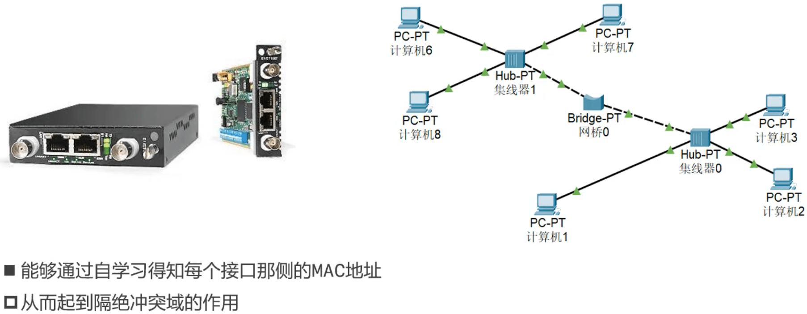

### 互联网（internet）

### 为什么要学习网络协议

- 互联网、移动互联网、物联网，都离不开网络协议
  - 最熟悉的网络协议: HTTP
  - 为了满足各种需求，有各式各样的网络协议(HTTPS、 SMTP、 MQTT、RTMP等)
- 随着物联网、音视频、直播等领域的发展，企业提高对开发人员网络基本功的要求，经常问网络协议的面试题
  - TCP和UDP的区别?说一下它们的报文格式?
  - TCP的流量控制和和拥塞控制? TCP如何实现可靠性传输?
  - 为什么连接是3次握手，关闭是4次挥手?
  - 7层模型与4层模型的区别?每一-层的作用是什么?
  - 交换机与路由器的区别?
  - ......

### 学习中需要搭建的环境

- 客户端-服务器开发环境
  - 客户端:浏览器(HTML+CSS+JS)
  - 服务器: Java
- 网络抓包.
  - 浏览器(Chrome、 Firefox) 、Fiddler、 Wireshark
- 模拟工具
  - Xshell (只有Windows版)、Packet Tracer、GNS3

### 客户端-服务器

### C/C++的跨平台原理

### Java的跨平台原理

### 必装工具

- JDK: https://www.oracle.com/java/technologies/javase-downloads.html
  - windows需要配置Path、JAVA_HOME，MacOS自动配置好了。
  - 参考: https://www.bilibili.com/video/BV1G7411F7v4?p=11,观看p11~p14
- Previous Java releases：https://www.oracle.com/java/technologies/downloads/archive/
- Tomcat: https://tomcat.apache.org/
- IntelliJ IDEA Ultimate: https://www.jetbrains.com/idea/download/

### 客户端 VS 服务器

**访问本地服务器**

- windows:ipconfig / macOS: ifconfig(en0) 查看ip地址，在浏览器中输入http://ip:8080
- 在浏览器中输入http://127.0.0.1:8080
- 在浏览器中输入http://localhost:8080

只需把我们自己的web服务器代码放在apache-tomcat/webapps目录下即可。

### 网络互联模型

### 请求过程

### 计算机之间的通信基础

- 需要得知对方的IP地址
- 最终是根据MAC地址(网卡地址)， 输送数据到网卡，被网卡接收
  - 如果网卡发现数据的目标MAC地址是自己，就会将数据传递给.上一层进行处理
  - 如果网卡发现数据的目标MAC地址不是自己，就会将数据丢弃，不会传递给上一层进行处理

### 计算机之间的链接方式

#### 网线直连

#### 同轴电缆（Coaxial）

广播的形式发送

#### 集线器（Hub）

#### 网桥（Bridge）

#### 交换机（Switch）

**适用于局域网**。

**如上图如果中间显示的不是绿色箭头（为橙色原点），可能会有问题，需要在Cisco Packet Tracer中点击Realtime和Simulation进行切换，直到刷新为绿色箭头为止（或者重启）。**

#### 路由器（Router）

