### Mac地址

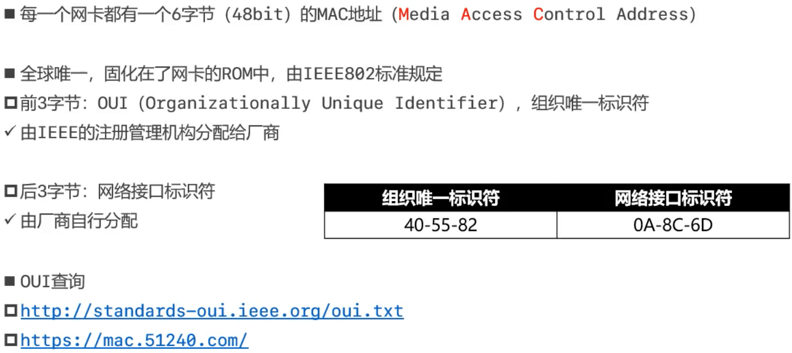

### Mac地址的表示格式

- Windows
  - 40-55-82-0A-8C-6D
- Linux、Android、Mac、iOS
  - 40:55:82:0A:8C:6D
- Packet Tracer
  - 4055.820A.8C6D
- 当48位全为1时,代表广播地址
  - FF-FF-FF-FF-FF-FF

### Mac地址操作

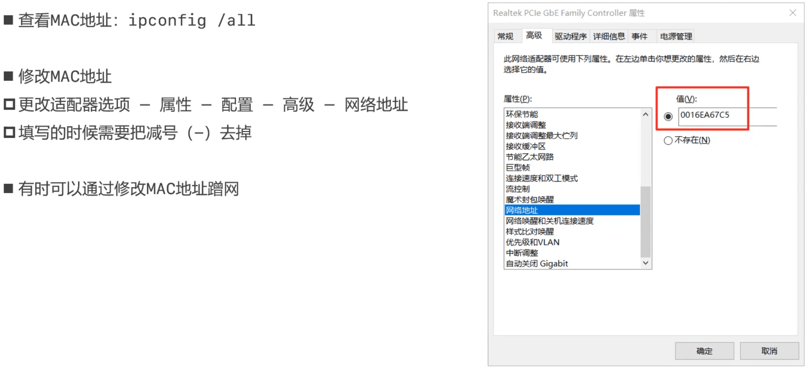

### Mac地址的获取

> arp -a： 查看缓存的mac地址，dynamic类型2分钟失效
>
> arp -d ：删除所有记录
>
> arp -d 地址: 删除某条
>
> arp -s ip mac地址 将ip对应的mac地址修改成静态

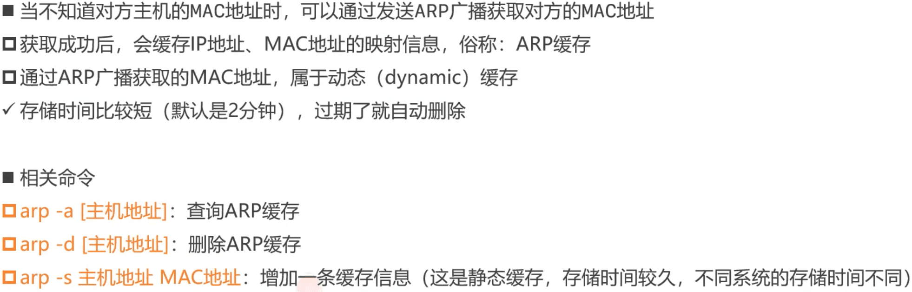

### ARP

- ARP (Address Resolution Protocol) ， 译为:地址解析协议
  - 通过IP地址获取MAC地址
- RARP (Reverse Address Resolution Protocol) ，译为:逆地址解析协议
  - 使用与ARP相同的报头结构
  - 作用与ARP相反，用于将MAC地址转换为IP地址
  - 后来被BOOTP、DHCP所取代

### ICMP

- ICMP (Internet Control Message Protocol) ，译为：互联网控制消息协议
  - IPv4中的ICMP被称作ICMPv4，IPv6中的ICMP则被称作ICMPv6
  - 通常用于返回错误信息
    - 比如TTL值过期、目的不可达
  - ICMP的错误消息总是包括了源数据并返回给发送者

### IP地址

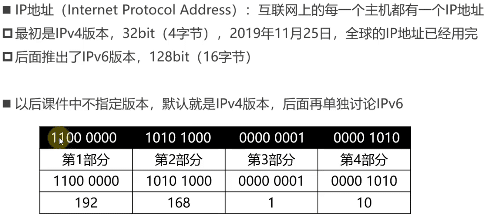

### IP地址的组成

- IP地址由2部分组成:网络标识(网络ID)、主机标识(主机ID)
  - 同一网段的计算机，网络ID相同
  - 通过子网掩码(subnet mask)可以计算出网络ID :子网掩码 & IP地址
- 计算机和其他计算机通信前，会先判断目标主机和自己是否在同一网段
  - 同一网段:不需要由路由器进行转发
  - 不同网段:交由路由器进行转发

### IP地址的分类

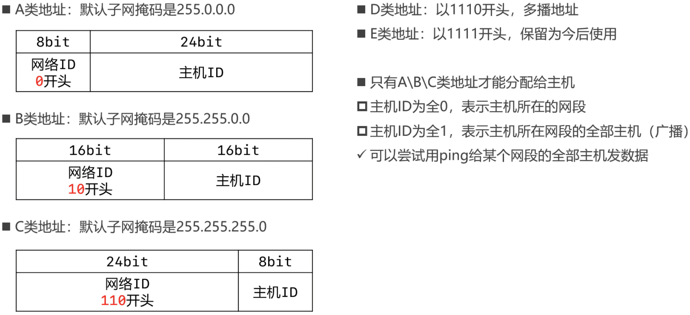

#### A类地址

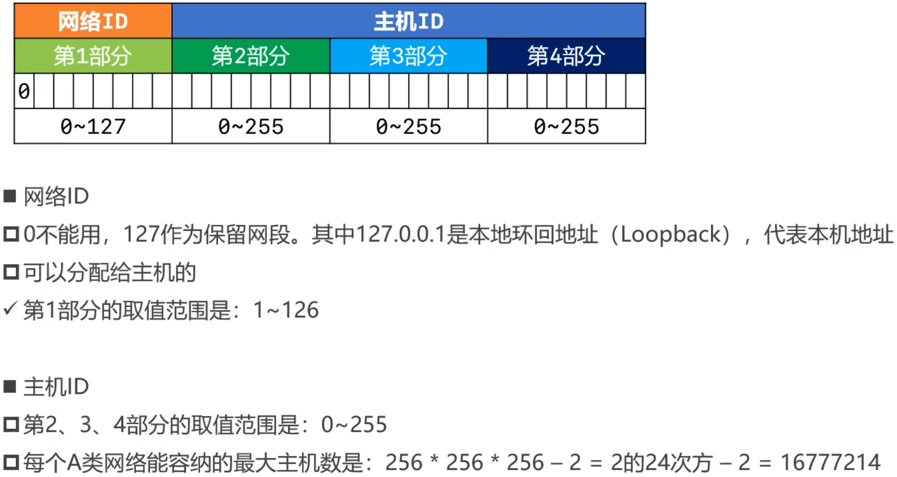

#### B类地址

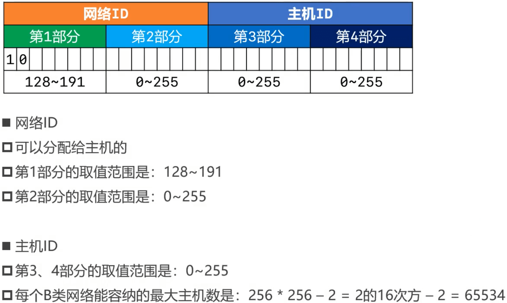

#### C类地址

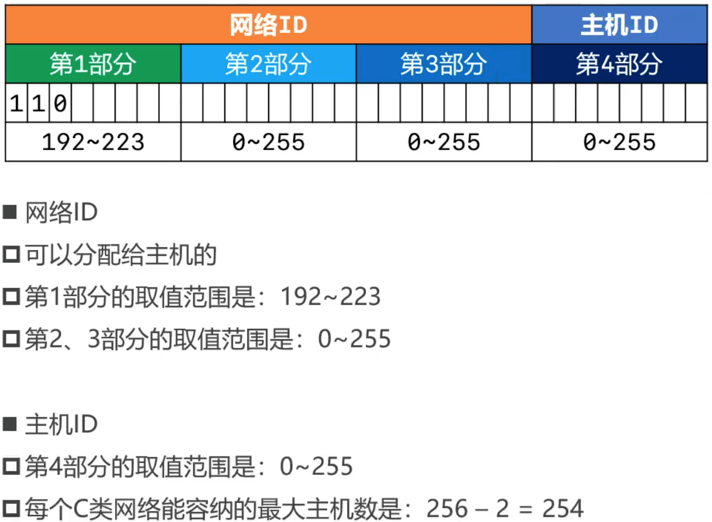

#### D类地址、E类地址

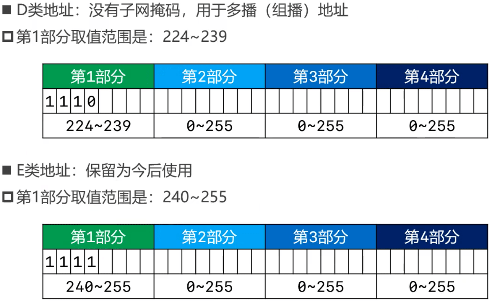

### 子网掩码的CIDR表示方法

- CIDR (Classless Inter-Domain Routing) ：无类别域间路由
- 子网掩码的CIDR表示方法
  - 192.168.1.100/24，代表子网掩码有24个1，也就是255.255.255.0
  - 123.210.100.200/16，代表子网掩码有16个1,也就是255.255.0.0
- 计算工具: https://www.sojson.com/convert/subnetmask.html

### 为什么要进行子网划分

- 如果需要让200台主机在同一个网段内，可以分配一个C类网段， 比如192.168.1.0/24
  - 共254个可用IP地址: 192.168.1.1~192.168.1.254
  - 多出54个空闲的IP地址，这种情况并不算浪费资源
- 如果需要让500台主机在同一个网段内，那就分配一个B类网段，比如191.100.0.0/16
  - 共65534个可用IP地址: 191.100.0.1~191.100.255.254
  - 多出65034个空闲的IP地址，这种情况属于极大的浪费资源
- 如何尽量避免浪费IP地址资源？
  - 合理进行子网划分

### 子网划分

- 子网划分：借用主机位作子网位，划分出多个子网
- 可用分为
  - 等长子网划分：将-一个网段等分成多个子网，每个子网的可用IP地址数量是一样的
  - 变长子网划分：每个子网的可用IP地址数量可以是不一样的
- 子网划分器： http://www.ab126.com/web/3552.html
- 子网划分的步骤
  - 确定子网的子网掩码长度
  - 确定子网中第1个、最后1个主机可用的IP地址

#### 等长子网划分

##### 等分成2个子网

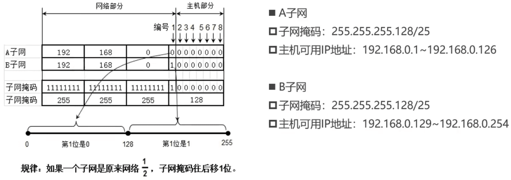

##### 等分成4个子网

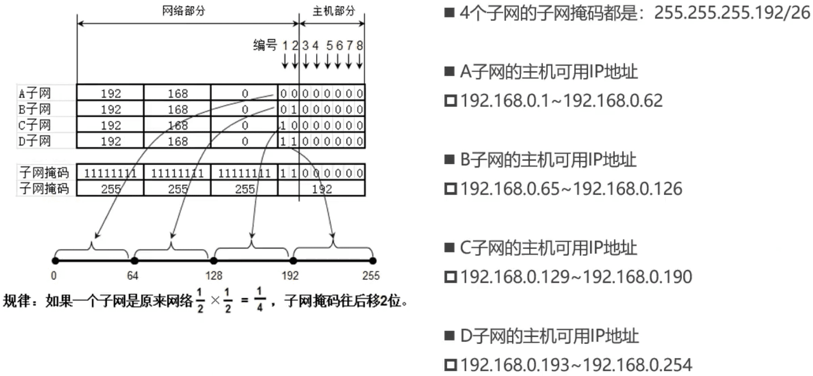

##### 等分成8个子网

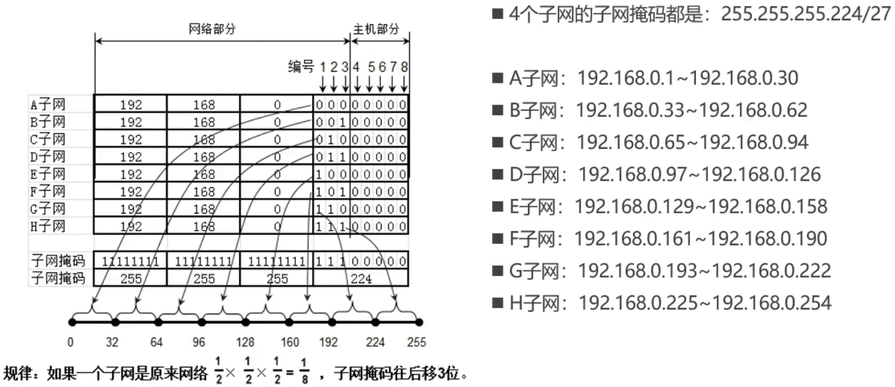

##### B类子网划分

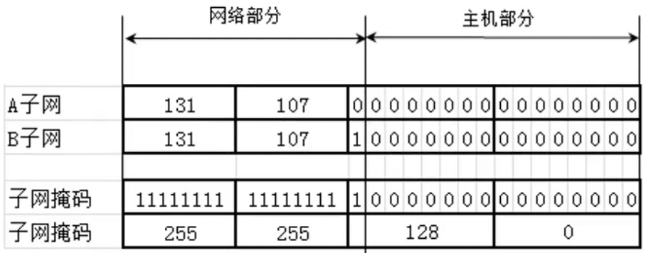

##### A类子网划分

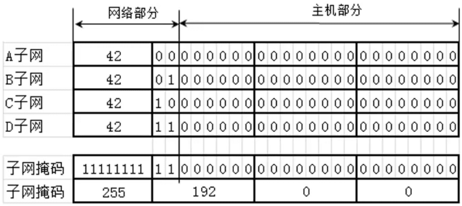

#### 变长子网划分

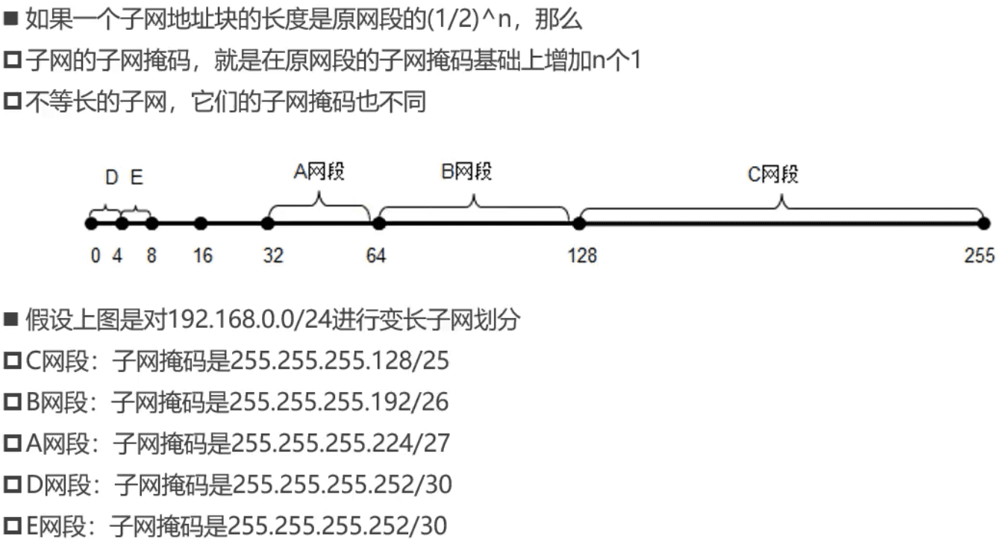

#### 思考题

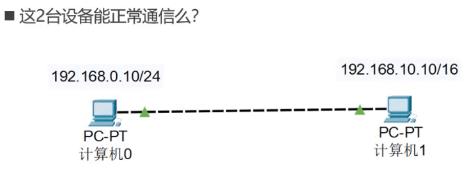

不能。

因为是直连，所以pc0和pc1必须在同一个网段内才能发消息。

当pc0发给pc1时，pc0计算自己的网段是192.168.0.10&255.255.255.0=192.168.0.0，pc0只能拿到pc1的ip，计算pc1的网段是192.168.10.10&255.255.255.0=192.168.10.0。网段不相同不能直接通信（需要经过路由）。

当pc1发给pc0时，pc1计算自己的网段是192.168.10.10&255.255.0.0=192.168.0.0。计算pc0的网段是192.168.0.10&255.255.0.0=192.168.0.0，pc1可以给pc0发消息，但当pc0接收到之后，发现不在同一个网段，不回消息。

### 超网

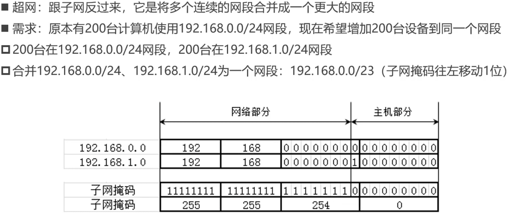

#### 思考题

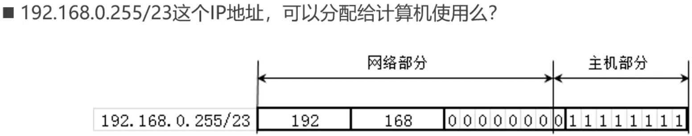

可以。

主机ID为后9位，不全为1。如果主机ID全为1代表广播。

#### 合并4个网段

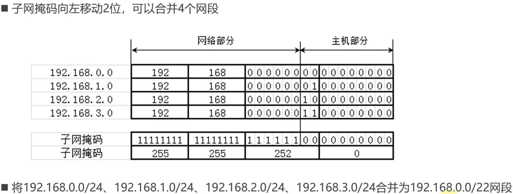

#### 思考题

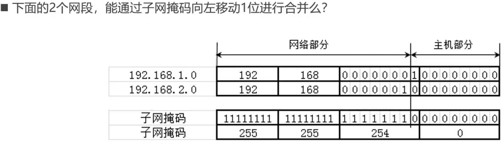

不可以，必须是连续的网段。192.168.1.0可以和192.168.0.0合并。

#### 合并网段的规律

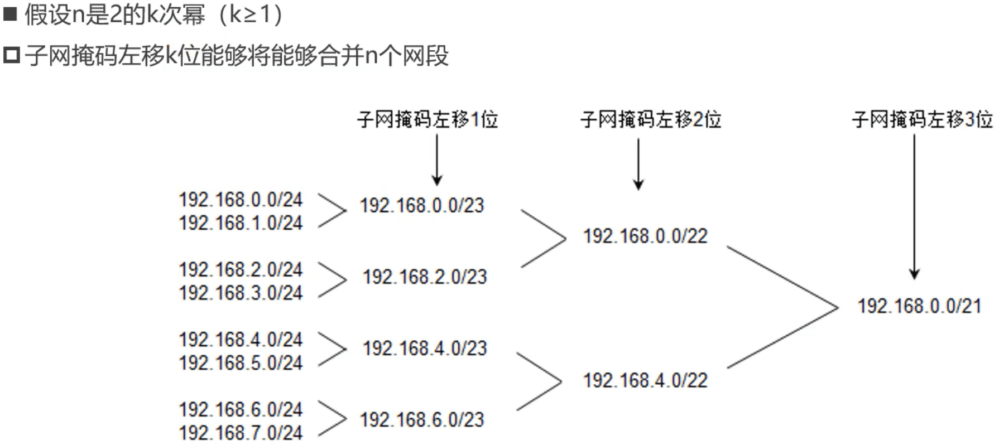

- 假设n是2的k次幂(k≥1)
  - 如果第一个网段的网络号能被n整除，那么由它开始连续的n个网段,能通过左移k位子网掩码进行合并
- 比如
  - 第一个网段的网络号以二进制0结尾，那么由它开始连续的2个网段，能通过左移1位子网掩码进行合
  - 第一个网段的网络号以二进制00结尾，那么由它开始连续的4个网段，能通过左移2位子网掩码进行合并
  - 第一个网段的网络号以二进制000结尾，那么由它开始连续的8个网段，能通过左移3位子网掩码进行合并

### 判断一个网段是子网还是超网

- 首先
  - 看看该网段的类型，是A类网络、B类网络、C类网络?
  - 默认情况下，A类子网掩码的位数是8，B类子网掩码的位数是16，C类子网掩码的位数是24
- 然后
  - 如果该网段的子网掩码位数比默认子网掩码多，就是子网
  - 如果该网段的子网掩码位数比默认子网掩码少，则是超网
- 比如
  - 25.100.0.0/16是一个A类子网
  - 200.100.0.0/16是一个C类超网

