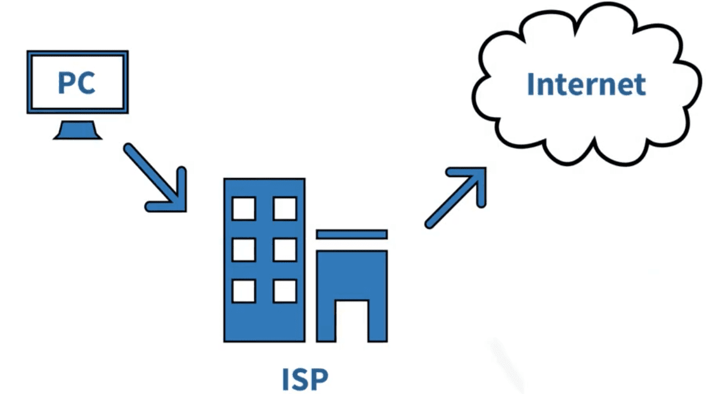

### 路由

- 在不同网段之间转发数据，需要有路由器的支持
- 默认情况下，路由器只知道跟它直连的网段,非直连的网段需要通过静态路由、动态路由告诉它
- 静态路由
  - 管理员手动添加路由信息
  - 适用于小规模网络
- 动态路由
  - 路由器通过路由选择协议(比如RIP、 OSPF)自动获取路由信息
  - 适用于大规模网络

### 练习1 - 让4台主机之间可以相互通信

添加默认路由，未知网段直接进行下一跳。

#### 路由器0的路由表

#### 路由器1的路由表

**注意：**

- 特定主机路由是指在路由表中直接添加特定主机，子网掩码全是255。
- 网络路由是到达某个局域网的路由（交换机）
- 汇总路由是到达多个局域网的路由（比如由路由器1连接的两个子网）

- 路由优先走精确的网段，不知道下一步怎么走的时候才走默认。

### 练习2 - 让4台主机之间可以相互通信

路由器0和路由器3是边缘路由器，能走的方向只有一条，直接用默认路由。中间的路由，去少的一路用网络路由，去多的一路用默认。这样路由表最精简。

### 数据包的传输过程

### 网络、互联网、因特网

### ISP

- ISP，Internet Service Provider，Internet服务提供商，比如移动、电信、网通、铁通等
  - 我们平时拉的宽带都是通过ISP连接到Internet的

### 服务器机房

### 网络的分类

### 常见的几种接口

- FastEthernet
  - 快速以太网接口(100M)（连接局域网）
- GigabitEthernet
  - 千兆以太网接口
- Serial
  - 串行接口（连接路由器）

### 上网方式

#### 电话线入户

#### 光纤入户

#### 网线入户

### 家用无线路由器的逻辑结构

###  公网IP、私网IP

- IP地址也分为:公网IP、私网IP
- 公网IP (Public)
  - Internet上的路由器中只有到达公网的路由表，没有到达私网的路由表
  - 公网IP由因特网信息中心(Internet Network Information Center, Inter NIC) 统一分配和管理
  - ISP需要向Inter NIC申请公网IP
- 私网IP (Private)
  - 主要用于局域网。下面是保留的私网网段
    - A类: 10.0.0.0/8，1个A类网络
    - B类: 172.16.0.0/16 ~ 172.31.0.0/16, 16个B类网络
    - C类: 192.168.0.0/24 ~ 192.168.255.0/24, 256个C类网络

### NAT

- 私网IP访问Internet需要进行NAT转换为公网IP
  - NAT (Network Address Translation)
  - 这一步可以由路由器来完成
- NAT的特点
  - 可以节约公网IP资源
  - 会隐藏内部真实IP
- NAT的分类
  - 静态转换
    - 手动配置NAT映射表;
    - 一对一转换
  - 动态转换
    - 定义外部地址池，动态随机转换
    - 一对一转换
  - PAT (Port Address Translation)
    - 多对一转换，最大程度节约公网IP资源
    - 采用端口多路复用方式，通过端口号标识不同的数据流
    - 目前应用最广泛的NAT实现方式

### 不同的路由

### 第一个包的丢失

PC0想和PC1通信，PC0先广播（ARP）获取R0的MAC地址，然后将信息发给R0，R0收到消息后，不知道PC1的mac地址，会将第一条信息丢弃，同时广播获取PC1的MAC地址，之后PC0发消息直接转发给PC1，第一次ping失效。

