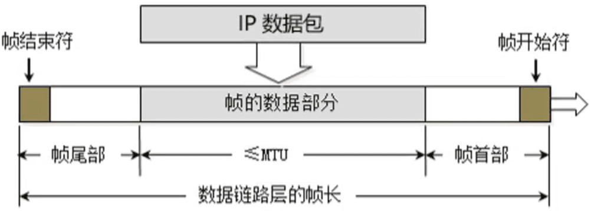
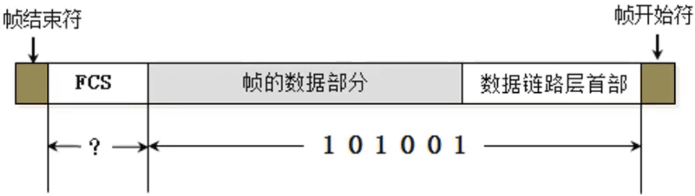
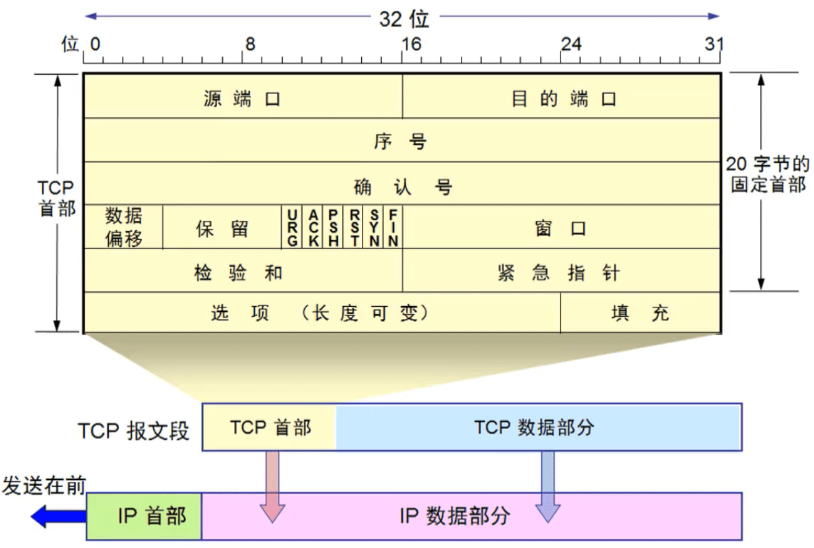
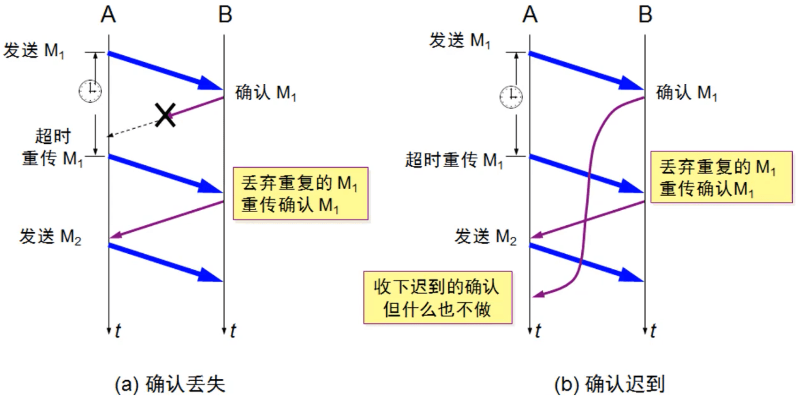
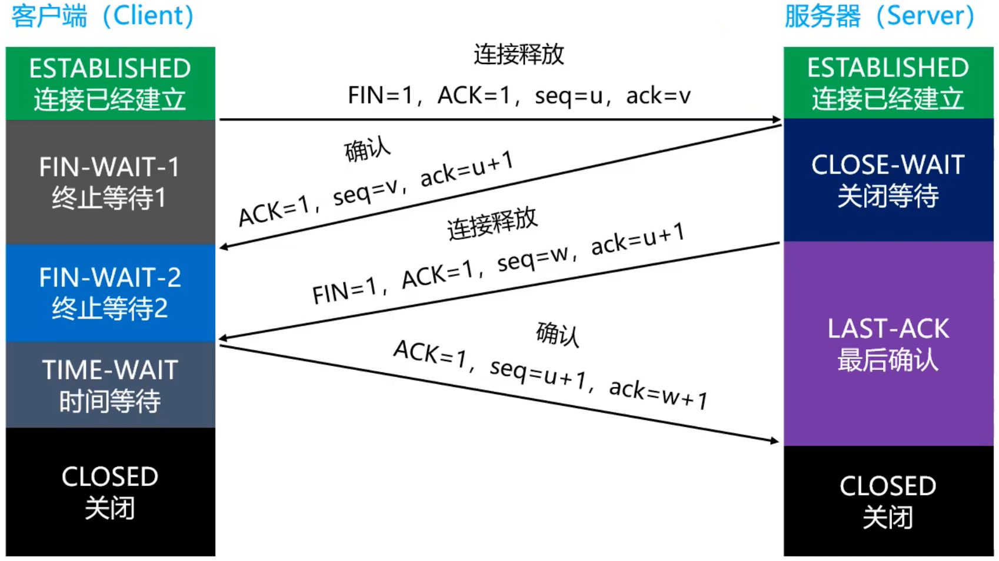

### 基本概念

#### 网络互联模型

#### 请求过程

#### 网络分层

### 物理层（Physical）

#### 数字信号、模拟信号

- 模拟信号(Analog Signal)
  - 连续的信号，适合长距离传输
  - 抗干扰能力差，受到干扰时波形变形很难纠正
- 数字信号(Digital Signal)
  - 离散的信号，不适合长距离传输
  - 抗干扰能力强，受到干扰时波形失真可以修复

#### 数据通信模型

#### 信道（Channel）

- 信道：信息传输的通道，一条传输介质上(比如网线)。上可以有多条信道
- 单工通信
  - 信号只能往一个方向传输，任何时候都不能改变信号的传输方向
  - 比如无线电广播、有线电视广播
- 半双工通信
  - 信号可以双向传输，但必须是交替进行，同一时间只能往一个方向传输
  - 比如对讲机
- 全双工通信
  - 信号可以同时双向传输
  - 比如手机(打电话，听说同时进行)

### 数据链路层（Data Link）

- 链路:从1个节点到相邻节点的一段物理线路(有线或无线)，中间没有其他交换节点

- 数据链路:在一条链路上传输数据时，需要有对应的通信协议来控制数据的传输
  - 不同类型的数据链路，所用的通信协议可能是不同的
    - 广播信道: CSMA/CD协议(比如同轴电缆、集线器等组成的网络)
    - 点对点信道: PPP协议(比如2个路由器之间的信道)

- 数据链路层的3个基本问题
  - 封装成帧
  - 透明传输
  - 差错检验

#### 封装成帧

- 帧(Frame)的数据部分
  - 就是网络层传递下来的数据包(IP数据包，Packet)
- 最大传输单元MTU (Maximum Transfer Unit)
  - 每一种数据链路层协议都规定了所能够传送的帧的数据长度上限
  - 以太网的MTU为1500个字节

#### 透明传输

- 使用SOH (Start Of Header)作为帧开始符
- 使用EOT (End Of Transmission)作为帧结束符
- 数据部分一旦出现了SOH、EOT，就需要进行转义

#### 差错检验

- FCS是根据数据部分+首部计算得出的

### 以太网

#### CSMA/CD协议

- CSMA/CD (Carrier Sense Multiple Access with Collision Detectio)
  - 载波侦听多路访问/冲突检测
- 使用了CSMA/CD的网络可以称为是以太网(Ethernet) ，它传输的是以太网帧
  - 以太网帧的格式有: Ethernet V2标准、IEEE的802.3标准
  - 使用最多的是: Ethernet V2标准
- 为了能够检测正在发送的帧是否产生了冲突，以太网的帧至少要 **64** 字节（64个字节是信道传输时间的两倍，只要没有发送完，收到的都认为是垃圾数据。 ）
- 用交换机组建的网络，已经支持全双工通信，不需要再使用CSMA/CD, 但它传输的帧依然是以太网帧
  - 所以，用交换机组建的网络，依然可以叫做以太网

#### Ethernet V2帧的格式

- 首部:目标MAC + 源MAC + 网络类型
- 以太网帧:首部 + 数据 + FCS
- 数据的长度至少是: 64-6-6-2-4 = 46字节

#### Ethernet V2标准

- 当数据部分的长度小于46字节时
  - 数据链路层会在数据的后面加入一些字节填充
  - 接收端会将添加的字节去掉

- 长度总结
  - 以太网帧的数据长度: 46 ~ 1500字节
  - 以太网帧的长度: 64 ~ 1518字节(目标MAC地址 +源MAC地址 + 网络类型 + 数据 + FCS)

### 网卡

- 网卡接收到一个帧，首先会进行差错校验,如果校验通过则接收,否则丢弃
- Wireshark抓到的帧没有FCS，因为它抓到的是差错校验通过的帧(帧尾的FCS会被硬件去掉)
  - Wireshark抓不到差错校验失败的帧

### PPP

#### PPP协议（Point to Point Protocol）

- Address字段:图中的值是0xFF,形同虚设,点到点信道不需要源MAC、目标MAC地址
- Control字段:图中的值是0x03，目前没有什么作用
- Protocol字段:内部用到的协议类型
- 帧开始符、帧结束符: 0x7E

#### PPP协议 - 字节填充

- 将0x7E替换成0x7D5E
- 将0x7D替换成0x7D5D

### 网络层

#### 网络层（Network）

- 网络层数据包(IP数据包，Packet) 由首部、数据2部分组成
  - 数据:很多时候是由传输层传递下来的数据段(Segment)

#### 网络层首部 - 版本、首部长度、区分服务

- 版本(Version)
  - 占4位
  - 0b0100：IPv4
  - 0b0110：IPv6
- 首部长度(Header Length)
  - 占4位，二进制乘以4才是最终长度
  - 0b0101: 20 (最小值)
  - 0b1111: 60 (最大值)
- 区分服务 (Differentiated Services Field)
  - 占8位
  - 可以用于提高网络的服务质量(QoS, Quality of Service)
  - 如果区分服务有特殊东西，路由器会优先让其通过

#### 网络层首部 - 总长度

- 总长度(Total Length)
  - 占16位
- 首部 + 数据的长度之和，最大值是65535

- 由于帧的数据不能超过1500字节，所以过大的IP数据包，需要分成片(fragments) 传输给数据链路层
  - 每一片都有自己的网络层首部(IP首部)

#### 网络层首部 - 标识、标志

- 标识(Identification)
  - 占16位
  - 数据包的ID，当数据包过大进行分片时，同一个数据包的所有片的标识都是一样的
  - 有一个计数器专门管理数据包的ID,每发出一个数据包，ID就加1
- 标志(Flags) 
  - 占3位
  - 第1位(Reserved Bit) :保留
  - 第2位(Don't Fragment) : 1代表不允许分片，0代表允许分片
  - 第3位(More Fragments) : 1代表不是最后一片, 0代表是最后一片

#### 网络层首部 - 片偏移

- 片偏移(Fragment Offset)
  - 占13位
  - 片偏移乘以8:字节偏移
  - 每一片的长度一定是8的整数倍

- ping ke.qq.com -l 4000

#### ping - 几个用法

- ping /?  ：查看ping的用法
- ping ip地址 -l 数据包大小 ：发送指定大小的数据包
- ping ip地址 -f ：不允许网络层分片
- ping ip地址 -i TTL ：设置TTL的值（设置TTL的值，从1开始累加，可以推测出中间经过的每一个路由器）
- 通过tracert、pathping命令，可以跟踪数据包经过了哪些路由

#### 网络层首部 - 生存时间

- 生存时间(Time To Live, TTL)
  - 占8位
  - 每个路由器在转发之前会将TTL减1,一旦发现TTL减为0,路由器会返回错误报告
  - 观察使用ping命令后的TTL,能够推测出对方的操作系统、中间经过了多少个路由器

#### 网络层首部 - 协议、首部校验和 

- 协议(Protocol)
  - 占8位
  - 表明所封装的数据是使用了什么协议

- 首部校验和(Header Checksum)
  - 用于检查首部是否有错误

### 传输层

#### 传输层（Transport）

- 传输层有2个协议
  - TCP (Transmission Control Protocol)传输控制协议
  - UDP (User Datagram Protocol) 用户数据报协议

#### UDP 

##### 数据格式

- UDP是无连接的，减少了建立和释放连接的开销
- UDP尽最大能力交付，不保证可靠交付
  - 因此不需要维护一些复杂的参数，首部只有8个字节(TCP的首部至少20个字节)

- UDP长度(Length)
  - 占16位，首部的长度 + 数据的长度
- 检验和的计算内容：伪首部 + 首部 + 数据

##### 检验和（Checksum）

- 检验和的计算内容：伪首部 + 首部 + 数据
  - 伪首部：仅在计算检验和时起作用，并不会传递给网络层

##### 端口（Port）

- UDP首部中端口是占用2字节
  - 可以推测出端口号的取值范围是: 0~65535
- 客户端的源端口是临时开启的随机端口
- 防火墙可以设置开启\关闭某些端口来提高安全性
- 常用命令行
  - netstat -an:查看被占用的端口
  - netstat -anb:查看被占用的端口、占用端口的应用程序
  - telnet 主机 端口:查看是否可以访问主机的某个端口
    - 安装telnet:控制面板 - 程序 - 启用或关闭Windows功能 - 勾选“Telnet Client”  - 确定

**服务器默认端口号**

####  TCP

#####  数据格式

- 数据偏移
  - 占4位，取值范围是0x0101~0x1111
  - 乘以4:首部长度(Header Length)
  - 首部长度是20~60字节
- 保留
  - 占6位，目前全为0

###### 细节

- 有些资料中，TCP首部的保留(Reserved) 字段占3位,标志(Flags) 字段占9位
  - Wireshark中也是如此

标志位的前三位是没什么用的，可以归到保留位，所以说保留位占6位，9位都可以。

###### 另一个细节

- UDP的首部中有个16位的字段记录了整个UDP报文段的长度(首部+数据)
- 但是，TCP的首部中仅仅有个4位的字段记录了TCP报文段的首部长度,并没有字段记录TCP报文段的数据长  
- 分析
  - UDP首部中占16位的长度字段是冗余的，纯粹是为了保证首部是32bit对齐
    - 长度、偏移量需要乘以4、乘以8等，所以需要对齐
  - TCP\UDP的数据长度，完全可以由IP数据包的首部推测出来
    - 传输层的数据长度 = 网络层的总长度 - 网络层的首部长度 - 传输层的首部长度

###### 检验和（Checksum）

- 跟UDP一样，TCP检验和的计算内容:伪首部 + 首部 + 数据
  - 伪首部:占用12字节,仅在计算检验和时起作用，并不会传递给网络层

###### 标志位

- URG (Urgent)
  - 当URG=1时，紧急指针字段才有效。表明当前报文段中有紧急数据，应优先尽快传送
- ACK (Acknowledgment)
  - 当ACK=1时，确认号字段才有效
- PSH (Push)
- RST (Reset)
  - 当RST=1时，表明连接中出现严重差错，必须释放连接，然后再重新建立连接

- SYN (Synchronization)
  - 当SYN=1、ACK=0时，表明这是一个建立连接的请求
  - 若对方同意建立连接，则回复SYN=1、ACK=1
- FIN (Finish)
  - 当FIN=1时，表明数据已经发送完毕，要求释放连接

###### 序号、确认号、窗口

- 序号(Sequence Number)
  - 占4字节
  - 首先，在传输过程中的每一个字节都会有一 个编号
  - 在建立连接后，序号代表：这一次传给对方的TCP数据部分的第一个字节的编号
- 确认号(Acknowledgment Number)
  - 占4字节
  - 在建立连接后，确认号代表：期望对方下一次传过来的TCP数据部分的第一个字节的编号
- 窗口(Window)
  - 占2字节
  - 这个字段有流量控制功能，用以告知对方下一次允许发送的数据大小(字节为单位)

##### 可靠传输

###### TCP的几个要点

- 可靠传输
- 流量控制
- 拥塞控制
- 连接管理
  - 建立连接
  - 释放连接

###### 停止等待ARQ协议

- ARQ (Automatic Repeat-reQuest)，自动重传请求

###### 连续ARQ协议 + 滑动窗口协议

- 如果接收窗口最多能接收4个包
  - 但发送方只发了2个包
- 接收方如何确定后面还有没有2个包?
  - 等待一定时间后没有第3个包
  - 就会返回确认收到2个包给发送方

- 现在假设每一组数据是100个字节， 代表一个数据段的数据
- 每一组给一个编号

###### SACK（选择性确认）

- 在TCP通信过程中，如果发送序列中间某个数据包丢失(比如1、2、*3*、4、5中的*3*丢失了)
- TCP会通过重传最后确认的分组后续的分组(最后确认的是2，会重传*3*、4、5)
- 这样原先已经正确传输的分组也可能重复发送(比如4、5)，降低了TCP性能
- 为改善上述情况，发展出了SACK (Selective Acknowledgment,选择性确认)技术
  - 告诉发送方哪些数据丢失，哪些数据已经提前收到
  - 使TCP只重新发送丢失的包(比如*3*)，不用发送后续所有的分组(比如4、5)

###### 疑问

- 若有个包重传了N此还是失败，会一直重传直到成功为止么？
  - 这个取决于系统的设置，比如有些操作系统，重传5次还没有成功就会发送reset报文（RST）断开TCP连接

###### 思考题

- 为什么选择在传输层就将数据“大卸八块”分成多个段，而不是等到网络层再分片传递给数据链路层?
  - 因为可以提高重传的性能
  - 需要明确的是：可靠传输是在传输层进行控制的
    - 如果在传输层不分段， 一旦出现数据丢失，整个传输层的数据都得重传
    - 如果在传输层分了段，一旦出现数据丢失，只需要重传丢失的那些段即可

###### 再次研究序列号、确认号

##### 流量控制

- 如果接收方的缓存区满了，发送方还在疯狂着发送数据
  - 接收方只能把收到的数据包丢掉，大量的丢包会极大着浪费网络资源
  - 所以要进行流量控制
- 什么是流量控制?
  - 让发送方的发送速率不要太快，让接收方来得及接收处理
- 原理
  - 通过确认报文中窗口字段来控制发送方的发送速率
  - 发送方的发送窗口大小不能超过接收方给出窗口大小
  - 当发送方收到接收窗门的大小为0时，发送方就会停止发送数据

###### 特殊情况

- ##### 有一种特殊情况

  - 一开始，接收方给发送方发送了0窗口的报文段
  - 后面，接收方又有了一些存储空间，给发送方发送的非0窗口的报文段丢失了
  - 发送方的发送窗口一直为零，双方陷入僵局

- 解决方案

  - 当发送方收到0窗口通知时，这时发送方停止发送报文
  - 并且同时开启一个定时器，隔一段时间就发一个测试报文去询问接收方最新的窗口大小
  - 如果接收的窗口大小还是为0，则发送方再次刷新启动定时器

##### 拥塞控制

- 拥塞控制
  - 防止过多的数据注入到网络中
  - 避免网络中的路由器或链路过载
- 拥塞控制是一个全局性的过程
  - 涉及到所有的主机、路由器
  - 以及与降低网络传输性能有关的所有因素
  - 是大家共同努力的结果
- 相比而言，流量控制是点对点通信的控制

###### 方法

- 慢开始(slow start，慢启动)
- 拥塞避免(congestion avoidance)
- 快速重传(fast retransmit)
- 快速恢复(fast recovery)
- 几个缩写
  - MSS (Maximum Segment Size) ：每个段最大的数据部分大小
    - 在建立连接时确定，只有在三次握手建立连接的时候，TCP首部选项中才会有此字段
  - cwnd (congestion window) ：拥塞窗口
  - rwnd (receive window) ：接收窗口
  - swnd (send window) ：发送窗口
    - swnd = min(cwnd, rwnd)

###### 慢开始

**注意：**接收方回复几个确认消息给发送方是由双方协商，每条消息都确认，或者全部接受之后确认最后一条都可以。连续ARQ协议中，在全部接受完之后才回复一次。

- cwnd的初始值比较小，然后随着数据包被接收方确认(收到一个ACK)
  - cwnd就成倍增长(指数级)

###### 拥塞避免

- ssthresh (slow start threshold) :慢开始阈值，cwnd达到阈值后，以线性方式增加
- 拥塞避免(加法增大) :拥塞窗口缓慢增大，以防止网络过早出现拥塞
- 乘法减小:只要网络出现拥塞，把ssthresh减半， 于此同时，执行慢开始算法( cwnd又恢复到初始值)
- 当网络出现频繁拥塞时，ssthresh值就下降的很快

###### 快重传

- 接收方
  - 每收到一个失序的分组后就立即发出重复确认
  - 使发送方及时知道有分组没有到达
  - 而不要等待自己发送数据时才进行确认
- 发送方
  - 只要连续收到三个重复确认(总共4个相同的确认) , 就应当立即重传对方尚未收到的报文段
  - 而不必继续等待重传计时器到期后再重传

###### 快恢复

- 当发送方连续收到三个重复确认，就执行“乘法减小”算法,把ssthresh减半
  - 这是为了预防网络发生拥塞
- 由于发送方现在认为网络很可能没有发生拥塞
  - 因此，与慢开始不同之处是现在不执行慢开始算法，即cwnd现在不恢复到初始值
  - 而是把cwnd值设置为ssthresh减半后的数值
  - 然后开始执行拥塞避免算法(“加法增大”)，使拥塞窗口缓慢地线性增大

###### 快重传 + 快恢复  

###### 滑动窗口的最大值

- 发送窗口的最大值: swnd = min(cwnd, rwnd)
- 当rwnd < cwnd时，是接收方的接收能力限制发送窗口的最大值
- 当cwnd < rwnd时，则是网络的拥塞限制发送窗口的最大值

##### 序号、确认号

 

##### 建立连接

###### 三次握手

###### 状态解读

- CLOSED: client处于关闭状态
- LISTEN: server处于监听状态，等待client连接
- SYN-RCVD:表示server接受到了SYN报文，当收到client的ACK报文后，它会进入到ESTABLISHED状态
- SYN-SENT:表示client已发送SYN报文，等待server的第2次握手
- ESTABLISHED: 表示连接已经建立

###### 前两次握手的特点

- SYN都设置为1
- 数据部分的长度都为0
- TCP头部的长度一般是32字节
  - 固定头部: 20字节
  - 选项部分: 12字节
- 双方会交换确认一些信息
  - 比如MSS、是否支持SACK、Window scale (窗口缩放系数)等
  - 这些数据都放在了TCP头部的选项部分中(12字节)

###### 疑问

- 为什么建立连接的时候，要进行3次握手? 2次不行么?
  - 主要目的:防止server端一直等待，浪费资源
- 如果建立连接只需要2次握手，可能会出现的情况
  - 假设client发出的第一个连接请求报文段，因为网络延迟，在连接释放以后的某个时间才到达server
  - 本来这是一个早已失效的连接请求,但server收到此失效的请求后， 误认为是client再次发出的一个新的连接请求
  - 于是server就向client发出确认报文段， 同意建立连接
  - 如果不采用“3次握手”,那么只要server发出确认,新的连接就建立了
  - 由于现在client并没有真正想连接服务器的意愿，因此不会理睬server的确认，也不会向server发送数
  - 但server却以为新的连接经建立，并一 直等待client发来数据,这样，server的很多资源就白白浪费掉了
- 采用“三次握手”的办法可以防止上述现象发生
  - 例如上述情况，client没有向server的确认发出确认， server由于收不到确认，就知道client并没有要求建立连接
- 第3次握手失败了,会怎么处理?
  - 此时server的状态为SYN-RECV,若等不到client的ACK, server会重新发送SYN+ ACK包
  - 如果server多次重发SYN+ ACK都等不到client的ACK,就会发送RST包，强制关闭连接

##### 释放连接

###### 4次挥手

###### 状态解读

- FIN-WAIT-1: 表示想主动关闭连接
  - 向对方发送了FIN报文，此时进入到FIN-WAIT-1状态
- CLOSE-WAIT:表示在等待关闭
  - 当对方发送FIN给自己，自己会回应一一个ACK报文给对方，此时则进入到CLOSE-WAIT状态
  - 在此状态下，需要考虑自己是否还有数据要发送给对方，如果没有，发送FIN报文给对方
- FIN-WAIT-2:只要对方发送ACK确认后，主动方就会处于FIN-WAIT-2状态，然后等待对方发送FIN报文
- CLOSING: 一种比较罕见的例外状态
  - 表示你发送FIN报文后，并没有收到对方的ACK报文，反而却也收到了对方的FIN报文
  - 如果双方几乎在同时准备关闭连接的话，那么就出现了双方同时发送FIN报文的情况，也即会出现CLOSING状态
  - 表示双方都正在关闭连接
- LAST-ACK:被动关闭一方在发送FIN报文后，最后等待对方的ACK报文
  - 当收到ACK报文后，即可进入CLOSED状态了
- TIME-WAIT:表示收到了对方的FIN报文，并发送出了ACK报文，就等2MSL后即可进入CLOSED状态了
  - 如果FIN-WAIT-1状态下，收到了对方同时带FIN标志和ACK标志的报文时
    - 可以直接进入到TIME-WAIT状态，而无须经过FIN-WAIT-2状态
- CLOSED:关闭状态
- 由于有些状态的时间比较短暂，所以很难用netstat命令看到，比如SYN-RCVD、FIN-WAIT-1等

###### 细节

- TCP/IP协议栈在设计上，允许任何一方先发起断开请求。这里演示的是client主动要求断开
- client发送ACK后，需要有个TIME-WAIT阶段,等待一段时间后， 再真正关闭连接
  - 一般是等待2倍的MSL (Maximum Segment Lifetime,最大分段生存期)
    - MSL是TCP报文在Internet上的最长生存时间
    - 每个具体的TCP实现都必须选择一个确定的MSL值, [RFC 1122](https://www.rfc-editor.org/rfc/rfc1122.html)建议是2分钟
    - 可以防止本次连接中产生的数据包误传到下一次连接中(因为本次连接中的数据包都会在2MSL时间内消失了)
- 如果client发送ACK后马上释放了，然后又因为网络原因，server没有收到client的ACK, server就会重发FIN。这时可能出现的情况是
  - ①client没有任何响应，服务器那边会干等，甚至多次重发FIN,浪费资源
  - ②client有个新的应用程序刚好分配了同一个端口号，新的应用程序收到FIN后马.上开始执行断开连接的操作，本来它可能是想跟server建立连接的

###### 疑问

- 为什么释放连接的时候，要进行4次挥手?
  - TCP是全双工模式
  - 第1次挥手:当主机1发出FIN报文段时
    - 表示主机1告诉主机2,主机1已经没有数据要发送了，但是，此时主机1还是可以接受来自主机2的数
  - 第2次挥手:当主机2返回ACK报文段时
    - 表示主机2已经知道主机1没有数据发送了，但是主机2还是可以发送数据到主机1的
  - 第3次挥手:当主机2也发送了FIN报文段时
    - 表示主机2告诉主机1,主机2已经没有数据要发送了  
  - 第4次挥手:当主机1返回ACK报文段时
    - 表示主机1已经知道主机2没有数据发送了。随后正式断开整个TCP连接
- 如何区别长链接和短连接？
  - 创建一个连接，做完一轮交互，拿完数据之后马上关闭，一般成为短连接。
  - 反之，需要多次交互，多次传输数据的称之为长链接。

###### 抓包

- 有时候在使用抓包工具的时候，有可能只会看到“3次"挥手
  - 这其实是将第2、3次挥手合并了

- 当server接收到client的FIN时，如果server后面也没有数据要发送给client了
  - 这时，server就可以将第2、3次挥手合并,同时告诉client两件事
    - 已经知道client没有数据要发
    - server已经没有数据要发了

###### 完整流程图

