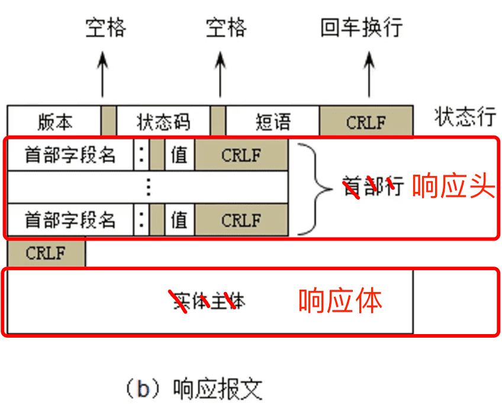
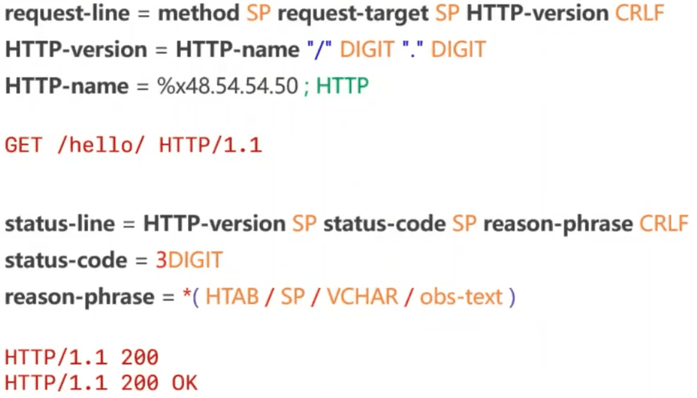
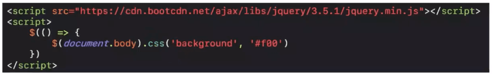

###   应用层常用的协议

- 超文本传输: HTTP、 HTTPS
- 文件传输: FTP
- 电子邮件: SMTP、POP3、 IMAP
- 动态主机配置: DHCP
- 域名系统: DNS

### DNS

#### 域名（Domain Name）

- 由于IP地址不方便记忆，并且不能表达组织的名称和性质，人们设计出了域名(比如baidu.com)
  - 但实际上，为了能够访问到具体的主机，最终还是得知道目标主机的IP地址
  - 域名申请注册: https://wanwanq.aliyun.com/
- 那干脆全程直接用域名，不用IP地址?
  - IP地址固定4个字节，域名随随便便都至少10几个字节，这无疑会增加路由器的负担,浪费流量
- 根据级别不同，域名可以分为
  - 顶级域名(Top-level Domain,简称TLD)
  - 二级域名
  - 三级域名
  - ...

#### 顶级域名的分类

- 通用顶级域名(General Top-level Domain,简称gTLD)
  - .com (公司)，.net (网络机构)，.org (组织机构)，.edu (教育)
  - .gov (政府部门)，.int (国际组织)等
- 国家及地区顶级域名(Country Code Top-level Domain,简称ccTLD)
  - .cn (中国)、jp (日本)、.uk (英国)
- 新通用顶级域名(New Generic Top-level Domain,简称: New gTLD)
  - .vip、.xyz、 .top、 .club、 .shop等

#### 二级域名

- 二级域名是指顶级域名之下的域名
  - 在通用顶级域名下，它一般指域名注册人的名称,例如google、baidu、 microsoft等
  - 在国家及地区顶级域名下，它一般指注册类别的，例如com, edu、gov. net等

#### DNS

- DNS的全称是: Domain Name System, 译为:域名系统
  - 利用DNS协议，可以将域名(比如baidu.com) 解析成对应的IP地址(比如220.181.38.148)
  - DNS可以基于UDP协议，也可以基于TCP协议,服务器占用53端口

#### 服务器

- 客户端首先会访问最近的一台DNS服务器(也就是客户端自己配置的DNS服务器)
- 所有的DNS服务器都记录了DNS根域名服务器的IP地址
- 上级DNS服务器记录了下一 级DNS服务器的IP地址
- 全球共13台IPv4的DNS根域名服务器、25台IPv6的DNS根域名服务器

#### 常用命令

- ipconfig /displaydns：查看DNS缓存记录
- ipconfig /flushdns：清空DNS缓存记录
- ping 域名
- nslookup 域名

### DHCP

#### IP地址的分配

- IP地址按照分配方式，可以分为：静态IP地址、动态IP地址
  - 静态IP地址
    - 手动设置
    - 适用场景：不怎么挪动的台式机(比如学校机房中的台式机)、服务器等
  - 动态IP地址
    - 从DHCP服务器自动获取IP地址
    - 适用场景:移动设备、无线设备等

#### DHCP

- DHCP (Dynamic Host Configuration Protocol)， 译为:动态主机配置协议
  - DHCP协议基于UDP协议，客户端是68端口，服务器是67端口
- DHCP服务器会从IP地址池中，挑选一个IP地址 “出租“给客户端一 段时间，时间到期就回收它们
  - 平时家里上网的路由器就可以充当DHCP服务器

#### 分配IP地址的4个阶段

- DISCOVER:发现服务器
  - 发广播包(源IP是0.0.0.0， 目标IP是255.255.255.255， 目标MAC是FF:FF:FF:FF:FF:FF)
- OFFER:提供租约
  - 服务器返回可以租用的IP地址，以及租用期限、子网掩码、网关、DNS等信息
  - 注意:这里可能会有多个服务器提供租约
- REQUEST:选择IP地址
  - 客户端选择一个OFFER, 发送广播包进行回应
- ACKNOWLEDGE:确认
  - 被选中的服务器发送ACK数据包给客户端
  - 至此，IP地址分配完毕

#### 细节

- DHCP服务器可以跨网段分配IP地址么? (DHCP服务器、 客户端不在同一个网段)
  - 可以借助DHCP中继代理(DHCP Relay Agent)实现跨网段分配IP地址
- 自动续约
  - 客户端会在租期不足的时候，自动向DHCP服务器发送REQUEST信息申请续约
- 常用命令
  - ipconfig /all：可以看到DHCP相关的详细信息，比如租约过期时间、DHCP服务器地址等
  - ipconfig /release：释放租约
  - ipconfig /renew：重新申请IP地址、申请续约(延长租期)

### HTTP

- HTTP (Hyper Text Transfer Protocol) ，译为超文本传输协议
  - 是互联网中应用最广泛的应用层协议之一
  - 设计HTTP最初的目的是:提供一种发布和接收HTML页面的方法， 由URI来标识具体的资源
  - 后面用HTTP来传递的数据格式不仅仅是HTML,应用非常广泛
- HTML ( Hyper Text Markup Language) :超文本标记语言
- 用以编写网页

#### 版本

- 1991年，HTTP/0.9
  - 只支持GET请求方法获取文本数据(比如HTML文档)，且不支持请求头、响应头等，无法向服务器传递太多信息
- 1996年， HTTP/1.0
  - 支持POST、HEAD等请求方法，支持请求头、响应头等,支持更多种数据类型(不再局限于文本数据)
  - 浏览器的每次请求都需要与服务器建立一个TCP连接, 请求处理完成后立即断开TCP连接
- 1997年，HTTP/1.1 (最经典、使用最广泛的版本)
  - 支持PUT、DELETE等请求方法
  - 采用持久连接(Connection: keep-alive)，多个请求可以共用同一个TCP连接
- 2015年，HTTP/2.0 
- 2018年，HTTP/3.0

#### 标准

- HTTP的标准
  - 由万维网协会(W3C)、互联网工程任务组(IETF) 协调制定，最终发布了一系列的RFC
- RFC (Request For Comments,可以译为:请求意见稿)
  - HTTP/1.1最早是在1997年的[RFC 2068](https://www.rfc-editor.org/rfc/rfc2068)中记录的
    - 该规范在1999年的[RFC 2616](https://www.rfc-editor.org/rfc/rfc2616)中已作废
    - 2014年又由[RFC 7230](https://www.rfc-editor.org/rfc/rfc7230)系列的RFC取代
  - HTTP/2标准于2015年5月以[RFC 7540](https://www.rfc-editor.org/rfc/rfc2540)正式发表，取代HTTP/1.1成为HTTP的实现标准

- 中国的RFC
  - 1996年3月，清华大学提交的适应不同国家和地区中文编码的汉字统一传输标准被IETF通过为[RFC 1922](https://www.rfc-editor.org/rfc/rfc1922)
  - 成为中国大陆第一个被认可为RFC文件的提交协议

#### 报文格式

在wireshark中查看请求过程

Chrome浏览器也能查看，但把请求头和请求体的数据分割了。

get请求没有请求体，post才有。

##### ABNF

- ABNF (Augmented BNF)
  - 是BNF (Backus-Naur Form,译为:巴科斯-瑙尔范式)的修改、增强版
  - 在[RFC 5234](https://www.rfc-editor.org/rfc/rfc5234)中表明: ABNF用作internet中通信协议的定义语言
  - ABNF是最严谨的HTTP报文格式描述形式，脱离ABNF谈论HTTP报文格式，往往都是片面、不严谨的
- 关于HTTP报文格式的定义
  - RFC 2616 4.HTTP Message (旧)
  - [RFC 7230 3.Message Format (新)](https://www.rfc-editor.org/rfc/rfc7230#section-3)

##### 核心规则

##### 整体

##### request-line、status-line

##### header-field、message-body

**RFC规定了报文的具体格式，真正实现的HTTP服务器（如tomcat）可能会加一些容错处理，有可能有多余的空格等，也能正确解析。**

#### URL的编码

- URL中一旦出现了一些特殊字符(比如中文、空格) , 需要进行[编码](https://tool.oschina.net/encode?type=4)
  - 在浏览器地址栏输入URL时，是采用UTF-8进行编码
- 比如
  - 编码前: https://www.baidu.com/s?wd=百度
  - 编码后: https://www.baidu.com/s?wd=%E5%8D%8E%E4%B8%BA

#### telnet 

- 安装一个Xshell (安全终端模拟软件，只有Window有，Mac自带终端)，在Xshell中使用telnet
  - 可以直接面向HTTP报文与服务器交互
  - 可以更清晰、直观地看到请求报文、响应报文的内容
  - 可以检验请求报文格式的正确与否，如果格式错误，直接退出telnet。

#### 请求方式

- RFC 7231, section 4: Request methods: 描述了8种请求方式
  - GET、HEAD、POST、PUT、DELETE、CONNECT、OPTIONS、TRACE
- RFC 5789, section 2: Patch method:描述了PATCH方法，一种9种
- GET:常用于读取的操作，请求参数直接拼接在URL的后面(浏览器对URL是有长度限制的)
- POST:常用于添加、修改、删除的操作，请求参数可以放到请求体中(没有大小限制)
- HEAD:请求得到与GET请求相同的响应，但没有响应体
  - 使用场景举例:在下载一个大文件前， 先获取其大小，再决定是否要下载。以此可以节约带宽资源
- OPTIONS:用于获取目的资源所支持的通信选项，比如服务器支持的请求方法
  - OPTIONS * HTTP/1.1（返回get，post，head等）
- PUT:用于对已存在的资源进行整体覆盖
- PATCH:用于对资源进行部分修改(资源不存在,会创建新的资源)
- DELETE:用于删除指定的资源
- TRACE:请求服务器回显其收到的请求信息，主要用于HTTP请求的测试或诊断
- CONNECT:可以开启一个客户端与所请求资源之间的双向沟通的通道，它可以用来创建隧道(tunnel)
  - 可以用来访问采用了SSL (HTTPS)协议的站点

#### 头部字段（Header Field）

- 头部字段可以分为4种类型
  - 请求头字段(Request Header Fields)
    - 有关要获取的资源或客户端本身信息的消息头
  - 响应头字段(Response Header Fields)
    - 有关响应的补充信息，比如服务器本身(名称和版本等)的消息头
  - 实体头字段(Entity Header Fields)
    - 有关实体主体的更多信息，比如主体长度(Content-Length) 或其MIME类型
  - 通用头字段(General Header Fields)
    - 同时适用于请求和响应消息，但与消息主体无关的消息头

##### 请求头字段

referer最经典的一个应用就是**防盗链**，如果希望从特定页面进入该页面才有权限，可以通过referer来控制。

[MDN Headers](https://developer.mozilla.org/zh-CN/docs/Web/HTTP/Headers)只要不是RFC提到的都是非标准。

##### 响应头字段

**关于跨域**：

**前后端分离**

**同源策略**

 

**跨域资源共享**

**浏览器缓存技术：**

- Cookie :
  - 在客户端(浏览器)
  - 存储一些数据， 存储到本地磁盘 (硬盘)
  - 服务器可以返回Cookie交给客户端去存储
- Session
  - 在服务器存储一些数据，存储到内存中
  - 会话跟踪

登陆成功之后，浏览器会自动保存JSEESIONID，domain和path，下一次请求相同的路径，会吧JSEESIONID发给服务器，服务器根据JSEESIONID从Session取出用户信息，如果存在，返回相应数据，不存在，重定向到登陆界面，登陆失败将Session清空等操作，避免浏览器多个账户切换，数据紊乱。

##### 状态码

- 在[RFC 2616 10.Status Code Definitions](https://www.rfc-editor.org/rfc/inline-errata/rfc2616.html)规范中定义
  - 状态码指示HTTP请求是否已成功完成
- 状态码可以分为5类
  - 信息响应: 100~199
  - 成功响应: 200~299
  - 重定向: 300~399
  - 客户端错误: 400~499
  - 服务器错误: 500~ 599

##### 缓存（Cache）

- 实际上，HTTP的缓存机制远远比上图的流程要复杂
- 通常会缓存的情况是: GET请求+静态资源(比如HTML、CSS. JS、图片等)
- Ctrl + F5:可以强制刷新缓存

###### 响应头

- Pragma：作用类似于Cache-Control, HTTP/1.0的产物
- Expires：缓存的过期时间(GMT格式时间)，HTTP/1.0的产物
- Cache-Control：设置缓存策略
  - no-storage：不缓存数据到本地
  - public：允许用户、代理服务器缓存数据到本地
  - private：只允许用户缓存数据到本地
  - max-age：缓存的有效时间(多长时间不过期)，单位秒
  - no-cache：每次需要发请求给服务器询问缓存是否有变化，再来决定如何使用缓存
- 优先级: Pragma > Cache-Control > Expires

- Last-Modified：资源的最后一次修改时间
- ETag：资源的唯一标识(根据文件内容计算出来的摘要值)
- 优先级: ETag > Last-Modified

###### 请求头

- If-None-Match
  - 如果上一次的响应头中有ETag，就会将ETag的值作为请求头的值
  - 如果服务器发现资源的最新摘要值跟lf-None-Match不匹配，就会返回新的资源(200 OK)
  - 否则，就不会返回资源的具体数据(304 Not Modified)

- If-Modified-Since
  - 如果上一次的响应头中没有ETag，有Last-Modified，就会将Last-Modified的值作为请求头的值
  - 如果服务器发现资源的最后一次修改时间晚于If-Modified-Since，就会返回新的资源(200 OK)
  - 否则，就不会返回资源的具体数据(304 Not Modified)

###### Last-Modified VS ETag

- Last-Modified的缺陷
  - 只能精确到秒级别，如果资源在1秒内被修改了，客户端将无法获取最新的资源数据
  - 如果某些资源被修改了(最后一次修改时间发生了变化)， 但是内容并没有任何变化会导致相同数据重复传输，没有使用到缓存

- ETag可以办到
  - 只要资源的内容没有变化，就不会重复传输资源数据
  - 只要资源的内容发生了变化，就会返回最新的资源数据给客户端

###### 缓存的使用流程

##### 常见状态码

- 100 Continue
  - 请求的初始部分已经被服务器收到，并且没有被服务器拒绝。客户端应该继续发送剩余的请求,如果请求已经完成，就忽略这个响应
  - 允许客户端发送带请求体的请求前，判断服务器是否愿意接收请求(服务器通过请求头判断)
  - 在某些情况下，如果服务器在不看请求体就拒绝请求时，客户端就发送请求体是不恰当的或低效的
- 200 OK:请求成功
- 302 Found:请求的资源被暂时的移动到了由Location头部指定的URL上
- 304 Not Modified:说明无需再次传输请求的内容,也就是说可以使用缓存的内容
- 400 Bad Request:由于语法无效，服务器无法理解该请求
- 401 Unauthorized:由于缺乏目标资源要求的身份验证凭证
- 403 Forbidden:服务器端有能力处理该请求,但是拒绝授权访问
- 404 Not Found:服务器端无法找到所请求的资源
- 405 Method Not Allowed:服务器禁止了使用当前HTTP方法的请求
- 406 Not Acceptable:服务器端无法提供与Accept-Charset以及Accept-Language指定的值相匹配的响应
- 408 Request Timeout:服务器想要将没有在使用的连接关闭
  - 一些服务器会在空闲连接上发送此信息，即便是在客户端没有发送任何请求的情况下
- 500 Internal Server Error:所请求的服务器遇到意外的情况并阻止其执行请求
- 501 Not lmplemented:请求的方法不被服务器支持，因此无法被处理
  - 服务器必须支持的方法(即不会返回这个状态码的方法)只有GET和HEAD
- 502 Bad Gateway:作为网关或代理角色的服务器，从上游服务器(如tomcat) 中接收到的响应是无效的
- 503 Service Unavailable:服务器尚未处于可以接受请求的状态
  - 通常造成这种情况的原因是由于服务器停机维护或者已超载

##### form提交

###### 常用属性

- action: 请求的URI
- method:请求方法(GET、 POST)
- enctype: POST请求时,请求体的编码方式
  - application/x-www-form-urlencoded (默认值)
    - 用&分隔参数，用=分隔键和值,字符用URL编码方式进行编码
  - multipart/form-data
    - 文件上传时必须使用这种编码方式

###### multipart/form-data

#### 代理服务器（Proxy Server）

- 特点
  - 本身不生产内容
  - 处于中间位置转发上下游的请求和响应
    - 面向下游的客户端:它是服务器
    - 面向上游的服务器:它是客户端

##### 正向代理，反向代理

- 正向代理:代理的对象是客户端
- 反向代理:代理的对象是服务器

##### 正向代理 - 作用

- 隐藏客户端身份
- 绕过防火墙(突破访问限制)
- Internet访问控制
- 数据过滤
- ...

- 一些免费的正向代理
-  https://ip.jiangxianli.com/
-  https://www.kuaidaili.com/free/inha/

方向代理 - 作用

- 隐藏服务器身份
- 安全防护
- 负载均衡

##### 抓包工具的原理

- Fiddler、 Charles等抓包工具的原理:在客户端启动了正向代理服务

- 需要注意的是
  - Wireshark的原理是:通过底层驱动，拦截网卡上流过的数据

##### 相关头部字段

#### CDN

- CDN (Content Delivery Network或Content Distribution Network)，译为:内容分发网络
  - 利用最靠近每位用户的服务器
  - 更快更可靠地将音乐、图片、视频等资源文件(-般是静态资源)传递给用户

##### 使用CDN前后

- CDN运营商在全国、乃至全球的各个大枢纽城市都建立了机房
  - 部署了大量拥有高存储高带宽的节点,构建了一个跨运营商、跨地域的专用网络

- 内容所有者向CDN运营商支付费用，CDN将其内容交付给最终用户

##### 使用CDN前

##### 使用CDN后

##### 使用举例

使用CDN引入jquery：https://www.bootcdn.cn/jquery/

#### 

