## 网络通信中面临的4种安全威胁

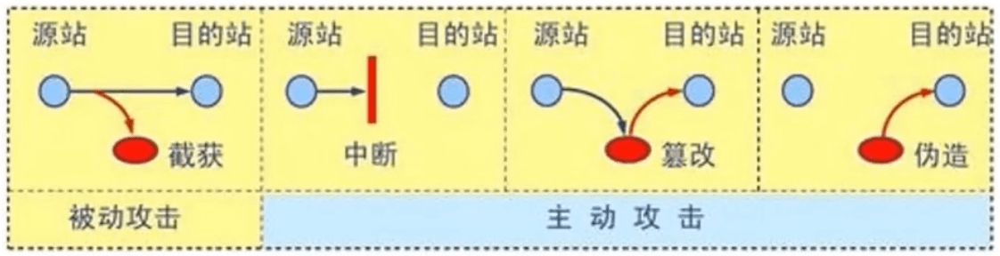

- 截获：窃听通信内容
- 中断：中断网络通信
- 篡改：篡改通信内容
- 伪造：伪造通信内容

## ARP欺骗

### 网络层 - ARP欺骗

- ARP欺骗(ARP spoofing)，又称ARP毒化(ARP poisoning)、ARP病毒、ARP攻击
- ARP欺骗可以造成的效果
  - 可让攻击者获取局域网.上的数据包甚至可篡改数据包
  - 可让网络上特定电脑之间无法正常通信(例如网络执法官这样的软件)
  - 让送至特定IP地址的流量被错误送到攻击者所取代的地方
  - ...

### 核心步骤举例

- 假设主机C是攻击者，主机A、B是被攻击者
  - C只要收到过A、B发送的ARP请求，就会拥有A、B的IP、 MAC地址，就可以进行欺骗活动
  - C发送一个ARP响应给B，把响应包里的源IP设为A的IP地址，源MAC设为C的MAC地址
  - B收到ARP响应后，更新它的ARP表，把A的MAC地址(IP_A, MAC_A)改为(IP_ A, MAC_C)
  - 当B要发送数据包给A时，它根据ARP表来封装数据包的头部,把目标MAC地址设为MAC_C，而非MAC_A
  - 当交换机收到B发送给A的数据包时，根据此包的目标MAC地址(MAC_C)而把数据包转发给C
  - C收到数据包后，可以把它存起来后再发送给A，达到窃听效果。C也可以篡改数据后才发送数据包给A

### 保护

- 静态ARP
- DHCP Snooping
  - 网络设备可借由DHCP保留网络.上各电脑的MAC地址,在伪造的ARP数据包发出时即可侦测到
- 利用一些软件监听ARP的不正常变动
- ...

## Dos攻击

### Dos、DDos

- DoS攻击(拒绝服务攻击, Denial-of Service attack)
  - 使目标电脑的网络或系统资源耗尽，使服务暂时中断或停止，导致其正常用户无法访问
- DDoS攻击(分布式拒绝服务攻击，Distributed Denial-of-Service attack)
  - 黑客使用网络上两个或以上被攻陷的电脑作为"僵尸（肉机）”向特定的目标发动DoS攻击
  - 2018年3月，GitHub遭到迄今为止规模最大的DDoS攻击
- DoS攻击可以分为2大类
  - 带宽消耗型: UDP洪水攻击、ICMP洪水攻击
  - 资源消耗型: SYN洪水攻击、LAND攻击

### Dos、DDos防御

- 防御方式通常为:入侵检测、流量过滤、和多重验证
  - 堵塞网络带宽的流量将被过滤,而正常的流量可正常通过
- 防火墙
  - 防火墙可以设置规则，例如允许或拒绝特定通讯协议，端口或IP地址
  - 当攻击从少数不正常的IP地址发出时，可以简单的使用拒绝规则阻止一切从攻击源IP发出的通信
  - 复杂攻击难以用简单规则来阻止，例如80端口遭受攻击时不可能拒绝端口所有的通信，因为同时会阻止合法流量
  - 防火墙可能处于网络架构中过后的位置，路由器可能在恶意流量达到防火墙前即被攻击影响
- 交换机:大多数交换机有一定的速度限制和访问控制能力
- 路由器:和交换机类似，路由器也有一定的速度限制和访问控制能力
- 黑洞引导
  - 将所有受攻击计算机的通信全部发送至一个“黑洞”(空接口或不存在的计算机地址)或者有足够能力处理洪流的网络设备商，以避免网络受到较大影响
- 流量清洗
  - 当流量被送到DDoS防护清洗中心时，通过采用抗DDoS软件处理，将正常流量和恶意流量区分开
  - 正常的流量则回注回客户网站

## SYN洪水攻击、LAND攻击

### 传输层 - SYN洪水攻击

- SYN洪水攻击(SYN flooding attack)
  - 攻击者发送一系列的SYN请求到目标， 然后让目标因收不到ACK (第3次握手)而进行等待、消耗资源
- 攻击方法
  - 跳过发送最后的ACK信息
  - 修改源IP地址，让目标送SYN-ACK到伪造的IP地址，因此目标永不可能收到ACK (第3次握手)
- 防护
  - 参考: [RFC 4987](https://tools.ietf.org/html/rfc4987)

### 传输层 - LAND攻击

- LAND攻击(局域网拒绝服务攻击，Local Area Network Denial attack)
  - 通过持续发送相同源地址和目标地址的欺骗数据包，使目标试图与自己建立连接,消耗系统资源直至崩溃
- 有些系统存在设计上的缺陷，允许设备接受并响应来自网络、却宣称来自于设备自身的数据包，导致循环应答
- 防护
  - 大多数防火墙都能拦截类似的攻击包，以保护系统
  - 部分操作系统通过发布安全补丁修复了这一漏洞
  - 路由器应同时配置上行与下行筛选器，屏蔽所有源地址与目标地址相同的数据包

## DNS劫持

- DNS劫持，又称为域名劫持
  - 攻击者篡改了某个域名的解析结果，使得指向该域名的IP变成了另一个IP
  - 导致对相应网址的访问被劫持到另一个不可达的或者假冒的网址
  - 从而实现非法窃取用户信息或者破坏正常网络服务的目的
- 为防止DNS劫持，可以考虑使用更靠谱的DNS服务器，比如: 114.114.114.114
  - 谷歌: 8.8.8.8、8.8.4.4
  - 微软: 4.2.2.1、4.2.2.2
  - 百度: 180.76.76.76
  - 阿里: 223.5.5.5、 223.6.6.6
- HTTP劫持：对HTTP数据包进行拦截处理，比如插入JS代码
  - 比如你访问某些网站时，在右下角多了个莫名其妙的弹窗广告

## HTTP协议的安全问题

- HTTP协议默认是采取明文传输的，因此会有很大的安全隐患
  - 常见的提高安全性的方法是：对通信内容进行加密后，再进行传输
- 常见的加密方式有
  - 不可逆
    - 单向散列函数: MD5、SHA等
  - 可逆
    - 对称加密: DES、3DES、 AES等
    - 非对称加密: RSA等
  - 其它
    - 混合密码系统
    - 数字签名
    - 证书

### 常见的英文

- encrypt：加密
- decrypt：解密
- plaintext：明文
- ciphertext：密文

### 学前须知

- 为了便于学习，设计4个虚拟人物
  - Alice、Bob：互相通信
  - Eve：窃听者
  - Mallory：主动攻击者

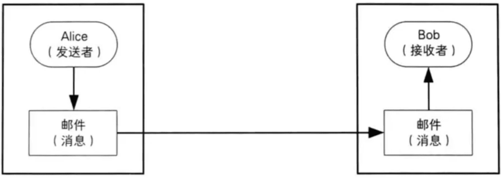

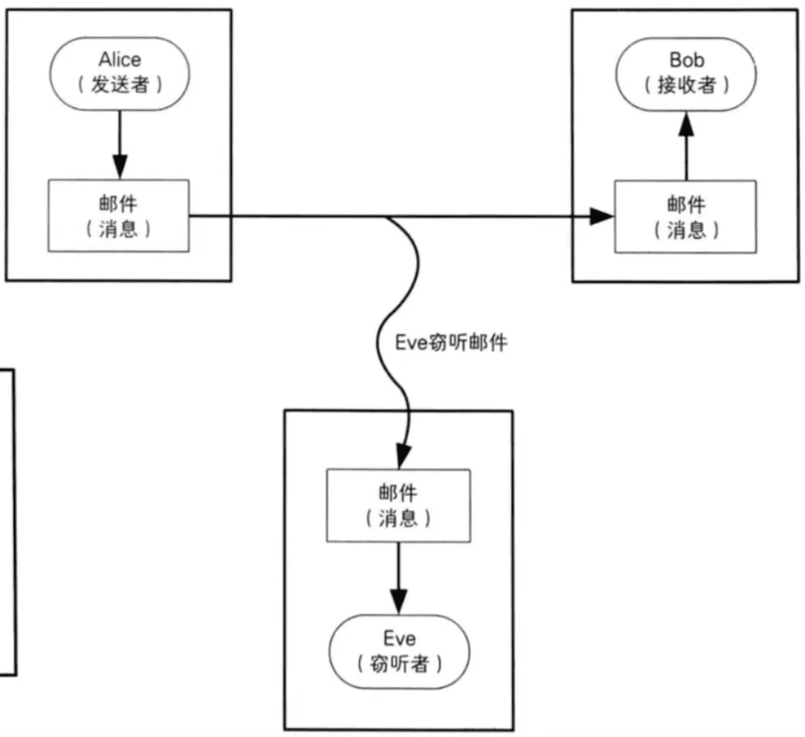

### 如何防止被窃听

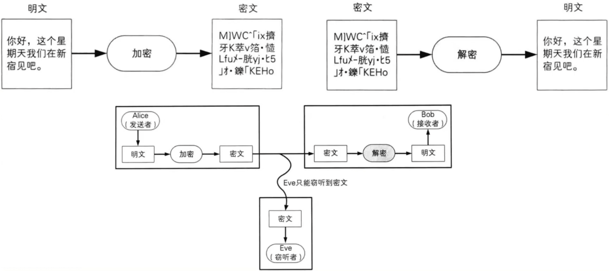

### 单向散列函数

#### 几个网站

- MD5加密
  - https://www.cmd5.com/hash.aspx
- MD5解密
  - https://www.cmd5.com/
- 其它加密
  - https://www.sojson.com/encrypt_des.html
  - https://tool.chinaz.com/tools/md5.aspx

#### 单向散列函数（One-way hash function）

- 单向散列函数，可以根据消息内容计算出散列值
- 散列值的长度和消息的长度无关，无论消息是1bit、10M、 100G, 单向散列函数都会计算出固定长度的散列值

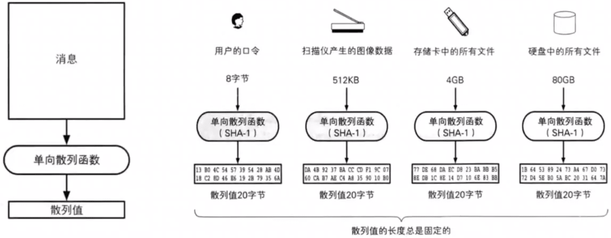

#### 特点

- 根据任意长度的消息，计算出固定长度的散列值
- 计算速度快，能快速计算出散列值
- 消息不同，散列值也不同
- 具备单向性

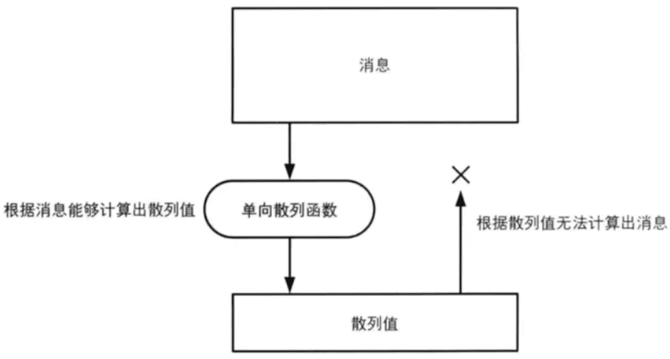

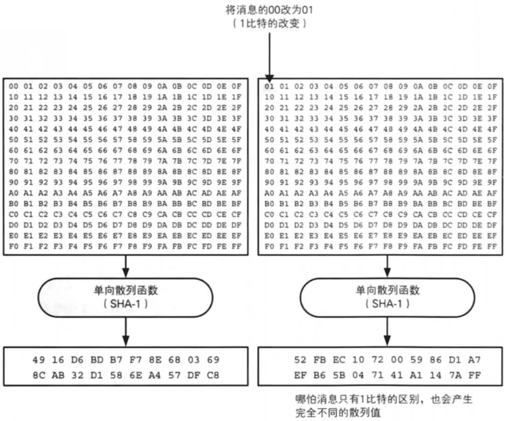

#### 称呼

- 单向散列函数,也被称为
  - 消息摘要函数(message digest function)
  - 哈希函数(hash function)
- 输出的散列值，也被称为
  - 消息摘要(message digest)
  - 指纹(fingerprint)

#### 常见的几种单向散列函数

- MD4、MD5
  - 产生128bi t的散列值，MD就是Message Digest的缩写， 目前已经不安全
- SHA-1
  - 产生160bit的散列值，目前已经不安全
- SHA-2
  - SHA- -256、SHA- -384、SHA- 512，散列值长度分别是256bit、384bit、 512bit
- SHA-3
  - 全新标准

#### 如何防止数据被篡改

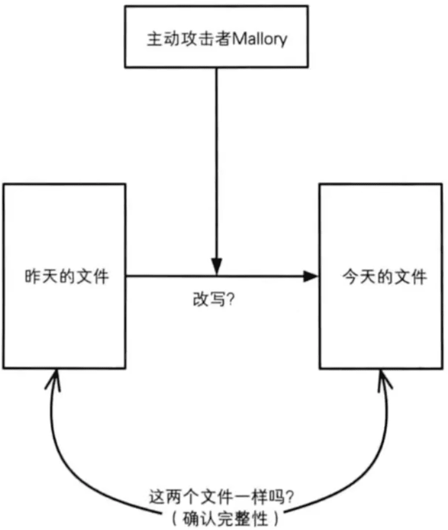

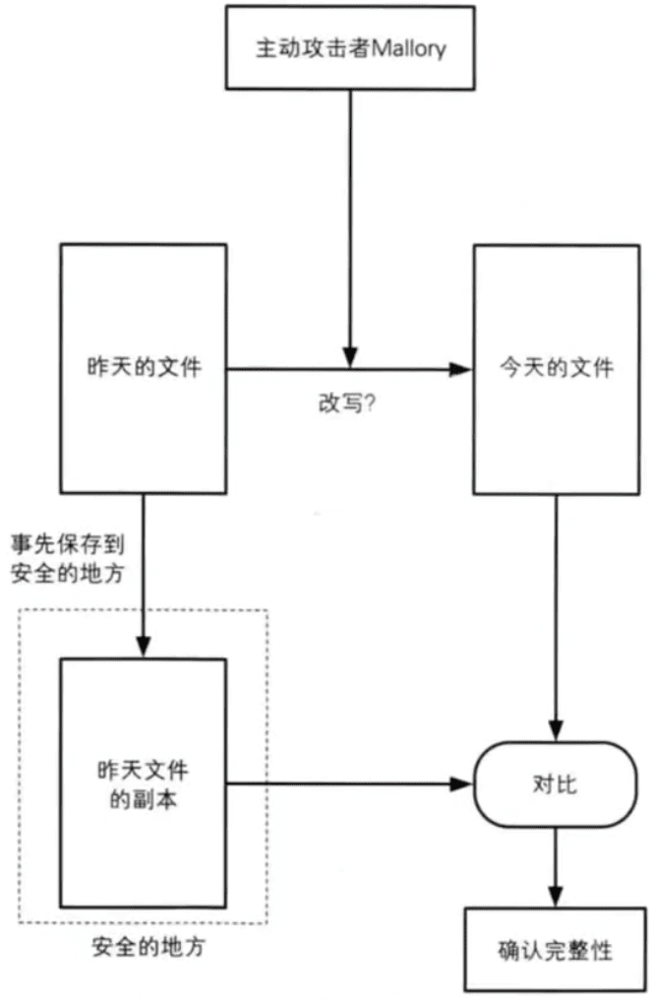

#### 应用：防止数据被篡改

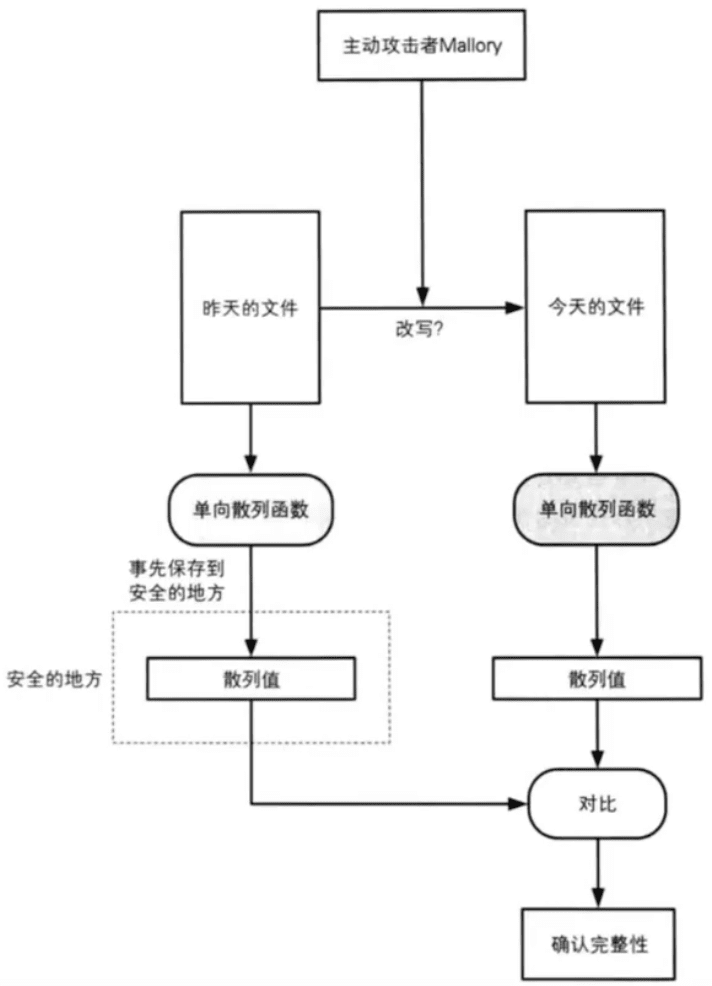

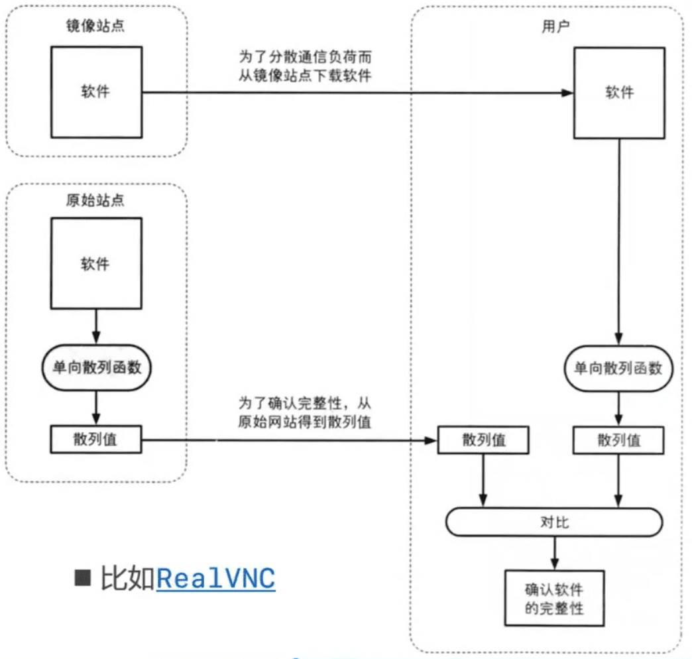

- 比如[RealVNC](https://www.realvnc.com/en/connect/download/vnc/)的SHA-256值，就是用以检查下载的包是否被篡改。

#### 应用：密码加密

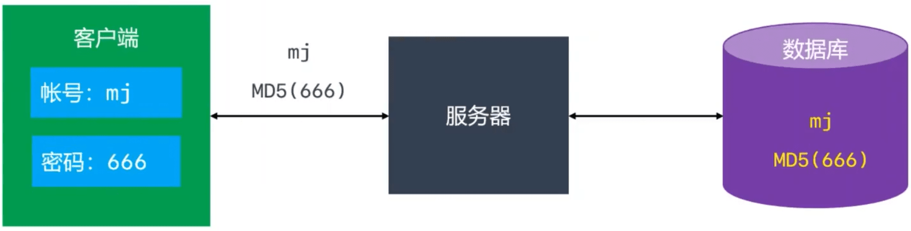

### 对称加密和非对称加密

#### 如何加密解密？

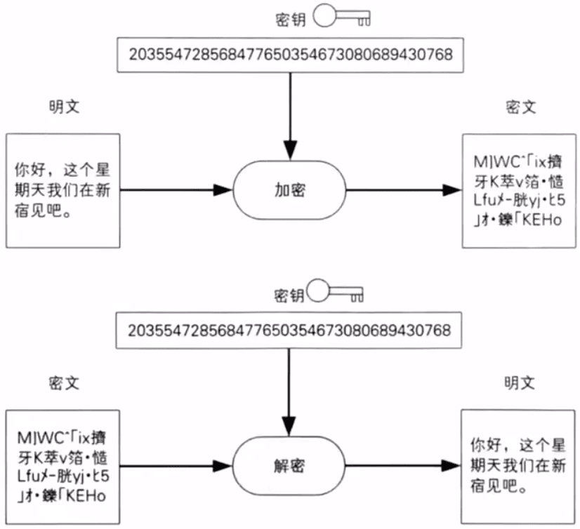

#### 对称加密（对称密码）

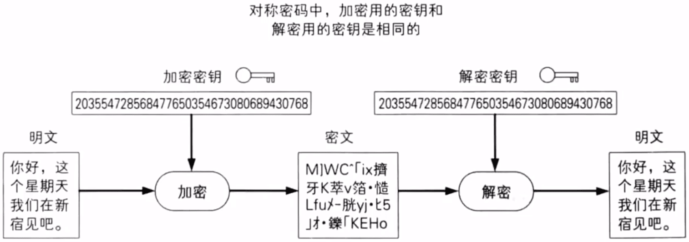

##### 对称加密（Symmetric Cryptography）

- 在对称加密中，加密、解密时使用的是同一个密钥
- 常见的对称加密算法有
  - DES
  - 3DES
  - AES

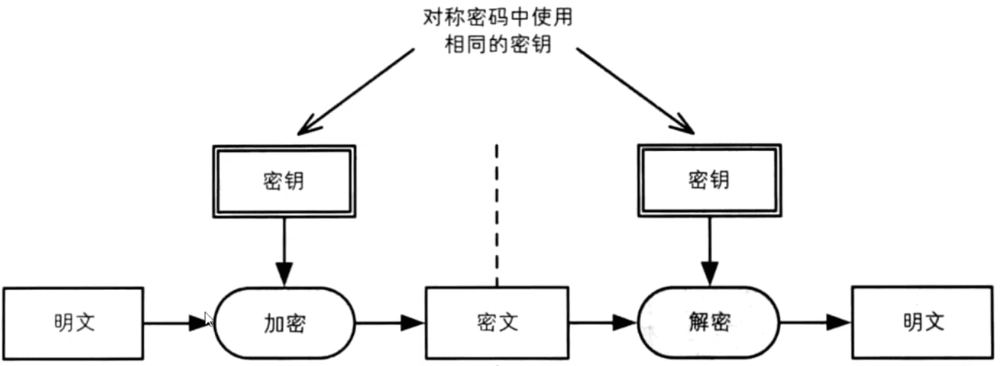

##### DES（Data Encryption Standard）

 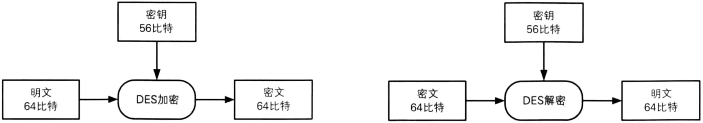

- DES是一 种将64bit明文加密成64bit密文的对称加密算法，密钥长度是56bit
- 规格上来说，密钥长度是64bit,但每隔7bit会设置一个用于错误检查的bit,因此密钥长度实质上是56bit
- 由于DES每次只能加密64bit的数据，遇到比较大的数据，需要对DES加密进行迭代(反复)
- 目前已经可以在短时间内被破解，所以不建议使用

##### 3DES (Triple Data Encryption Algorithm)

- 3DES，将DES重复3次所得到的一种密码算法，也叫做3重DES
  - 三重DES并不是进行三次DES加密(加密>加密→加密)
  - 而是加密(Encryption) > 解密(Decryption) > 加密(Encryption)的过程
- 目前还被一些银行等机构使用，但处理速度不高，安全性逐渐暴露出问题

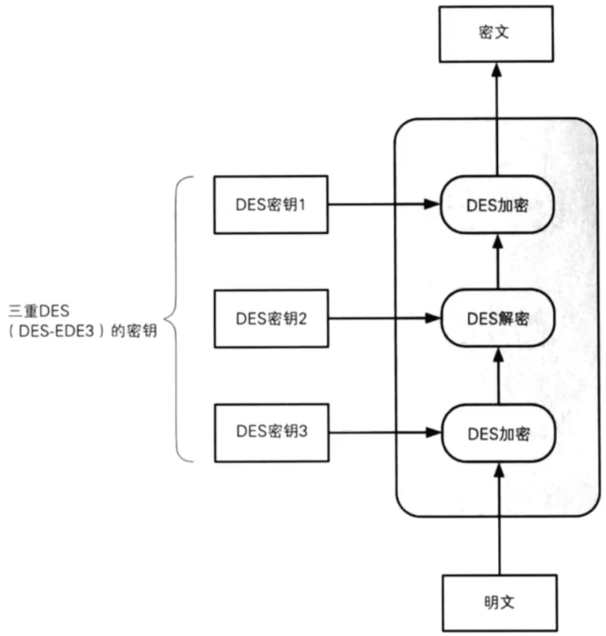

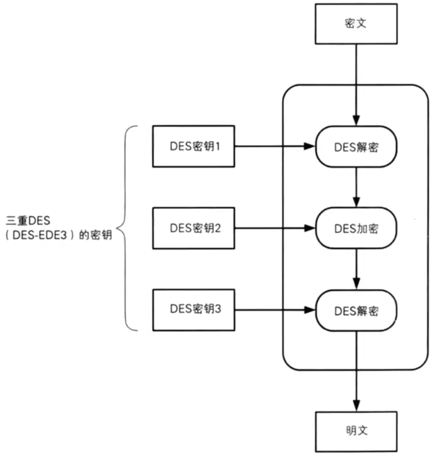

- 3个密钥都是不同的，也称为DES-EDE3
- 如果所有密钥都使用同一个，则结果与普通的DES是等价的

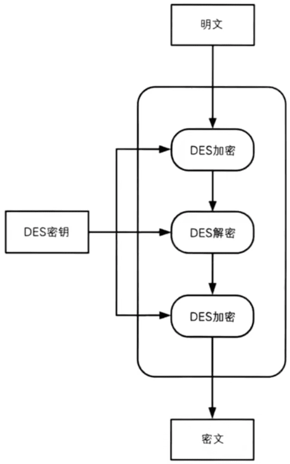

- 如果密钥1、密钥3相同，密钥2不同，称为DES-EDE2

##### AES (Advanced Encryption Standard)

- 取代DES成为新标准的一种对称加密算法，又称Rijndael加密法
- AES的密钥长度有128、192、 256bit三种
- 目前AES,已经逐步取代DES、3DES, 成为首选的对称加密算法
- 一般来说，我们也不应该去使用任何自制的密码算法，而是应该使用AES
  - 它经过了全世界密码学家所进行的高品质验证工作

#### 秘钥配送

##### 秘钥配送问题

- 在使用对称加密时，一定会遇到密钥配送问题
- 如果Alice将使用对称加密过的消息发给了Bob
  - 只有将密钥发送给Bob, Bob才能完成解密
  - 在发送密钥过程中
    - 可能会被Eve窃取密钥
    - 最后Eve也能完成解密

##### 如何解决秘钥配送问题

- 有以下几种解决密钥配送的方法
  - 事先共享密钥(比如私下共享)
  - 密钥分配中心(Key Distribution Center, 简称KDC)
  - Diffie-Hellman密钥交换
  - 非对称加密

#### 非对称加密（公钥密码）

##### 非对称加密(Asymmetric Cryptography )

- 在非对称加密中，密钥分为加密密钥、解密密钥2种，它们并不是同一个密钥
- 加密密钥：一般是公开的，因此该密钥称为公钥(public key)
  - 因此，非对称加密也被称为公钥密码(Public-key Cryptography)
- 解密密钥：由消息接收者自己保管的，不能公开，因此也称为私钥(private key)

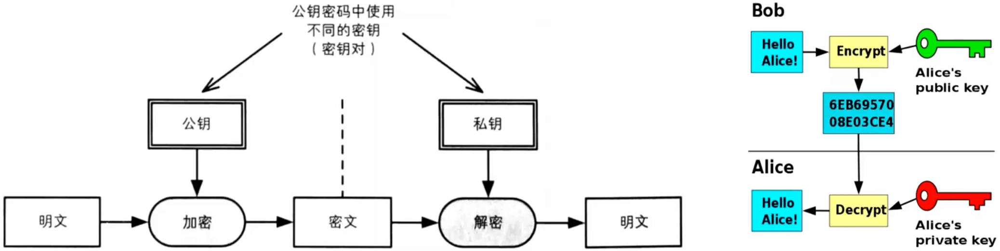

##### 公钥、私钥

- 公钥和私钥是一一对应的， 不能单独生成
  - 一对公钥和私钥统称为密钥对(key pair)
- 由公钥加密的密文，必须使用与该公钥对应的私钥才能解密
- 由私钥加密的密文，必须使用与该私钥对应的公钥才能解密

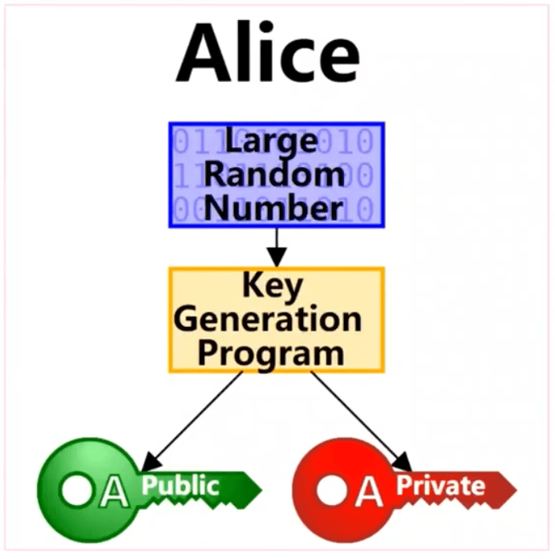

##### 解决密钥配送问题

- 由消息的接收者，生成一对公钥、私钥
- 将公钥发给消息的发送者
- 消息的发送者使用公钥加密消息
- 非对称加密的加密解密速度比对称加密要慢

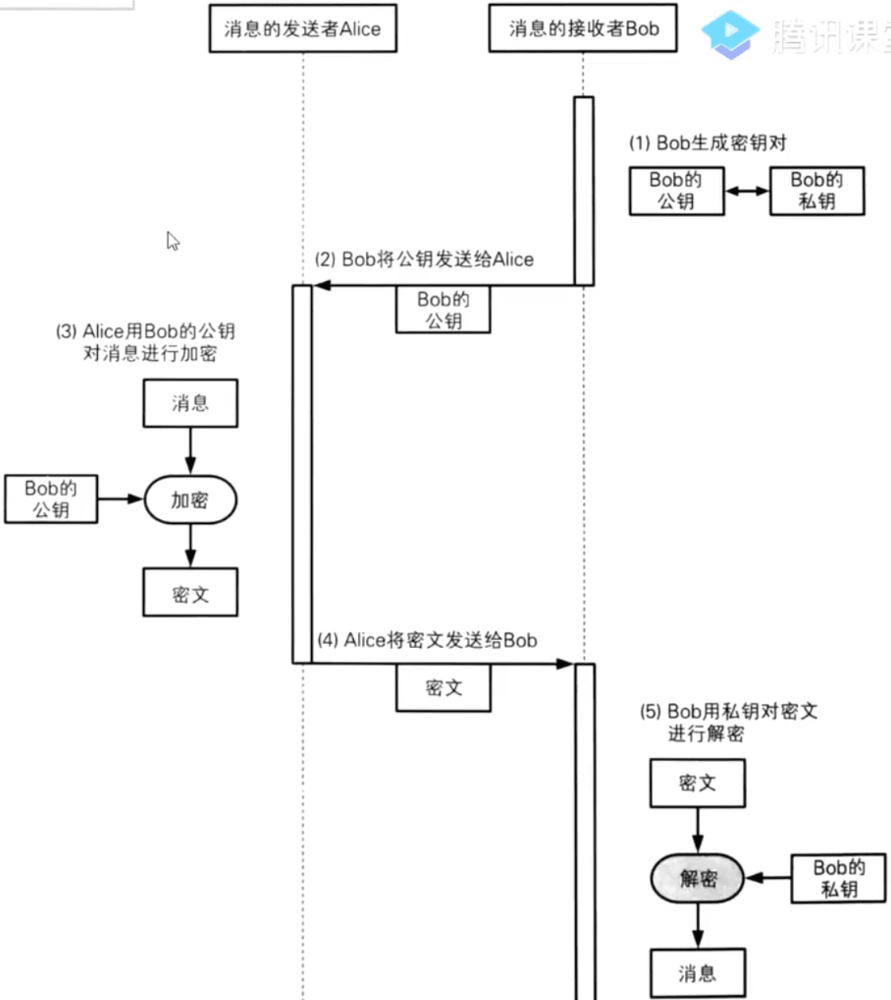

##### RSA

- 目前使用最广泛的非对称加密算法是RSA
- RSA的名字，由它的3位开发者，即Ron Rivest、 Adi Shamir、 Leonard Adleman的姓氏首字母组成

#### 混合密码系统（Hybrid Cryptosystem）

- 对称加密的缺点
  - 不能很好地解决密钥配送问题(密钥会被窃听)
- 非对称加密的缺点
  - 加密解密速度比较慢
- 混合密码系统:是将对称加密和非对称加密的优势相结合的方法
  - 解决了非对称加密速度慢的问题
  - 并通过非对称加密解决了对称加密的密钥配送问题
- 网络上的密码通信所用的SSL/TLS都运用了混合密码系统

##### 加密

- 会话密钥(session key)
  - 为本次通信随机生成的临时密钥
  - 作为对称加密的密钥，用于加密消息，提高速度
- 加密步骤(发送消息)
  - ①首先，消息发送者要拥有消息接收者的公钥
  - ②生成会话密钥，作为对称加密的密钥，加密消息
  - ③用消息接收者的公钥，加密会话密钥
  - ④将前2步生成的加密结果，一并发给消息接收者
- 发送出去的内容包括
  - 用会话密钥加密的消息(加密方法：对称加密)
  - 用公钥加密的会话密钥(加密方法：非对称加密)

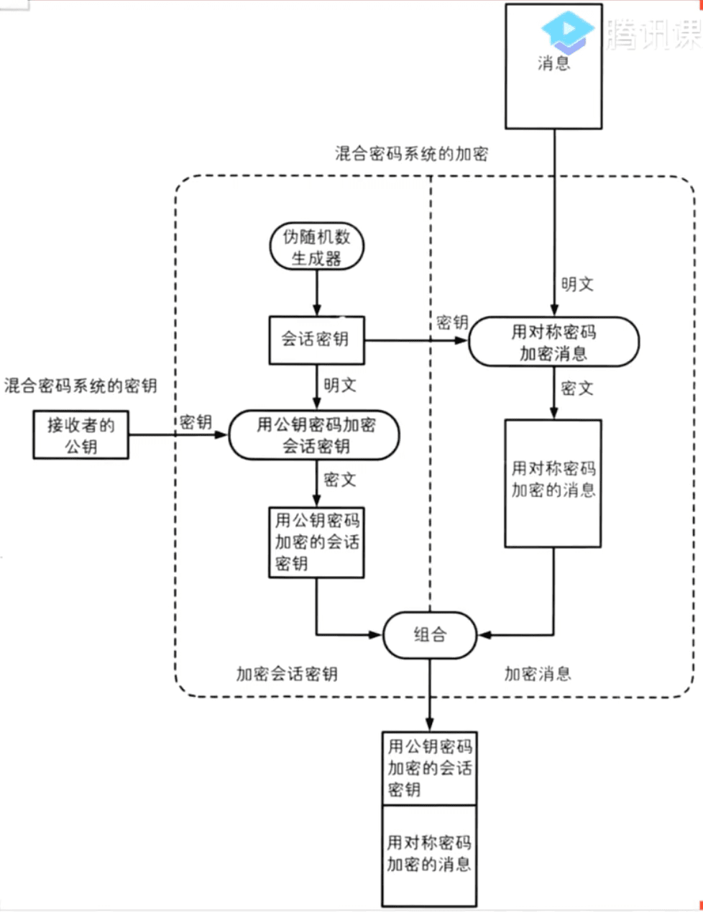

##### 解密

- 解密步骤(收到消息)
  - ①消息接收者用自己的私钥解密出会话密钥
  - ②再用第①步解密出来的会话密钥，解密消息

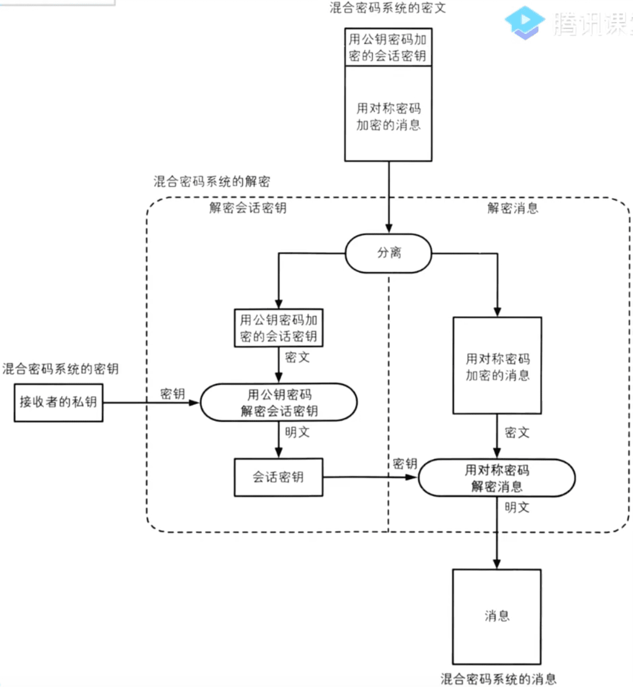

##### 加密解密流程

- Alice >>>>>> Bob
  - 发送过程(加密过程)
    - ①Bob先生成一对公钥、私钥
    - ②Bob把公钥共享给Alice
    - ③Alice随机生成一个会话密钥(临时密钥)
    - ④Alice用会话密钥加密需要发送的消息(使用的是对称加密)
    - ⑤Alice用Bob的公钥加密会话密钥(使用的是非对称加密)
    - ⑥Alice把第④、⑤步的加密结果，一并发送给Bob
  - 接收过程(解密过程)
    - ①Bob利用自己的私钥解密会话密钥(使用的是非对称加密算法进行解密)
    - ②Bob利用会话密钥解密发送过来的消息(使用的是对称加密算法进行解密)

#### 公钥、私钥再总结

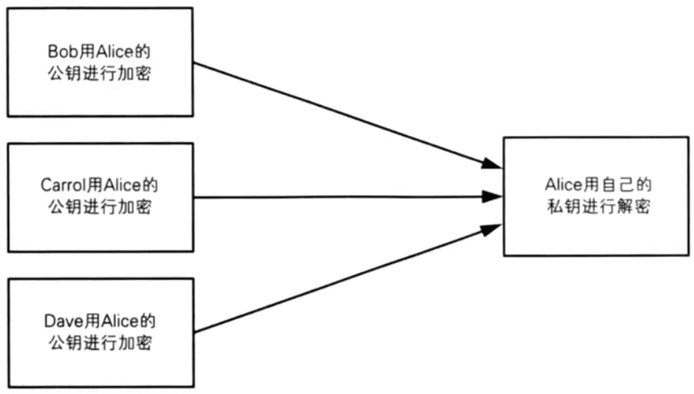

在**非对称加密**中，任何人都可以使用公钥进行加密

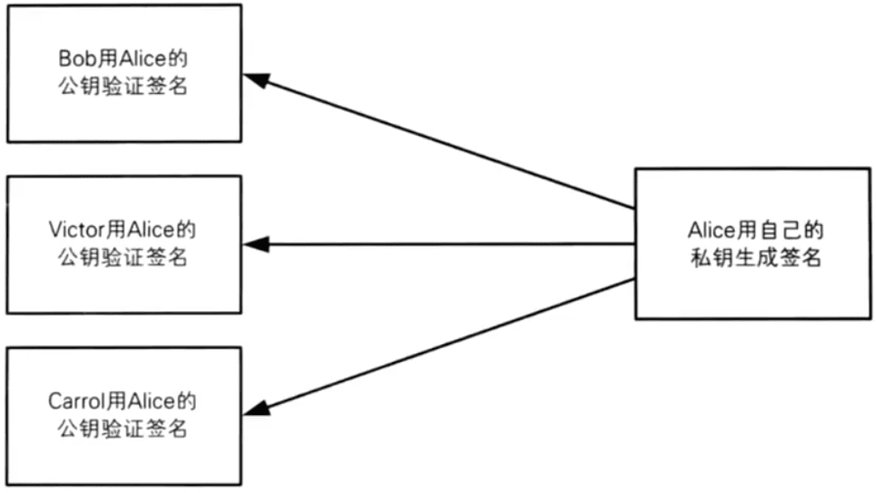

在**数字签名**中，任何人都可以使用公钥验证签名

- 数字签名，其实就是将非对称加密反过来使用

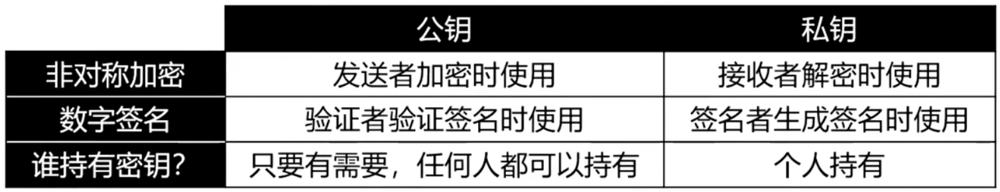

- 既然是加密，那肯定是不希望别人知道我的消息，所以只有我才能解密
  - 公钥负责加密，私钥负责解密
- 既然是签名，那肯定是不希望有人冒充我发消息，所以只有我才能签名
  - 私钥负责签名，公钥负责验签

### 数字签名

#### 想象以下场景

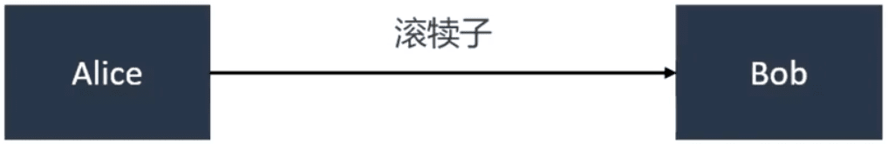

- Alice发的内容有可能是被篡改的，或者有人伪装成Alice发消息，或者就是Alice发的,但她可以否认
- 问题来了: Bob如何确定这段消息的真实性?如何识别篡改、伪装、否认?
- 解决方案
  - 数字签名

#### 数字签名

- 在数字签名技术中，有以下2种行为
  - 生成签名
    - 由消息的发送者完成，通过"签名密钥”生成
  - 验证签名
    - 由消息的接收者完成，通过“验证密钥”验证
  - 如何能保证这个签名是消息发送者自己签的?
    - 用消息发送者的私钥进行签名

#### 过程

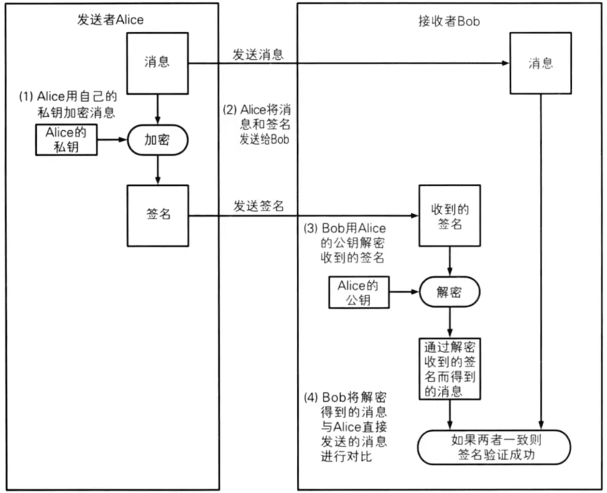

#### 改进过程

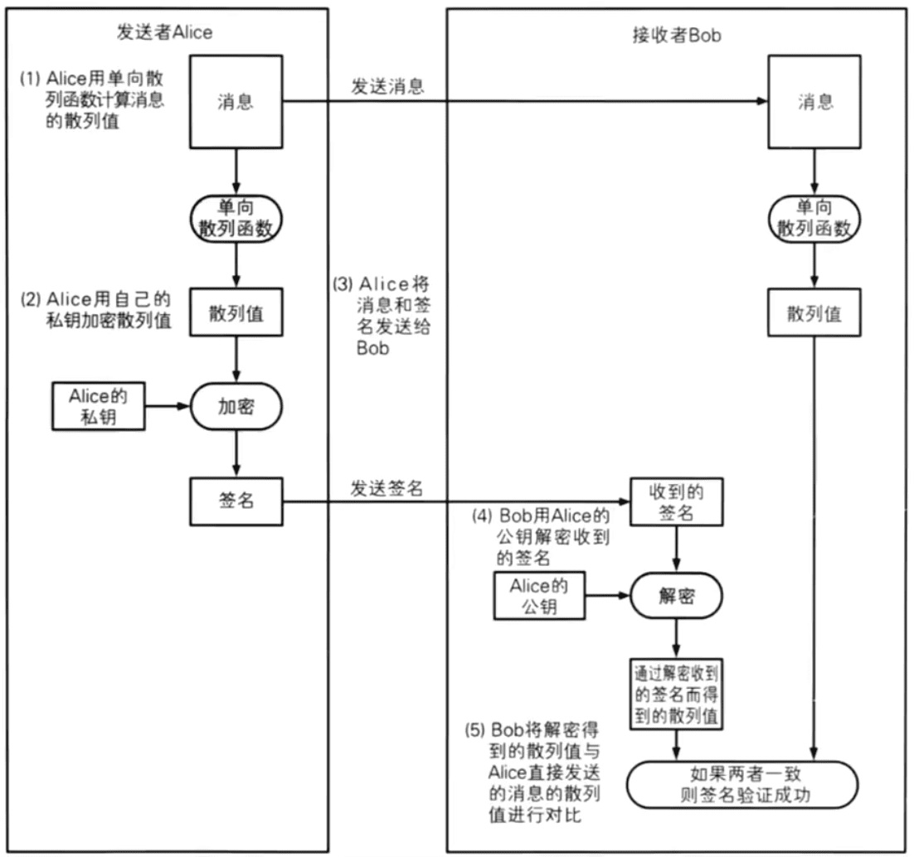

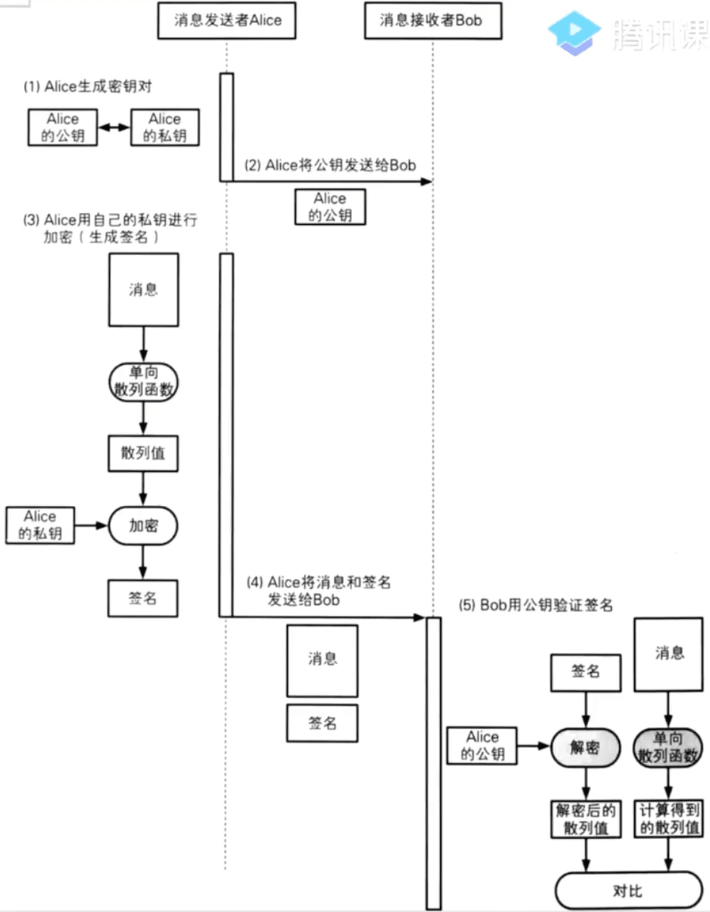

#### 疑惑

- 如果有人篡改了消息内容或签名内容,会是什么结果?
  - 签名验证失败，证明内容被篡改了
- 数字签名不能保证机密性?
  - 数字签名的作用不是为了保证机密性，仅仅是为了能够识别内容有没有被篡改
- 数字签名的作用
  - 确认消息的完整性
  - 识别消息是否被篡改
  - 防止消息发送人否认 

### 证书

#### 公钥的合法性

- 如果遭遇了中间人攻击，那么
  - 公钥将可能是伪造的
- 如何验证公钥的合法性?
  - 证书

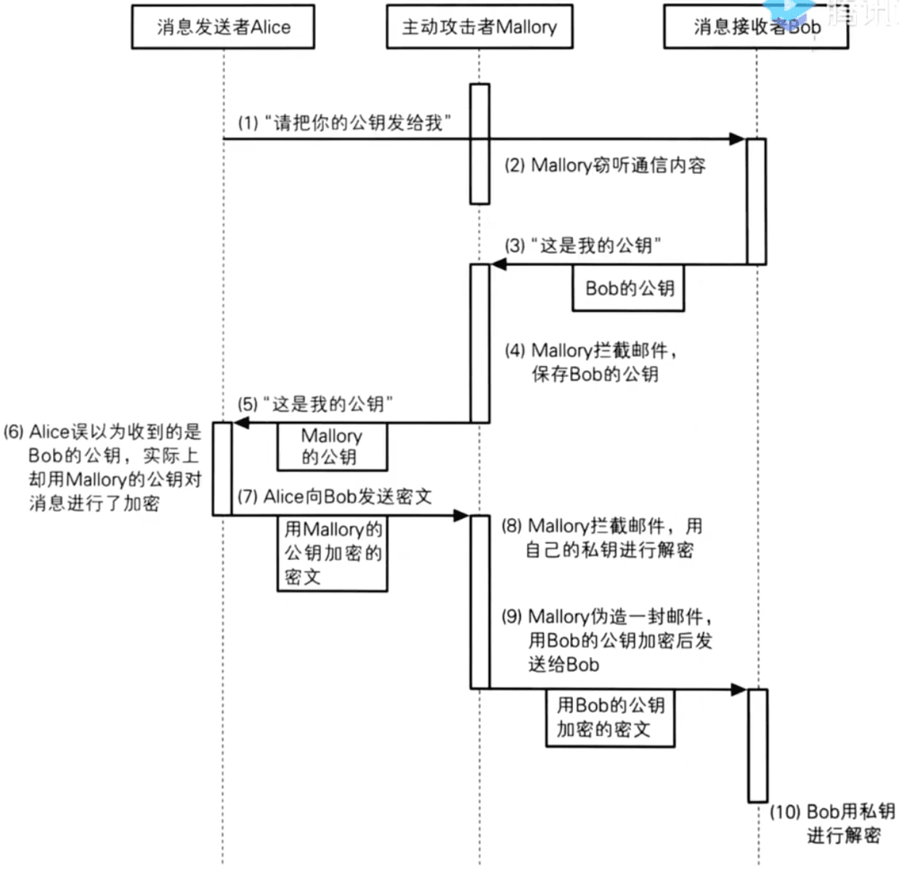

#### 证书 (Certificate)

- 说到证书
  - 首先联想到的是驾驶证、毕业证、英语四六级证等等，都是由权威机构认证的
- 密码学中的证书，全称叫公钥证书(Public-key Certificate, PKC)，跟驾驶证类似
  - 里面有姓名、邮箱等个人信息，以及此人的公钥
  - 并由认证机构(Certificate Authority, CA) 施加数字签名
- CA就是能够认定"公钥确实属于此人”并能够生成数字签名的个人或者组织
  - 有国际性组织、政府设立的组织
  - 有通过提供认证服务来盈利的企业
  - 个人也可以成立认证机构

#### 使用

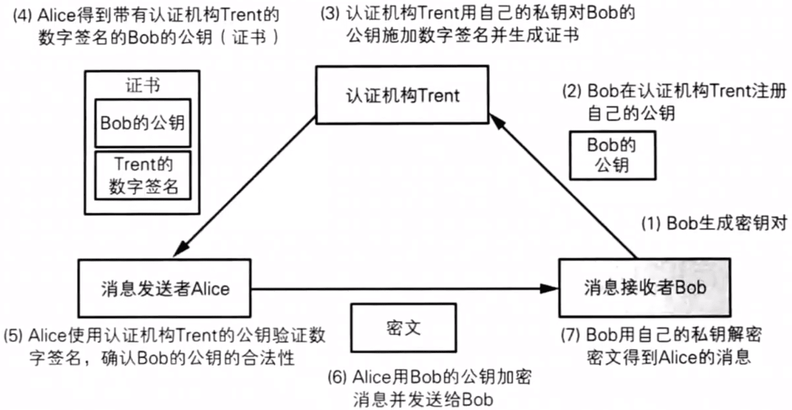

- 各大CA的公钥，默认已经内置在浏览器和操作系统中

通过证书拿到bob的公钥，防止中间人篡改公钥

#### 注册和下载

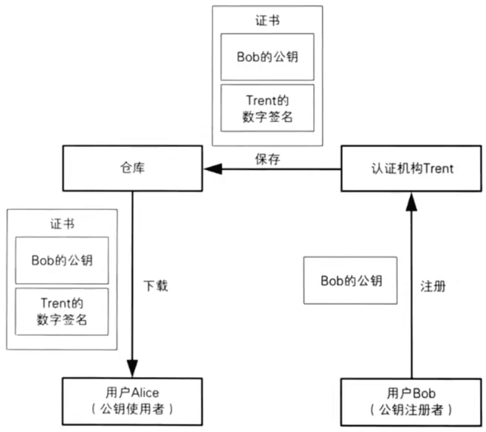

#### 查看Windos已经信任的合法证书

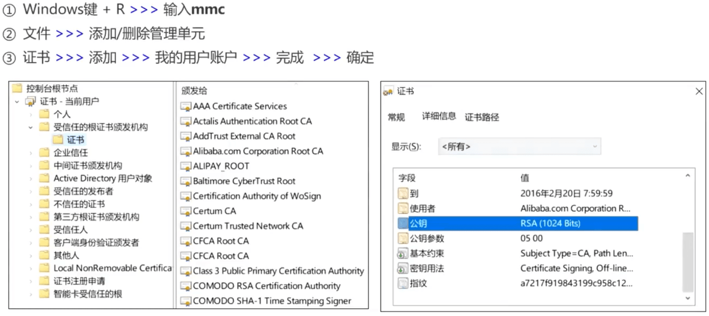

