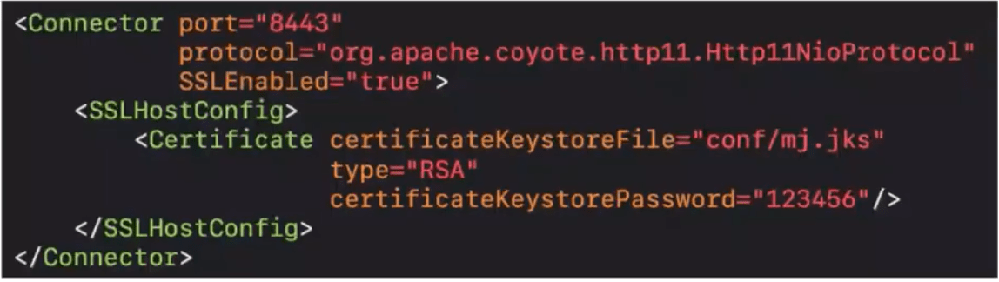

##  HTTPS

- HTTPS (HyperText Transfer Protocol Secure)，译为:超文本传输安全协议
  - 常称为HTTP over TLS、HTTP over SSL、HTTP Secure
  - 由网景公司于1994年首次提出

- HTTPS的默认端口号是443 (HTTP是80)
- 现在在浏览器上输入http://www.baidu.com
  - 会自动重定向到https://www.baidu.com

## SSL/TLS

- HTTPS是在HTTP的基础上使用SSL/TLS来加密报文，对窃听和中间人攻击提供合理的防护

- SSL/TLS也可以用在其他协议上，比如
  - FTP -> FTPS
  - SMTP ->SMTPS

- TLS (Transport Layer Security)， 译为:传输层安全性协议
  - 前身是SSL (Secure Sockets Layer)，译为:安全套接层
- 历史版本信息
  - SSL 1.0:因存在严重的安全漏洞，从未公开过
  - SSL 2.0: 1995年，已于2011年弃用(RFC 6176)
  - SSL 3.0: 1996年，已于2015年弃用(RFC 7568)
  - TLS 1.0: 1999年(RFC 2246)
  - TLS 1.1: 2006年(RFC 4346)
  - TLS 1.2: 2008年(RFC 5246)
  - TLS 1.3: 2018年(RFC 8446)
    - 有没有发现: TLS的RFC文档编号都是以46结尾

### SSL/TLS工作在哪一层？

## OpenSSL

- OpenSSL是SSL/TLS协议的开源实现，始于1998年，支持Windows、Mac、 Linux等平台
  - Linux、Mac一般自带OpenSSL
  - Windows下载安装OpenSSL: https://slproweb.com/products/Win32OpenSSL.html
- 常用命令
  - 生成私钥: openssI genrsa -out mj.key
  - 生成公钥: openssI rsa -in mj.key -pubout -out mj.pem
- 可以使用OpenSSL构建一套属于自己的CA, 自己给自己颁发证书,称为“自签名证书”

## HTTPS的成本

- 证书的费用
- 加解密计算
- 降低了访问速度
- 有些企业的做法是:包含敏感数据的请求才使用HTTPS,其他保持使用HTTP
  - http://www.icbc.com.cn/
  - https://mybank.icbc.com.cn/

## HTTPS通信过程

- 总的可以分为3大阶段
  - TCP的3次握手
  - TLS的连接
  - HTTP请求和响应

## TLS 1.2的连接

- 大概是有10大步骤
- 图片中省略了中间产生的一些ACK确认

- ①Client Hello
  - TLS的版本号
  - 支持的加密组件(Cipher Suite)列表
    - 加密组件是指所使用的加密算法及密钥长度等
  - 一个随机数(Client Random)

- ②Server Hello
  - TLS的版本号
  - 选择的加密组件
    - 是从接收到的客户端加密组件列表中挑选出来的
  - 一个随机数(Server Random)

**如果秘钥交换算法不是ECDHE流程可能不同**

- ③Certificate
  - 服务器的公钥证书(被CA签名过的)

- ④Server Key Exchange
  - 用以实现ECDHE算法的其中一个参数(Server Params)
    - ECDHE是一 种密钥交换算法
    - 为了防止伪造，Server Params经过了服务器私钥签名

- ⑤Server Hello Done
  - 告知客户端:协商部分结束

- 目前为止，客户端和服务器之间通过明文共享了
  - Client Random, Server Random, Server Params

- 而且，客户端也已经拿到了服务器的公钥证书，接下来，客户端会验证证书的真实有效性

- ⑥Client Key Exchange
  - 用以实现ECDHE算法的另一个参数(Client Params)

- 目前为止，客户端和服务器都拥有了ECDHE算法需要的2个参数:Server Params. Client Params
- 客户端、服务器都可以
  - 使用ECDHE算法根据Server Params、Client Params计算出一个新的随机密钥串: Pre-master secret
  - 然后结合Client Random、Server Random、Pre-master secret生成一个主密钥
  - 最后利用主密钥衍生出其他密钥:客户端发送用的会话密钥、服务器发送用的会话密钥等
  - 在客户端可以生产客户端发送消息的密钥和服务器发送消息的密钥，在服务器也能生成客户端发送消息的密钥和服务器发送消息的密钥，因为是对称密钥，所以相同。客户端发送消息时，用客户端发送消息的密钥加密，服务器用客户端发送消息的密钥加密解密。

- ⑦Change Cipher Spec
  - 告知服务器:之后的通信会采用计算出来的会话密钥进行加密

- ⑧Finished
  - 包含连接至今全部报文的整体校验值(摘要)，加密之后发送给服务器
  - 这次握手协商是否成功，要以服务器是否能够正确解密该报文作为判定标准

- ⑨Change Cipher Spec
- ⑩Finished
  - 到此为止，客户端服务器都验证加密解密没问题,握手正式结束
  - 后面开始传输加密的HTTP请求和响应

## Wireshark解密HTTPS

- 设置环境变量SSLKEYLOGFILE (浏览器会将key信息导出到这个文件)

- 设置完成后，最好重启一下操作系统
- 在Wireshark中选择这个文件
  - 编辑→首选项→Protocols→TLS .

## 配置服务器HTTPS

### 生成证书

- 环境： Tomcat9.0.34、JDK1.8.0_251
- 首先，使用JDK自带的keytool生成证书(一个生成免费证书的网站: https://freessl.org/)
  - keytool -genkeypair -alias mj -keyalg RSA -keystore F:/mj.jks

### 配置Tomcat

- 将证书*.jks文件放到TOMCAT HOME/conf目录下

- 修改TOMCAT_HOME/conf/server.xml中的Connector

- 重启TOMCAT