## WebSocket

### WebSocket

- WebSocket，是基于TCP的支持全双工通信的应用层协议
  - 在2011年由IETF标准化为RFC 6455，后由RFC 7936补充规范
  - 客户端、服务器，任何一方都可以主动发消息给对方
- WebSocket的应用场景很多
  - 社交订阅、股票基金报价、体育实况更新、多媒体聊天、多玩家游戏等

### HTTP VS WebSocket

- HTTP请求的特点:通信只能由客户端发起。所以，早期很多网站为了实现推送技术，所用的技术都是轮询
  - 轮询是指由浏览器每隔一-段时间(如每秒)向服务器发出HTTP请求，然后服务器返回最新的数据给客户端
  - 为了能更好的节省服务器资源和带宽，并且能够更实时地进行通讯，HTML5规范中出现了WebSocket协议

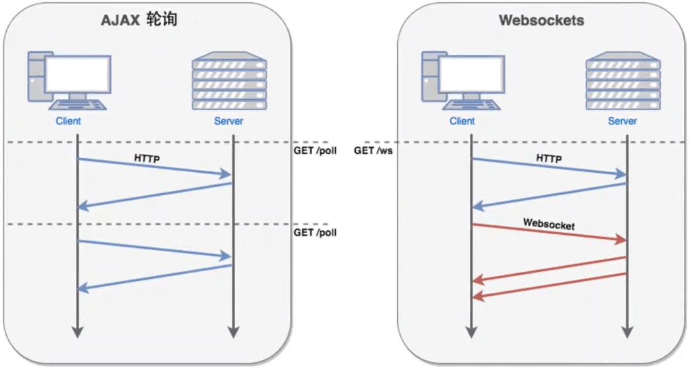

- WebSocket和HTTP属于平级关系，都是应用层的协议
  - 其实TCP本身就是支持全双工通信的(客户端、服务器均可主动发消息给对方)
  - 只是HTTP的“请求-应答模式"限制了TCP的能力
- WebSocket使用80 (ws://)、 443 (wss://) 端口，可以绕过大多数防火墙的限制
  - ws://example.com/wsapi
  - wss://secure.example.com/wsapi
- 与HTTP不同的是，WebSocket需要先建立连接
  - 这里的连接指的是应用层的连接
  - 这就使得WebSocket成为一种有状态的协议，之后通信时可以省略部分状态信息
  - 而HTTP请求可能需要在每个请求都额外携带状态信息(如身份认证等)

### 建立连接

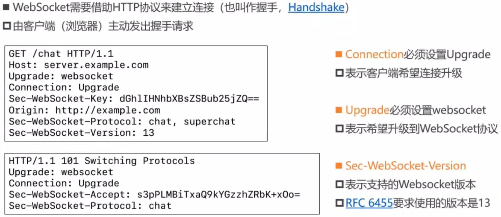

[Handshake](https://tools.ietf.org/html/rfc6455#section-1.3)

### 使用

- WebSocket体验

  - https://www.websocket.org/echo.html

- W3C标准化了一套WebSocket API，可以直接使用JS调用

  

## WebService

- WebSenvice,译为: Web服务,是- -种跨编程语言和跨操作系统平台的远程调用技术标准
- WebService使用场景举例
  - 天气预报、手机归属地查询、航班信息查询、物流信息查询等
  - 比如天气预报，气象局把自己的服务以WebService形式暴露出来,让第三方程序可以调用这些服务功能
  - http://www.webxml.com.cn/zh_cn/index.aspx
- 事实上，WebService完全可以用普通的Web API取代(比如HTTP + JSON)
  - 现在很多企业的开放平台都是直接采用Web API

### 核心概念

- SOAP (Simple Object Access Protocol)， 译为:简单对象访问协议
  - 很多时候，SOAP = HTTP + XML
  - WebService使用SOAP协议来封装传递数据

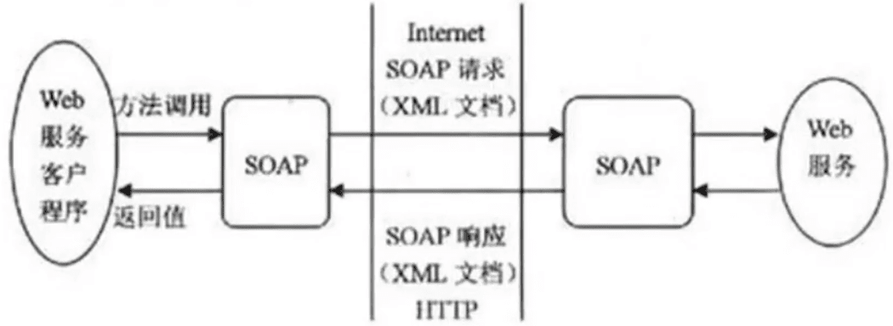

- WSDL (Web Services Description Language)， 译为: Web服务描述语言
  - 一个XML文档，用以描述WebService接口的细节(比如参数、返回值等)
  - 一般在WebService的URL后面跟上*?wsdl*获取WSDL信息
    - 比如: http://ws.webxml.com.cn/WebServices/WeatherWS.asmx?wsdl

- 现在基本使用JSON

## RESTful

### 简介

- REST的全称是: REpresentational State Transfer
  - 译为“表现层状态转移”
- REST是一 种互联网软件架构设计风格
  - 定义了一-组用于创建Web服务的约束
  - 符合REST架构的Web服务,称为RESTful Web服务

### 实践建议

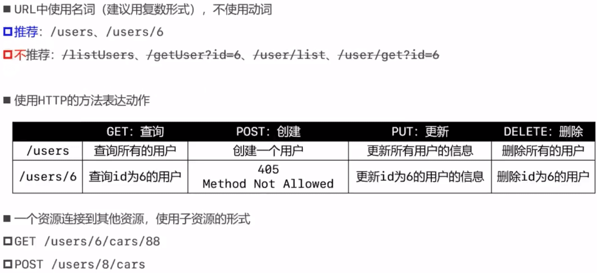

- API版本化
  - mj.com/v1/users
  - mj.com/v2/users/66
- 返回JSON格式的数据
- 发生错误时，不要返回200状态码

## HTTPDNS

- HTTPDNS是基于HTTP协议向DNS服务器发送域名解析请求
  - 替代了基于DNS协议向运营商Local DNS发起解析请求的传统方式
  - 可以避免Local DNS造成的域名劫持和跨网访问问题
  - 常用在移动互联网中(比如在Android、iOS开发中)

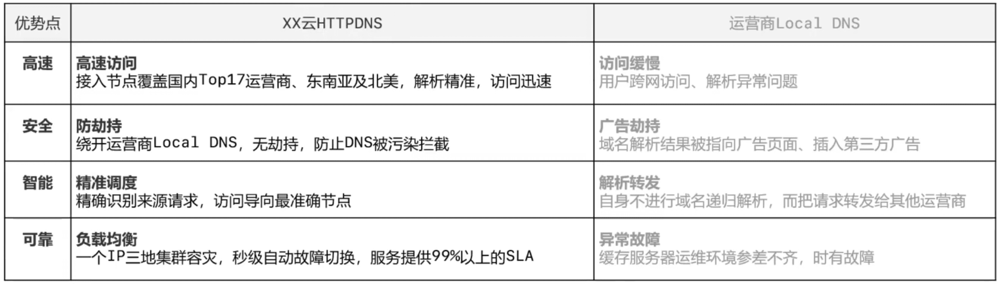

### 使用

- 市面上已经有现成的解决方案
  - 腾讯云: https://cloud.tencent.com/product/httpdns
  - 阿里云: https://help.aliyun.com/product/30100.html
- 移动端集成相关的SDK即可使用HTTPDNS服务

## FTP

- FTP (File Transport Protocol) ，译为:文件传输协议，RFC 959定义了此规范,是基于TCP的应用层协议
  - 在RFC 1738中有定义，FTP的URL格式为: ftp://[user[:password]@]host[:port]/url-path

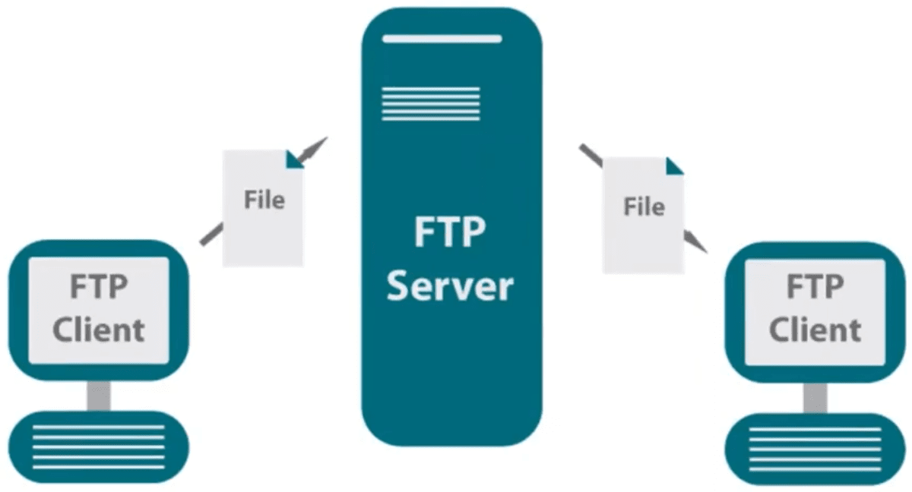

### 连接模式

- FTP有2种连接模式:主动(Active) 和被动(Passive)
- 不管是哪种模式，都需要客户端和服务器建立2个连接
  - ①控制连接:用于传输状态信息(命令, cmd)
  - ②数据连接:用于传输文件和目录信息(data)

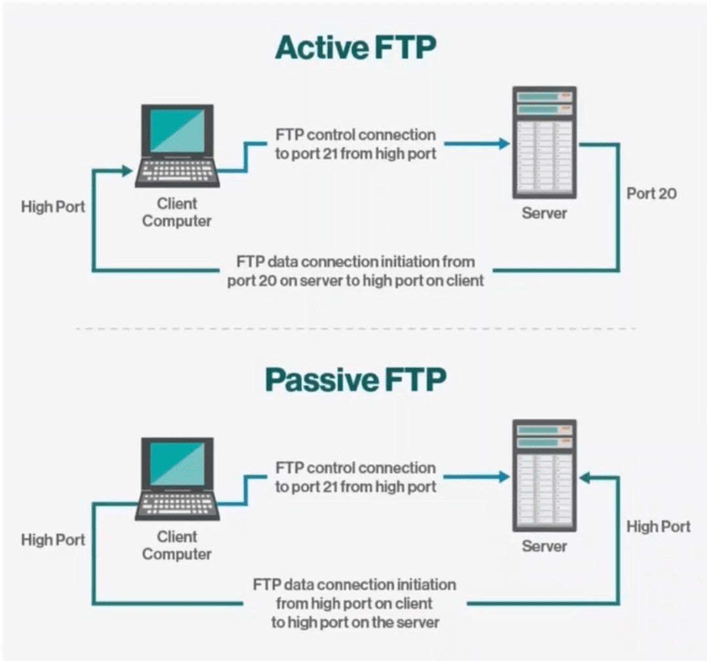

#### 主动模式

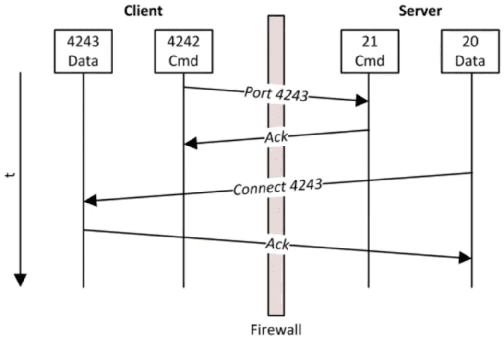

- ①客户端打开一个随机的命令端口
  - 端口号大于1024,假设为N 
  - 同时连接至服务器的命令端口21
- ②客户端开始监听N + 1数据端口
  - 同时向服务器发送一个Port命令给服务器的命令端口21
  - 此命令告诉服务器
    - 客户端正在监听的数据端口N + 1
    - 并且已准备好从此端口接收数据

- ③服务器打开20号数据端口，并且创建和客户端数据端口(N+1) 的连接

#### 被动模式

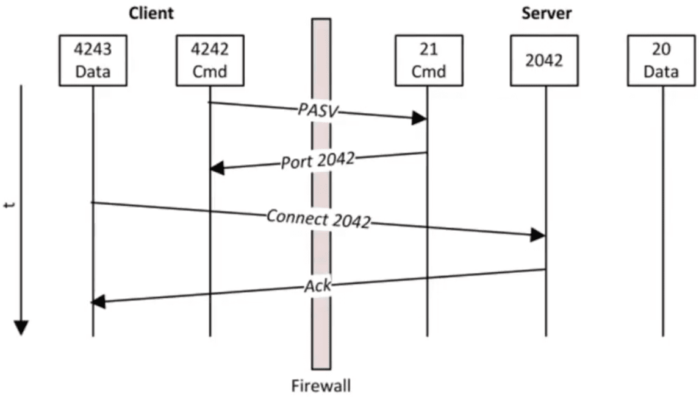

- 客户端通过两个随机的端口与服务器建立连接
  - 命令端口N
  - 数据端口N+1

- ①客户端的命令端口N用于连接服务器的命令端口21
- ②客户端通过命令端口N发送PASV命令给服务器的命令端口21
- ③服务器打开一个随机的数据端口P，并告知客户端该端口号P
- ④客户端数据端口N+ 1发起与服务器数据端口P的连接

## 邮件相关协议

- 发邮件使用的协议
  - SMTP (Simple Mail Transfer Protocol)，译为:简单邮件传输协议
    - 基于TCP，标准参考RFC 5321
    - 服务器默认使用25端口，SSL/TLS使用465端口
- 收邮件使用的协议
  - POP (Post Office Protocol)，译为:邮局协议
    - 基于TCP，最新版是POP3,标准参考RFC 1939
    - 服务器默认使用110端口，SSL/TLS使用995端口
  - IMAP (Internet Message Access Protocol)，译为:因特网信息访问协议
    - 基于TCP，最新版是IMAP4,标准参考RFC 3501
    - 服务器默认使用143端口，SSL/TLS使用993端口

### 发邮件的过程

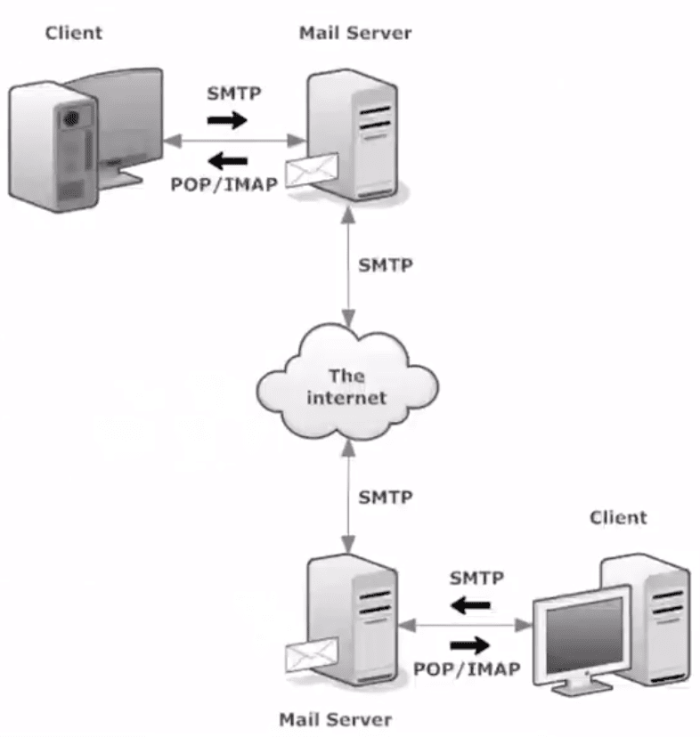

POP VS IMAP

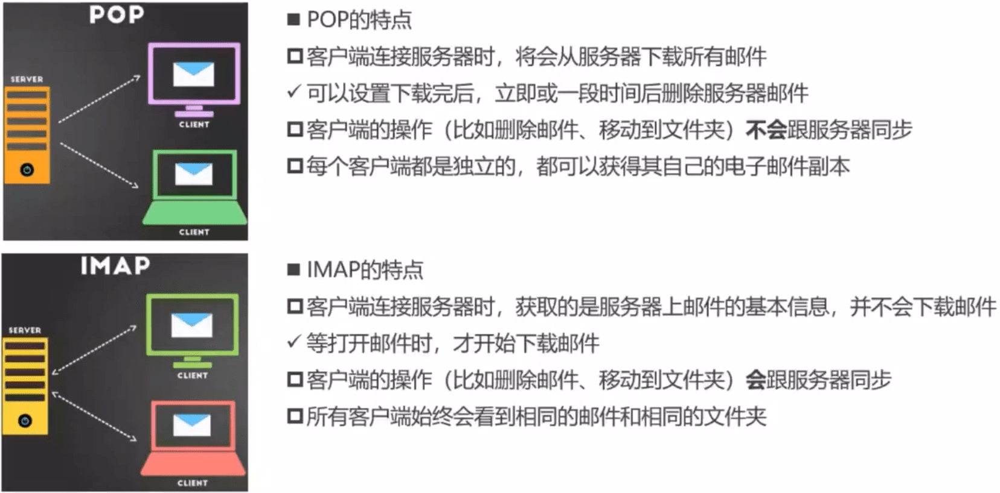

## IPV6

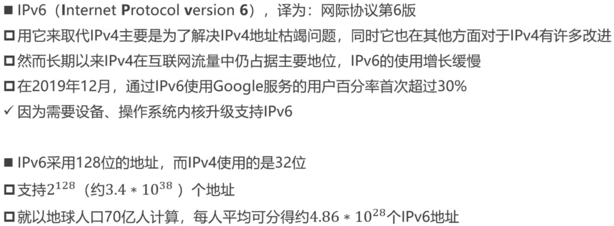

### 地址格式

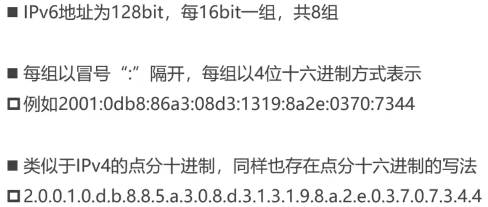

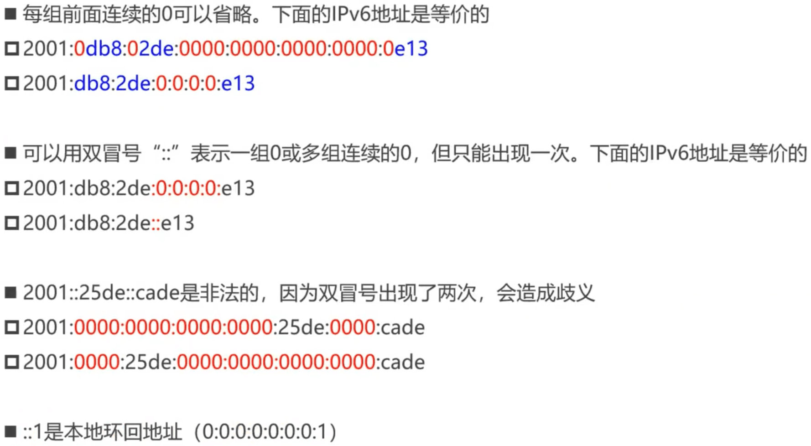

### 首部格式

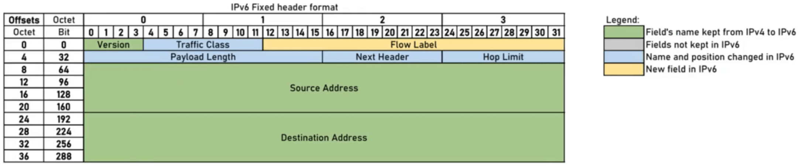

- 有40字节的固定首部

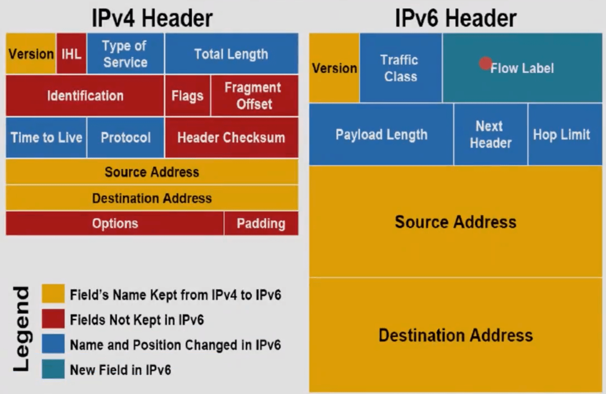

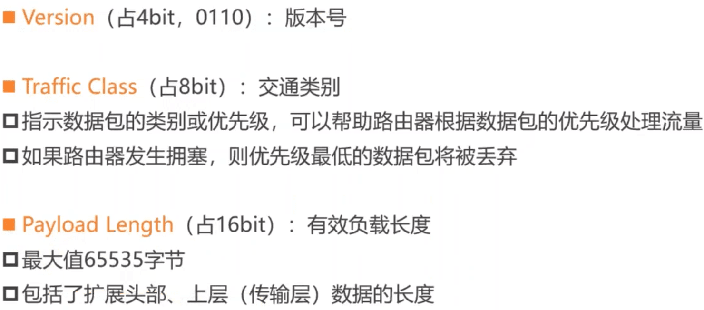

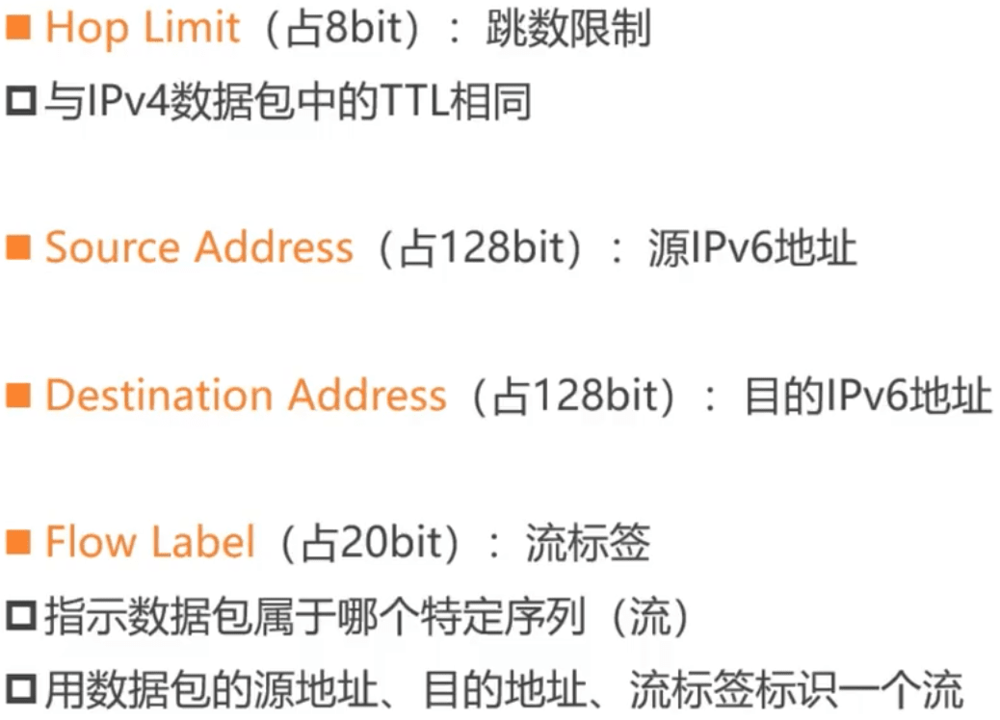

### 扩展头部

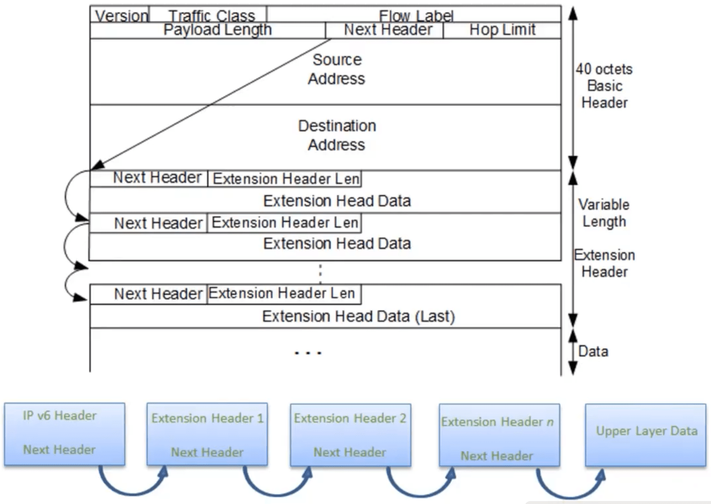

- Next Header (占8bit) ：下一个头部
  - 指示扩展头部(如果存在)的类型、上层数据包的协议类型 (例如TCP、 UDP、 ICMPv6)

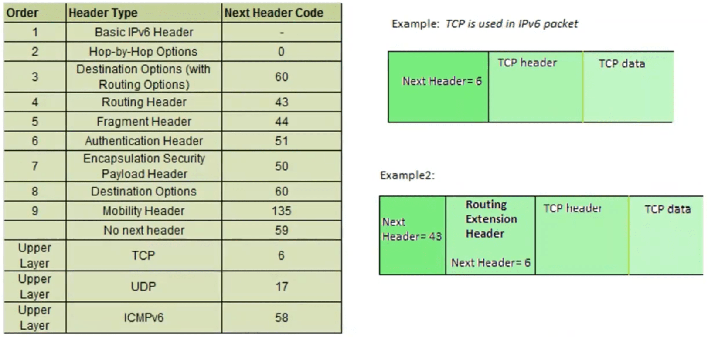

## 即时通讯

- 即时通信(Instant Messaging，简称IM)， 平时用的QQ、 微信，都属于典型的IM应用
- 国内的IM开发者社区
  - http://www.52im.net/
- IM云服务
  - 网易云信、腾讯云、环信等
- 常用的协议
  - XMPP、MQTT、自定义协议

### XMPP

- XMPP (Extensible Messaging and Presence Protocol)
  - 译为:可扩展消息与存在协议，前身是Jabber
  - 基于TCP，默认端口5222、5269
- 特点
  - 使用XML格式进行传输，体积较大
  - 比较成熟的IM协议，开发者接入方便，

### MQTT

- MQTT (Message Queuing Telemetry Transport)，译为:消息队列遥测传输
  - 基于TCP，默认端口1883、8883 (带SSL/TLS)
- 特点
  - 开销很小，以降低网络流量,信息冗余远小于XMPP
  - 不是专门为IM设计的协议,很多功能需要自己实现
  - 很多人认为MQTT是最适合物联网(IoT, Internet of Things)的网络协议

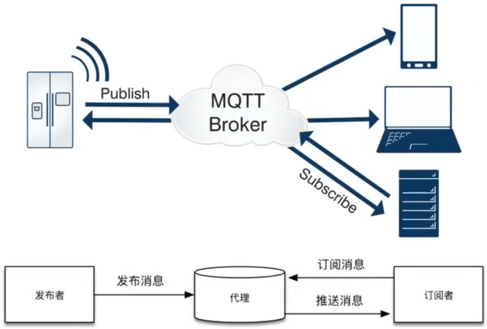

- 发布者:客户端
- 代理: 服务器
- 订阅者:客户端

## 流媒体

- 流媒体(Streaming Media)，又叫流式媒体
  - 是指将一连串的多媒体数据压缩后，经过互联网分段发送数据，在互联网上即时传输影音以供观赏的一种技术
  - 此技术使得资料数据包得以像流水一样发送， 不使用此技术，就必须在使用前下载整个媒体文件

- RTP (Real-Time Transport Protocol) ,译为:实时传输协议
  - 参考: RFC 3550、RFC 3551,基于UDP
- RTCP (Real-Time Transport Control Protocol)， 译为:实时传输控制协议
  - 参考: RFC 3550，基于UDP,使用RTP的下一个端口
- RTSP (Real-Time Streaming Protocol)，译为:实时流协议，参考: RFC 7820
  - 基于TCP、UDP的554端口
- RTMP (Real-Time Messaging Protocol)， 译为:实时消息传输协议，由Adobe公司出品
  - 默认基于TCP的1935端口
- HLS (HTTP Live Streaming) ，基于HTTP的流媒体网络传输协议，苹果公司出品，参考: RFC 8216

