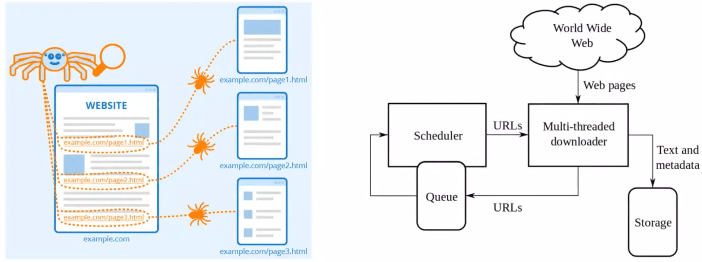
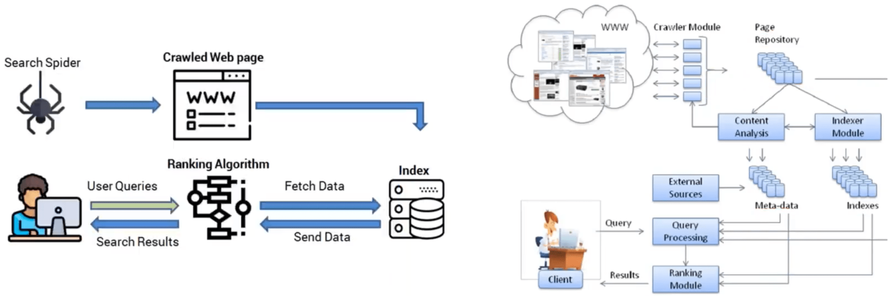
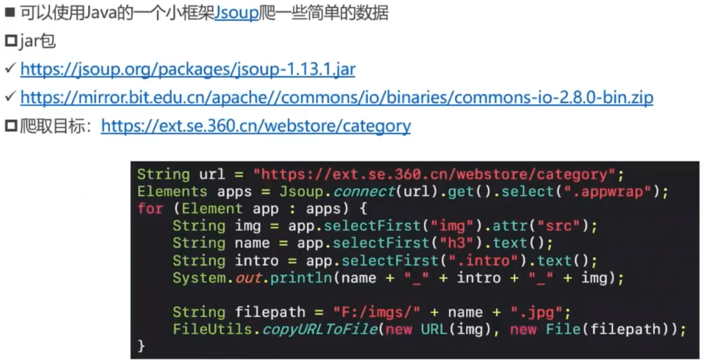
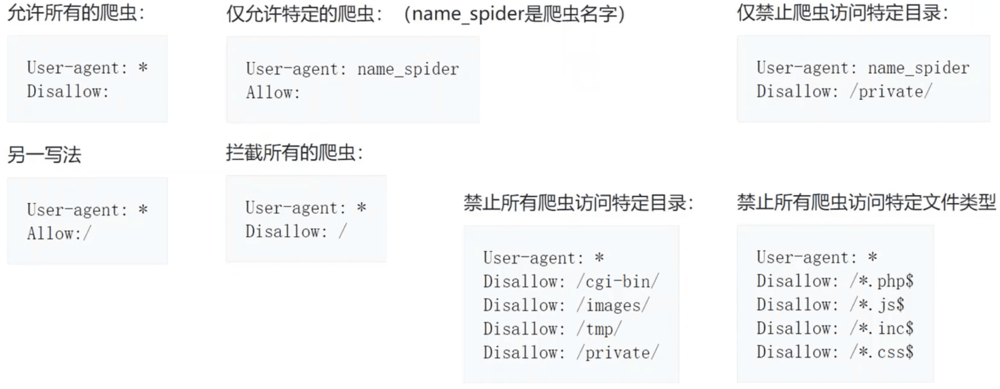
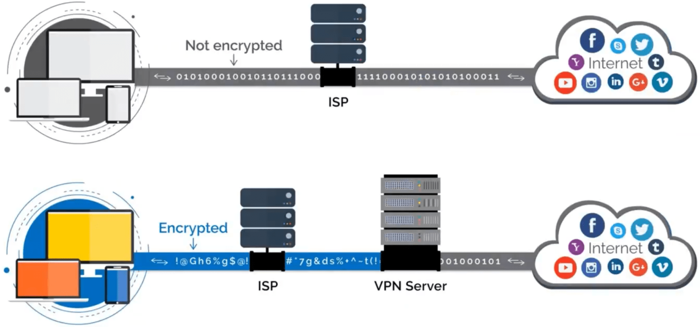
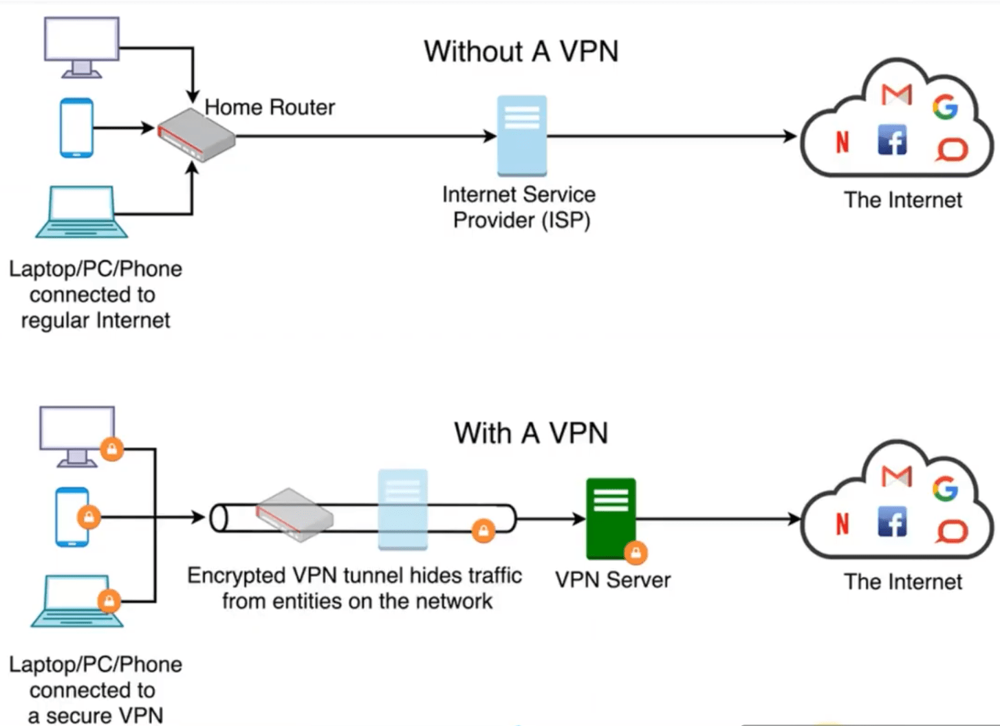
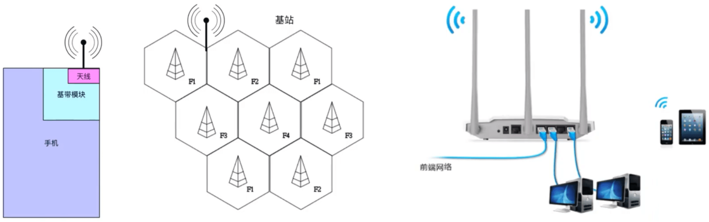

## 网络爬虫

- 网络爬虫(Web Crawler)，也叫做网络蜘蛛(Web Spider)
  - 模拟人类使用浏览器操作页面的行为，对页面进行相关的操作
  - 常用爬虫工具: Python的Scrapy框架

### 搜索引擎

### 简易实例

### robots.txt

- robots.txt是存放于网站根目录下的文本文件，比如https://www.baidu.com/robots.txt
  - 用来告诉爬虫:哪些内容是不应被爬取的，哪些是可以被爬取的
  - 因为一些系统中的URL是大小写敏感的，所以robots.txt的文件名应统一为小写
- 它并不是一个规范，而只是约定俗成的，所以并不能保证网站的隐私
  - 只能防君子，不能防小人
  - 无法阻止不讲“武德”的年轻爬虫爬取隐私信息

## VPN

- VPN (Virtual Private Network)，译为:虚拟私人网络
  - 它可以在公共网络上建立专用网络，进行加密通讯

VPN Server 和服务器都在公司内网。

### 作用

- 提高上网的安全性
- 保护公司内部资料
- 隐藏上网者的身份
- 突破网站的地域限制
  - 有些网站针对不同地区的用户展示不同的内容

- 突破网络封锁
  - 因为有GFW的限制，有些网站在国内上不了
  - Great Firewall of China
  - 中国长城防火墙

### VPN和代理的区别

- 软件
  - VPN一般需要安装VPN客户端软件
  - 代理不需要安装额外的软件
- 安全性
  - VPN默认会对数据进行加密
  - 代理默认不会对数据进行加密(数据最终是否加密取决于使用的协议本身)
- 费用
  - 一般情况下，VPN比代理贵

### 实现原理

- VPN的实现原理是:使用了隧道协议(Tunneling Protocol)
- 常见的VPN隧道协议有
  - PPTP (Point to Point Tunneling Protocol) :点对点隧道协议
  - L2TP (Layer Two Tunneling Protocol) :第二层隧道协议
  - IPsec (Internet Protocol Security) :互联网安全协议
  - SSL VPN (如OpenVPN)
  - ...

## tcpdump

- tcpdump是Linux平台的抓包工具，Windows版本是WinDump
- 使用手册
  - https://www.tcpdump.org/manpages/tcpdump.1.html
- 不错的教程
  - https://danielmiessler.com/study/tcpdump/

## 无线网络

- 无限AP（Access Point）：无线接入点

