# 图解TCP/IP详解（史上最全）

## 一、OSI参考模型

### 1.图示

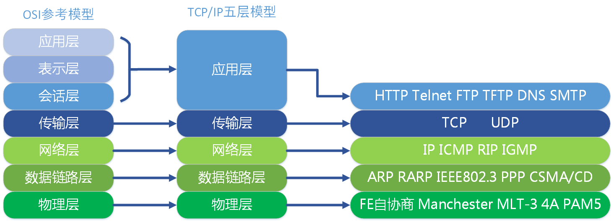

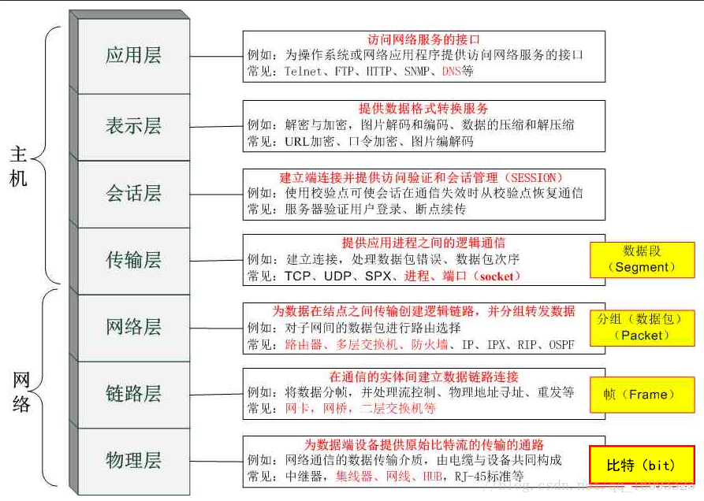

### 2.OSI七层模型各自作用

**应用层**

为应用程序提供服务并规定应用程序中通信的相关细节。包括文件传输、电子邮件、远程登录等协议。

**表示层**

将应用处理的信息转换为适合网络传输的格式，或将来自下一层的数据转换为上层能够处理的格式。因此它主要负责数据格式的转换。

**会话层**

负责建立和断开通信连接（数据流动的逻辑通路），以及数据的分割等数据传输相关的管理。

**传输层**

起着可靠传输的作用。只在通信双方节点上进行处理，而无需在路由器上处理。会话层负责决定建立连接和断开连接的时机，而传输层进行实际的建立和断开处理

**网络层**

将数据传输到目标地址。目标地址可以是多个网络通过路由器连接而成的某个地址。因此这一层主要负责寻址和路由选择

**数据链路层**

负责物理层上的互联、节点之间的通信传输。例如与1个以太网相连的2个节点之间的通信。将0、1序列划分为具有意义的数据帧传送给对端（数据帧的生成与接收）。

**物理层**

负责0、1比特流（0、1序列）与电压的高低、光的闪灭之间的互换

### 3.七层通信过程

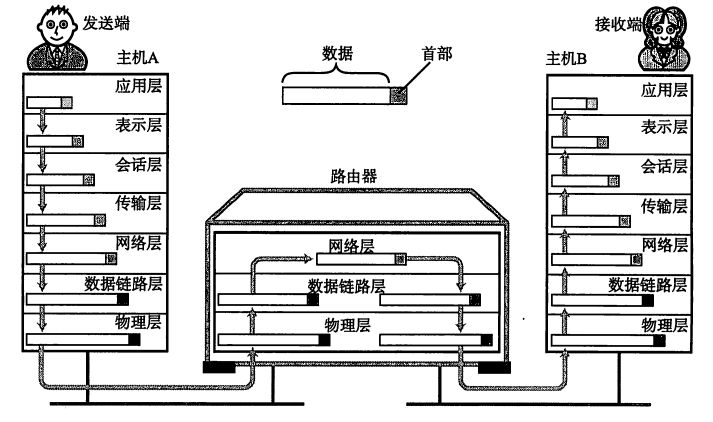

## 二、IP协议

### 1.IPv4首部

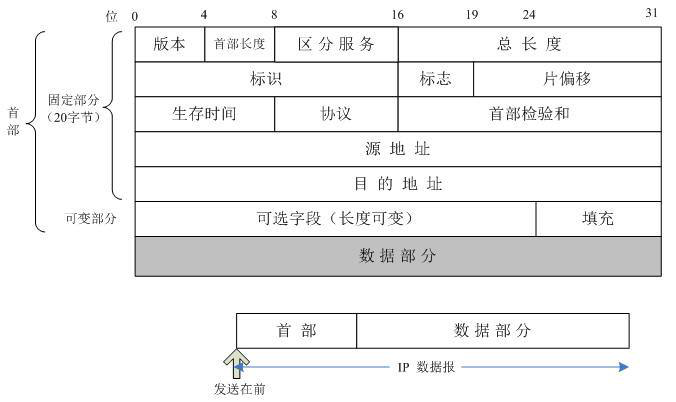

* **版本** ：表示 IP 协议的版本。
* **首部长度：** 首部的长度，单位是 4 字节。
* **区分服务：** 暂时无意义。
* **总长度：** 首部和数据之和的长度，单位为字节，当数据报的总长度超过数据链路层的最大传送单元时就必须进行分片处理。将一个 IP 数据报分成多个分片，每个分片都具有 IP 首部。
* **标识：** 对分片进行标识，同一个数据报的分片具有同样的标识。
* **标志：** 占 3 位。最低位记为 MF(More Fragment)，MF = 1 表示后面“还有分片”，MF = 0 表示这是多个数据报片中的最后一个；中间一位记为 DF(Don't Fragment)，只有当 DF = 0 时才允许分片。
* **片偏移：** 表示该分片在原分组中的相对位置，片偏移以 8 个字节为偏移单位。
* **生存时间：** TTL，表示该数据报在网络中可以被转发的次数，每经过一次转发，这个值减 1。
* **首部校验和：** 这个字段只检验数据报的首部，不检验数据部分。
* **源地址**
* **目的地址**
* **可变部分：** 可变部分中包括用于增加 IP 数据报功能的选项，这些选项一个一个拼起来，中间不需要分隔符，最后用 0 填充为 4 字节的整数倍。

WireShark抓包的情况

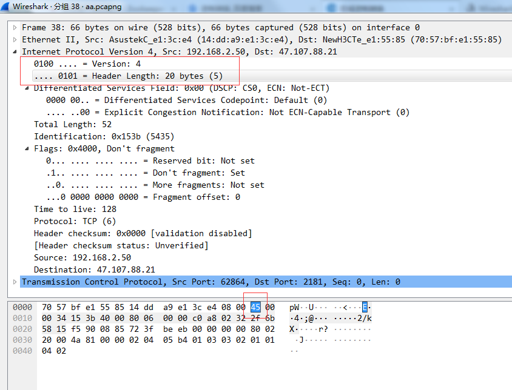
可以看到首部长度值为5行，20bytes（5行*4字节每行=20字节）

首部长度是4bit，而2^4是16，所以它的取值范围是0-15(也可理解为4bit即是4个1，转换成十进制就是15)，图中每行是4个字节(32bits)，所以最大长度就是15*4=60字节。

### 2.IPv6首部

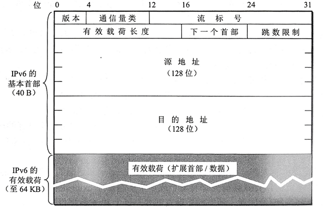
* **版本：** 协议的版本，对于 IPv6 是 6.
* 流标号：“流”指互联网络上从特定源点到特定终点的一系列数据报，所有属于同一个流的数据报都具有同样的流标号。
* **有效载荷长度：** 表示 IPv6 数据报除基本首部以外的字节数。
* **下一个首部：** 当没有扩展首部时，下一个首部字段指出基本首部后面的数据应该移交给哪个高层协议。当出现扩展首部时，下一个首部字段的值表示后面第一个扩展首部的类型。
* 数据报图中经过的路由器不处理扩展首部。
* IPv6 采用冒号十六进制记法，如 68E6:8C64:FFFF:FFFF:0:1180:960A:FFFF，冒号十六进制记法允许零压缩，即一连串连续的零可以为一对冒号所取代，任一地址中只能够使用一次零压缩。

## 三、TCP协议

面向连接，提供可靠的服务，有流量控制，拥塞控制，无重复、无丢失、无差错，面向字节流(把应用层传下来的报文看成字节流，把字节流组织成大小不等的数据块)，只能是点对点，首部 20 字节，全双工

### 1.tcp首部格式

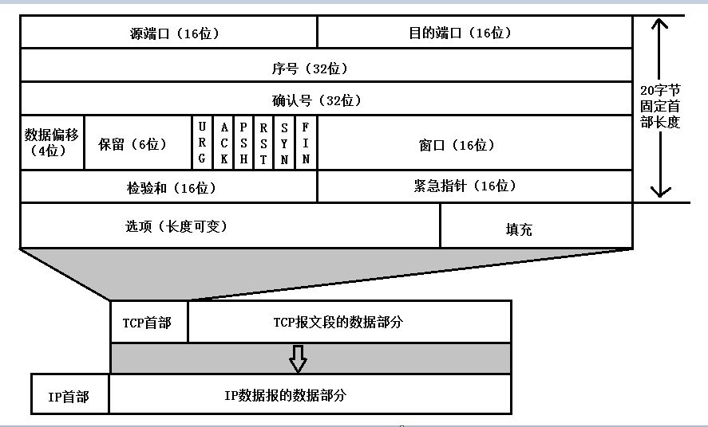
* **序号** **：** 用于对字节流进行编号，例如序号为 301，表示第一个字节的编号为 301，如果携带的数据长度为 100 字节，那么下一个报文段的序号应为 401。
* **确认号** **：** 期望收到的下一个报文段的序号。例如 B 正确收到 A 发送来的一个报文段，序号为 501，携带的数据长度为 200 字节，因此 B 期望下一个报文段的序号为 701，B 发送给 A 的确认报文段中确认号就为 701。
* **数据偏移** ：指的是数据部分距离报文段起始处的偏移量，实际上指的是首部的长度。
* **确认 ACK** ：当 ACK=1 时确认号字段有效，否则无效。TCP 规定，在连接建立后所有传送的报文段都必须把 ACK 置 1。
* **同步 SYN** **：** 在连接建立时用来同步序号。当 SYN=1，ACK=0 时表示这是一个连接请求报文段。若对方同意建立连接，则响应报文中 SYN=1，ACK=1。
* **终止 FIN** **：** 用来释放一个连接，当 FIN=1 时，表示此报文段的发送方的数据已发送完毕，并要求释放运输连接。
* **窗口** **：** 窗口值作为接收方让发送方设置其发送窗口的依据。之所以要有这个限制，是因为接收方的数据缓存空间是有限的。

**TCP连接:SYN ACK RST UTG PSH FIN**

**SYN：同步标志**

同步序列编号(Synchronize Sequence Numbers)栏有效。该标志仅在三次握手建立TCP连接时有效。它提示TCP连接的服务端检查序列编号，该序列编号为TCP连接初始端(一般是客户端)的初始序列编号。

**ACK：确认标志**

确认编号(Acknowledgement Number)栏有效。大多数情况下该标志位是置位的。TCP报头内的确认编号栏内包含的确认编号(w+1，Figure-1)为下一个预期的序列编号，同时提示远端系统已经成功接收所有数据。

**RST：复位标志**

复位标志有效。用于复位相应的TCP连接。

**URG：紧急标志**

紧急(The urgent pointer) 标志有效。紧急标志置位，

**PSH：推标志**

该标志置位时，接收端不将该数据进行队列处理，而是尽可能快将数据转由应用处理。在处理 telnet 或 rlogin 等交互模式的连接时，该标志总是置位的。

**FIN：结束标志**

带有该标志置位的数据包用来结束一个TCP回话，但对应端口仍处于开放状态，准备接收后续数据。

在TCP层，有个FLAGS字段，这个字段有以下几个标识：SYN, FIN, ACK, PSH, RST, URG.其中，对于我们日常的分析有用的就是前面的五个字段。它们的含义是：SYN表示建立连接，FIN表示关闭连接，ACK表示响应，PSH表示有 DATA数据传输，RST表示连接重置。

其中，ACK是可能与SYN，FIN等同时使用的，比如SYN和ACK可能同时为1，它表示的就是建立连接之后的响应，如果只是单个的一个SYN，它表示的只是建立连接。

TCP的几次握手就是通过这样的ACK表现出来的。但SYN与FIN是不会同时为1的，因为前者表示的是建立连接，而后者表示的是断开连接。

RST一般是在FIN之后才会出现为1的情况，表示的是连接重置。一般地，当出现FIN包或RST包时，我们便认为客户端与服务器端断开了连接；

而当出现SYN和SYN＋ACK包时，我们认为客户端与服务器建立了一个连接。

PSH为1的情况，一般只出现在DATA内容不为0的包中，也就是说PSH为1表示的是有真正的TCP数据包内容被传递。TCP的连接建立和连接关闭，都是通过请求－响应的模式完成的。

WireShark抓包的情况

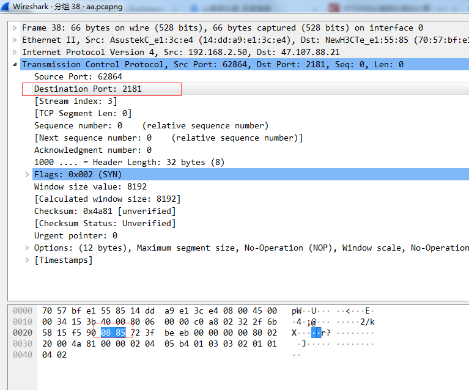

其中目的端口为0885（16进制），转换成10进制就为2181

### 2.握手挥手图示

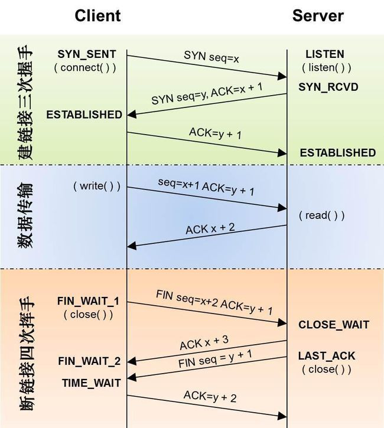

### 3.握手流程

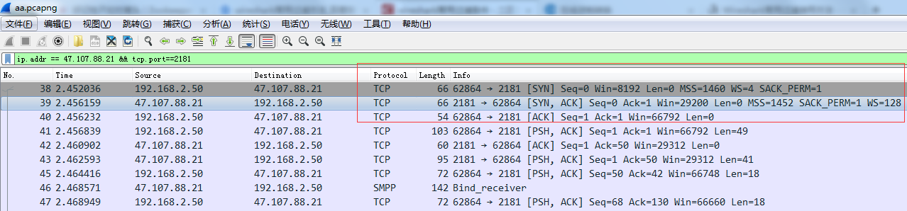

第一次握手： 建立连接。客户端发送连接请求报文段，将SYN位置为1，Sequence Number为x；然后，客户端进入SYN_SEND状态，等待服务器的确认；

第二次握手： 服务器收到SYN报文段。服务器收到客户端的SYN报文段，需要对这个SYN报文段进行确认，设置Acknowledgment Number为x+1(Sequence Number+1)；同时，自己自己还要发送SYN请求信息，将SYN位置为1，Sequence Number为y；服务器端将上述所有信息放到一个报文段（即SYN+ACK报文段）中，一并发送给客户端，此时服务器进入SYN_RECV状态；

第三次握手： 客户端收到服务器的SYN+ACK报文段。然后将Acknowledgment Number设置为y+1，向服务器发送ACK报文段，这个报文段发送完毕以后，客户端和服务器端都进入ESTABLISHED状态，完成TCP三次握手。

### 4为什么要三次握手

为了防止已失效的连接请求报文段突然又传送到了服务端，因而产生错误。

具体例子：“已失效的连接请求报文段”的产生在这样一种情况下：client发出的第一个连接请求报文段并没有丢失，而是在某个网络结点长时间的滞留了，以致延误到连接释放以后的某个时间才到达server。本来这是一个早已失效的报文段。但server收到此失效的连接请求报文段后，就误认为是client再次发出的一个新的连接请求。于是就向client发出确认报文段，同意建立连接。假设不采用“三次握手”，那么只要server发出确认，新的连接就建立了。由于现在client并没有发出建立连接的请求，因此不会理睬server的确认，也不会向server发送数据。但server却以为新的运输连接已经建立，并一直等待client发来数据。这样，server的很多资源就白白浪费掉了。采用“三次握手”的办法可以防止上述现象发生。例如刚才那种情况，client不会向server的确认发出确认。server由于收不到确认，就知道client并没有要求建立连接。”

### 5.四次挥手流程

客户端正常断开：

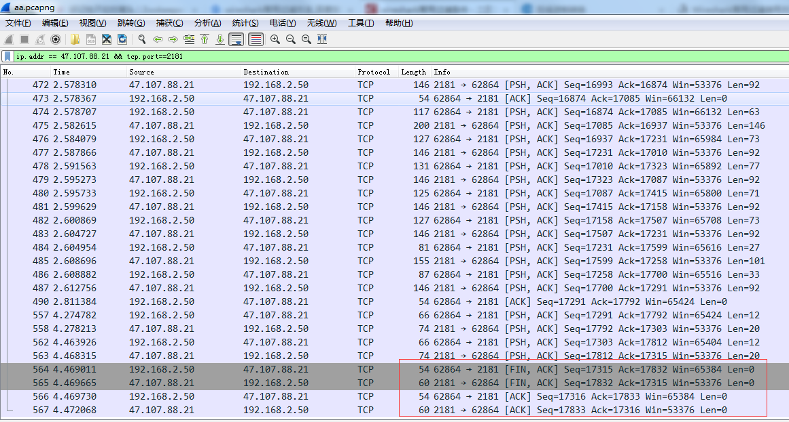

服务器端杀掉进程：

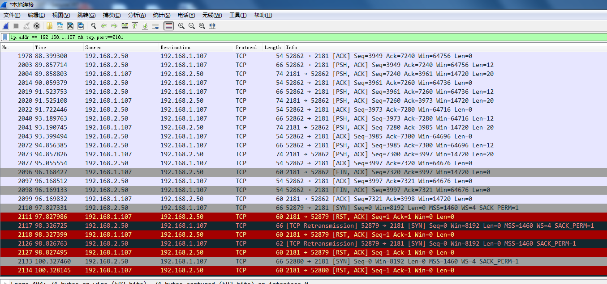

从抓包信息看是服务器的一个流量控制机制启动了。服务器发回rst位，同时win置为0，是告诉客户端不要发包。按tcp流控机制来说，此时客户端应该停止发包，直至服务器发送信息告诉客户端可以继续发送，从图中可以看到，客户端的请求重传了两次，如果还是失败会创建新的syn包继续尝试连接。

挥手流程：

第一次分手： 主机1（可以使客户端，也可以是服务器端），设置Sequence Number，向主机2发送一个FIN报文段；此时，主机1进入FIN_WAIT_1状态；这表示主机1没有数据要发送给主机2了；

第二次分手： 主机2收到了主机1发送的FIN报文段，向主机1回一个ACK报文段，Acknowledgment Number为Sequence Number加1；主机1进入FIN_WAIT_2状态；主机2告诉主机1，我“同意”你的关闭请求；

第三次分手： 主机2向主机1发送FIN报文段，请求关闭连接，同时主机2进入LAST_ACK状态；

第四次分手： 主机1收到主机2发送的FIN报文段，向主机2发送ACK报文段，然后主机1进入TIME_WAIT状态；主机2收到主机1的ACK报文段以后，就关闭连接；此时，主机1等待2MSL后依然没有收到回复，则证明Server端已正常关闭，那好，主机1也可以关闭连接了。

上图中服务器发回rst位，同时win置为0，是告诉客户端不要发包。按tcp流控机制来说，此时客户端应该停止发包，直至服务器发送信息告诉客户端可以继续发送。

### ******6.**** ****为什么要四次分手？******

TCP协议是一种面向连接的、可靠的、基于字节流的运输层通信协议。TCP是全双工模式，这就意味着，当主机1发出FIN报文段时，只是表示主机1已经没有数据要发送了，主机1告诉主机2，它的数据已经全部发送完毕了；但是，这个时候主机1还是可以接受来自主机2的数据；当主机2返回ACK报文段时，表示它已经知道主机1没有数据发送了，但是主机2还是可以发送数据到主机1的；当主机2也发送了FIN报文段时，这个时候就表示主机2也没有数据要发送了，就会告诉主机1，我也没有数据要发送了，之后彼此就会愉快的中断这次TCP连接。

### ******7.**** ****为什么要等待2MSL？******

MSL：报文段最大生存时间，它是任何报文段被丢弃前在网络内的最长时间。

原因有二：

- 保证TCP协议的全双工连接能够可靠关闭

- 保证这次连接的重复数据段从网络中消失

第一点：如果主机1直接CLOSED了，那么由于IP协议的不可靠性或者是其它网络原因，导致主机2没有收到主机1最后回复的ACK。那么主机2就会在超时之后继续发送FIN，此时由于主机1已经CLOSED了，就找不到与重发的FIN对应的连接。所以，主机1不是直接进入CLOSED，而是要保持TIME_WAIT，当再次收到FIN的时候，能够保证对方收到ACK，最后正确的关闭连接。

第二点：如果主机1直接CLOSED，然后又再向主机2发起一个新连接，我们不能保证这个新连接与刚关闭的连接的端口号是不同的。也就是说有可能新连接和老连接的端口号是相同的。一般来说不会发生什么问题，但是还是有特殊情况出现：假设新连接和已经关闭的老连接端口号是一样的，如果前一次连接的某些数据仍然滞留在网络中，这些延迟数据在建立新连接之后才到达主机2，由于新连接和老连接的端口号是一样的，TCP协议就认为那个延迟的数据是属于新连接的，这样就和真正的新连接的数据包发生混淆了。所以TCP连接还要在TIME_WAIT状态等待2倍MSL，这样可以保证本次连接的所有数据都从网络中消失。

### ******8.**** ****TCP流量控制******

如果发送方把数据发送得过快，接收方可能会来不及接收，这就会造成数据的丢失。所谓流量控制就是让发送方的发送速率不要太快，要让接收方来得及接收。

利用滑动窗口机制可以很方便地在TCP连接上实现对发送方的流量控制。

设A向B发送数据。在连接建立时，B告诉了A：“我的接收窗口是 rwnd = 400 ”(这里的 rwnd 表示 receiver window) 。因此，发送方的发送窗口不能超过接收方给出的接收窗口的数值。请注意，TCP的窗口单位是字节，不是报文段。假设每一个报文段为100字节长，而数据报文段序号的初始值设为1。大写ACK表示首部中的确认位ACK，小写ack表示确认字段的值ack。

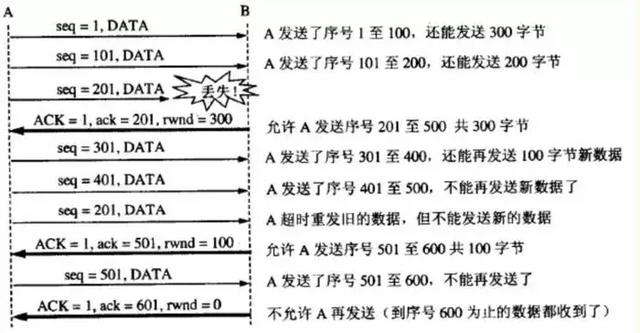

从图中可以看出，B进行了三次流量控制。第一次把窗口减少到 rwnd = 300 ，第二次又减到了 rwnd = 100 ，最后减到 rwnd = 0 ，即不允许发送方再发送数据了。这种使发送方暂停发送的状态将持续到主机B重新发出一个新的窗口值为止。B向A发送的三个报文段都设置了 ACK = 1 ，只有在ACK=1时确认号字段才有意义。

TCP为每一个连接设有一个持续计时器(persistence timer)。只要TCP连接的一方收到对方的零窗口通知，就启动持续计时器。若持续计时器设置的时间到期，就发送一个零窗口控测报文段（携1字节的数据），那么收到这个报文段的一方就重新设置持续计时器。

### ******9.**** ****TCP拥塞控制******

******慢开始和拥塞避免******

发送方维持一个拥塞窗口 cwnd ( congestion window )的状态变量。拥塞窗口的大小取决于网络的拥塞程度，并且动态地在变化。发送方让自己的发送窗口等于拥塞窗口。

发送方控制拥塞窗口的原则是：只要网络没有出现拥塞，拥塞窗口就再增大一些，以便把更多的分组发送出去。但只要网络出现拥塞，拥塞窗口就减小一些，以减少注入到网络中的分组数。

******慢开始算法******

当主机开始发送数据时，如果立即所大量数据字节注入到网络，那么就有可能引起网络拥塞，因为现在并不清楚网络的负荷情况。

因此，较好的方法是 先探测一下，即由小到大逐渐增大发送窗口，也就是说，由小到大逐渐增大拥塞窗口数值。

通常在刚刚开始发送报文段时，先把拥塞窗口 cwnd 设置为一个最大报文段MSS的数值。而在每收到一个对新的报文段的确认后，把拥塞窗口增加至多一个MSS的数值。用这样的方法逐步增大发送方的拥塞窗口 cwnd ，可以使分组注入到网络的速率更加合理。

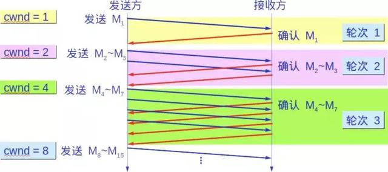

每经过一个传输轮次，拥塞窗口 cwnd 就加倍。一个传输轮次所经历的时间其实就是往返时间RTT。不过“传输轮次”更加强调：把拥塞窗口cwnd所允许发送的报文段都连续发送出去，并收到了对已发送的最后一个字节的确认。

另，慢开始的“慢”并不是指cwnd的增长速率慢，而是指在TCP开始发送报文段时先设置cwnd=1，使得发送方在开始时只发送一个报文段（目的是试探一下网络的拥塞情况），然后再逐渐增大cwnd。

为了防止拥塞窗口cwnd增长过大引起网络拥塞，还需要设置一个慢开始门限ssthresh状态变量。慢开始门限ssthresh的用法如下：

当 cwnd < ssthresh 时，使用上述的慢开始算法。

当 cwnd > ssthresh 时，停止使用慢开始算法而改用拥塞避免算法。

当 cwnd = ssthresh 时，既可使用慢开始算法，也可使用拥塞控制避免算法。

******拥塞避免******

让拥塞窗口cwnd缓慢地增大，即每经过一个往返时间RTT就把发送方的拥塞窗口cwnd加1，而不是加倍。这样拥塞窗口cwnd按线性规律缓慢增长，比慢开始算法的拥塞窗口增长速率缓慢得多。

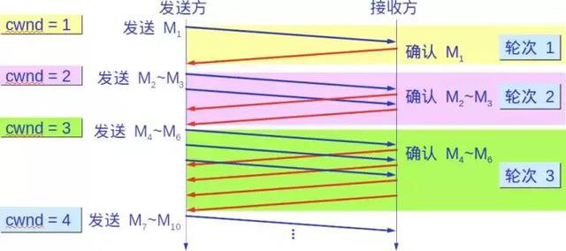

无论在慢开始阶段还是在拥塞避免阶段，只要发送方判断网络出现拥塞（其根据就是没有收到确认），就要把慢开始门限ssthresh设置为出现拥塞时的发送方窗口值的一半（但不能小于2）。然后把拥塞窗口cwnd重新设置为1，执行慢开始算法。

这样做的目的就是要迅速减少主机发送到网络中的分组数，使得发生 拥塞的路由器有足够时间把队列中积压的分组处理完毕。

如下图，用具体数值说明了上述拥塞控制的过程。现在发送窗口的大小和拥塞窗口一样大。

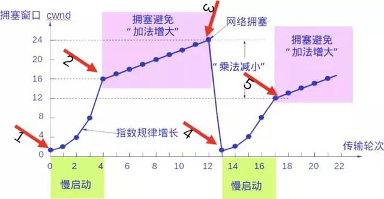

### 2.快重传和快恢复

**快重传**

快重传算法首先要求接收方每收到一个失序的报文段后就立即发出重复确认（为的是使发送方及早知道有报文段没有到达对方）而不要等到自己发送数据时才进行捎带确认。

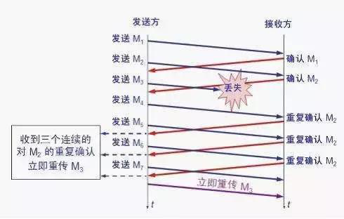

接收方收到了M1和M2后都分别发出了确认。现在假定接收方没有收到M3但接着收到了M4。

显然，接收方不能确认M4，因为M4是收到的失序报文段。根据 可靠传输原理，接收方可以什么都不做，也可以在适当时机发送一次对M2的确认。

但按照快重传算法的规定，接收方应及时发送对M2的重复确认，这样做可以让 发送方及早知道报文段M3没有到达接收方。发送方接着发送了M5和M6。接收方收到这两个报文后，也还要再次发出对M2的重复确认。这样，发送方共收到了 接收方的四个对M2的确认，其中后三个都是重复确认。

快重传算法还规定，发送方只要一连收到三个重复确认就应当立即重传对方尚未收到的报文段M3，而不必 继续等待M3设置的重传计时器到期。

由于发送方尽早重传未被确认的报文段，因此采用快重传后可以使整个网络吞吐量提高约20%。

******快恢复******

与快重传配合使用的还有快恢复算法，其过程有以下两个要点：

当发送方连续收到三个重复确认，就执行“乘法减小”算法，把慢开始门限ssthresh减半。

与慢开始不同之处是现在不执行慢开始算法（即拥塞窗口cwnd现在不设置为1），而是把cwnd值设置为 慢开始门限ssthresh减半后的数值，然后开始执行拥塞避免算法（“加法增大”），使拥塞窗口缓慢地线性增大。

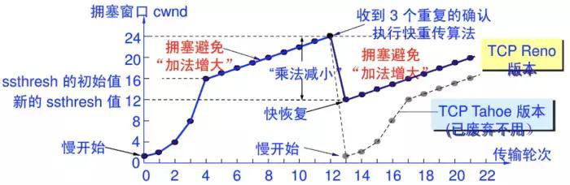

## 四、UDP协议

UDP（User Data Protocol，用户数据报协议）是一个非连接的协议，传输数据之前源端和终端不建立连接，当它想传送时就简单地去抓取来自应用程序的数据，并尽可能快地把它扔到网络上。在发送端，UDP传送数据的速度仅仅是受应用程序生成数据的速度、计算机的能力和传输带宽的限制。

### ******1.**** ****UDP首部格式******

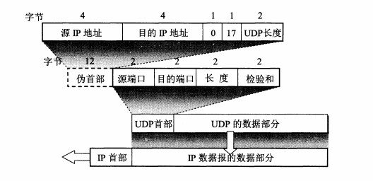

首部字段只有 8 个字节，包括源端口、目的端口、长度、检验和。12 字节的伪首部是为了计算检验和临时添加的。

## 五、HTTP协议

### 1.http请求报文

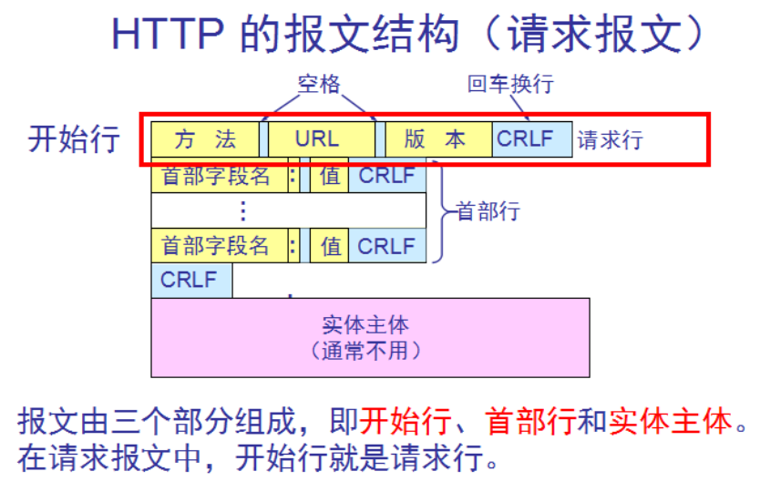

### 2.http响应报文

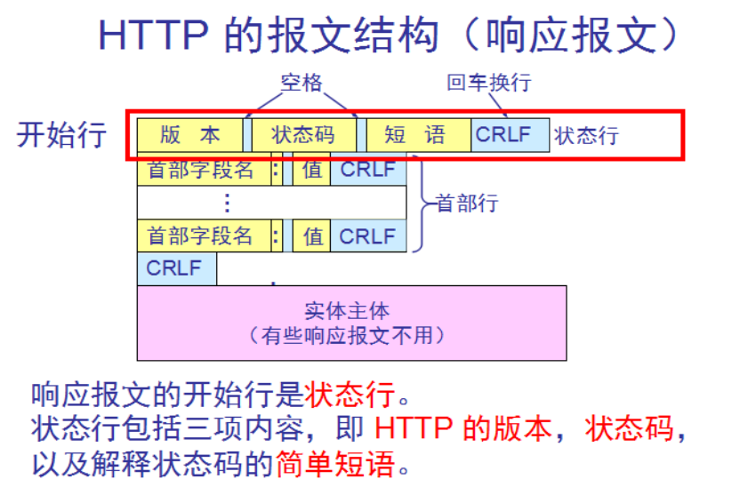

### 3.method: 请求方法，标明客户端希望服务器对资源执行的动作

* GET：从服务器获取一个资源
* HEAD：只从服务器获取文档的响应首部
* POST：向服务器输入数据，通常会再由网关程序继续处理
* PUT：将请求的主体部分存储在服务器中，如上传文件
* DELETE：请求删除服务器上指定的文档
* TRACE：追踪请求到达服务器中间经过的代理服务器
* OPTIONS：请求服务器返回对指定资源支持使用的请求方法

### 4.status：标记请求处理过程中发生的情况，如200，301, 302, 404, 502

* 200： 成功，请求数据通过响应报文的entity-body部分发送；OK
* 301： 请求的URL指向的资源已经被删除；但在响应报文中通过首部Location指明了资源现在所处的新位置；Moved Permanently
* 302： 响应报文Location指明资源临时新位置；Moved Temporarily
* 304： 客户端发出了条件式请求，但服务器上的资源未曾发生改变，则通过响应此响应状态码通知客户端；Not Modified
* 401： 需要输入账号和密码认证方能访问资源；Unauthorized
* 403： 请求被禁止；Forbidden
* 404： 服务器无法找到客户端请求的资源；Not Found
* 500： 服务器内部错误；Internal Server Error
* 502： 代理服务器从后端服务器收到了一条伪响应，如无法连接到网关；Bad Gateway
* 503： 服务不可用，临时服务器维护或过载，服务器无法处理请求
* 504： 网关超时

### 5.HTTP 首部字段

HTTP 首部字段包含的信息最为丰富。首部字段同时存在于请求和响应报文内，并涵盖 HTTP 报文相关的内容信息。使用首部字段是为了给客服端和服务器端提供报文主体大小、所使用的语言、认证信息等内容；

首部字段结构HTTP 首部字段是由首部字段名和字段值构成的，中间用冒号“:”分隔；

字段值对应单个 HTTP 首部字段可以有多个值；

报文首部中出现了两个或以上具有相同首部字段名的首部字段时，在规范内尚未明确，根据浏览器内部处理逻辑的不同，优先处理的顺序可能不同，结果可能并不一致。

通用首部:请求报文和响应报文两方都会使用的首部

* Date：报文的创建时间
* Connection：连接状态，如keep-alive, close
* Via：显示报文经过的中间节点（代理，网关）
* Cache-Control：控制缓存，如缓存时长
* MIME-Version：发送端使用的MIME版本
* Warning：错误通知

请求首部:从客户端向服务器端发送请求报文时使用的首部。补充了请求的附加内容、客户端信息、请求内容相关优先级等信息

#### 5.1请求首部：

* Accept：通知服务器自己可接受的媒体类型
* Accept-Charset： 客户端可接受的字符集
* Accept-Encoding：客户端可接受编码格式，如gzip
* Accept-Language：客户端可接受的语言
* Client-IP: 请求的客户端IP
* Host: 请求的服务器名称和端口号
* Referer：跳转至当前URI的前一个URL
* User-Agent：客户端代理，浏览器版本

#### 5.2代理请求首部：

* Proxy-Authorization：向代理服务器认证
* 响应首部：从服务器端向客户端返回响应报文时使用的首部。补充了响应的附加内容，也会要求客户端附加额外的内容信
* Age：从最初创建开始，响应持续时长
* Server：服务器程序软件名称和版本
* 协商首部：某资源有多种表示方法时使用
* Accept-Ranges：服务器可接受的请求范围类型
* Vary：服务器查看的其它首部列表
* Set-Cookie：向客户端设置cookie
* Set-Cookie2: 以上面相似
* WWW-Authenticate：来自服务器对客户端的质询列表

#### 5.3实体首部：针对请求报文和响应报文的实体部分使用的首部。

补充了资源内容更新时间等与实体有关的的信息

* Location：告诉客户端真正的实体位于何处
* Content-Encoding:对主体执行的编码
* Content-Language:理解主体时最适合的语言
* Content-Length: 主体的长度
* Content-Location: 实体真正所处位置
* Content-Type：主体的对象类型，如text

缓存相关：

* ETag：实体的扩展标签
* Expires：实体的过期时间
* Last-Modified：最后一次修改的时间

#### 5.4扩展首部Cookie

HTTP 是一种无状态协议。协议自身不对请求和响应之间的通信状态进行保存。也就是说在 HTTP 这个级别，协议对于发送过的请求或响应都不做持久化处理。这是为了更快地处理大量事务，确保协议的可伸缩性，而特意把 HTTP 协议设计成如此简单的。可是随着 Web 的不断发展，很多业务都需要对通信状态进行保存。于是引入了 Cookie 技术。使用 Cookie 的状态管理Cookie 技术通过在请求和响应报文中写入 Cookie 信息来控制客户端的状态。Cookie 会根据从服务器端发送的响应报文内的一个叫做 Set-Cookie 的首部字段信息，通知客户端保存Cookie。当下次客户端再往该服务器发送请求时，客户端会自动在请求报文中加入 Cookie 值后发送出去。服务器端发现客户端发送过来的 Cookie 后，会去检查究竟是从哪一个客户端发来的连接请求，然后对比服务器上的记录，最后得到之前的状态信息

### 6.图示为http跟踪流实例，可以很好的了解一个http的请求和响应流程

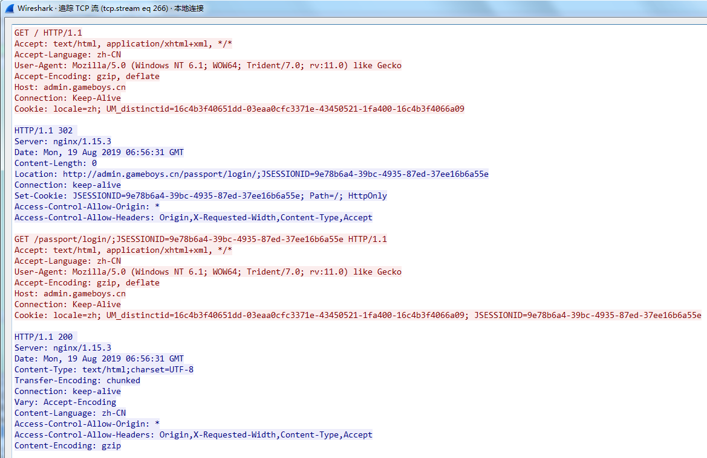

### 7.Get请求抓包情况

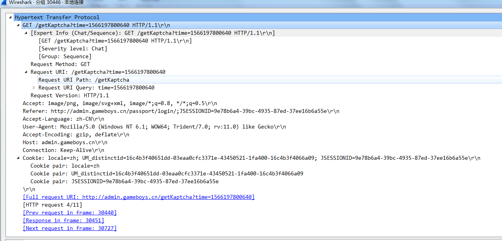

### 8.Post请求抓包情况，和get请求不一样的是post的数据是放到了包体部分，而get请求是放到了heads里面

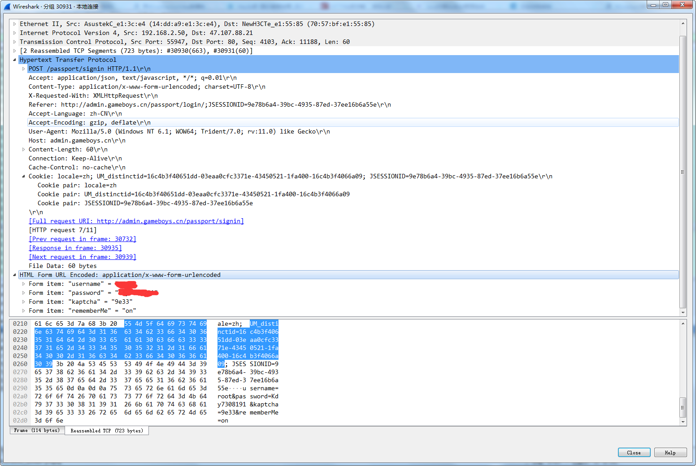

## 六、Wireshark常用过滤使用方法

### 1.过滤IP

```
如来源IP或者目标IP等于某个IP
ip.src eq 192.168.1.107 or ip.dst eq 192.168.1.107
或者
ip.addr eq 192.168.1.107 // 都能显示来源IP和目标IP
```

### 2.过滤端口

```
tcp.port eq 80 // 不管端口是来源的还是目标的都显示
tcp.port == 80
tcp.port eq 2722
tcp.port eq 80 or udp.port eq 80
tcp.dstport == 80 // 只显tcp协议的目标端口80
tcp.srcport == 80 // 只显tcp协议的来源端口80
udp.port eq 15000
过滤端口范围
tcp.port >= 1 and tcp.port <= 80
```

### 3.过滤协议

```
tcp、udp、arp、icmp、http、smtp、ftp、dns、msnms、ssl
排除arp包，如!arp   或者   not arp
```

### 4.过滤MAC

```
太以网头过滤
eth.dst == A0:00:00:04:C5:84 // 过滤目标mac
eth.src eq A0:00:00:04:C5:84 // 过滤来源mac
eth.dst==A0:00:00:04:C5:84
eth.dst==A0-00-00-04-C5-84
eth.addr eq A0:00:00:04:C5:84 // 过滤来源MAC和目标MAC都等于A0:00:00:04:C5:84的
less than 小于 < lt
小于等于 le
等于 eq
大于 gt
大于等于 ge
不等 ne
```

### 5.包长度过滤

```
udp.length == 26 这个长度是指udp本身固定长度8加上udp下面那块数据包之和
tcp.len >= 7   指的是ip数据包(tcp下面那块数据),不包括tcp本身
ip.len == 94 除了以太网头固定长度14,其它都算是ip.len,即从ip本身到最后
frame.len == 119 整个数据包长度,从eth开始到最后
eth ---> ip or arp ---> tcp or udp ---> data
```

### 6.http模式过滤

```
http.request.method == "GET"
http.request.method == "POST"
http.request.uri == "/img/logo-edu.gif"
http contains "GET"
http contains "HTTP/1."
// GET包
http.request.method == "GET" && http contains "Host: "
http.request.method == "GET" && http contains "User-Agent: "
// POST包
http.request.method == "POST" && http contains "Host: "
http.request.method == "POST" && http contains "User-Agent: "
// 响应包
http contains "HTTP/1.1 200 OK" && http contains "Content-Type: "
http contains "HTTP/1.0 200 OK" && http contains "Content-Type: "
一定包含如下
Content-Type:
```

### 7.TCP参数过滤

```
tcp.flags 显示包含TCP标志的封包。
tcp.flags.syn == 0x02     显示包含TCP SYN标志的封包。
tcp.window_size == 0 && tcp.flags.reset != 1
```

[图解TCP/IP详解（史上最全）](https://blog.csdn.net/weixin_42100064/article/details/102739531)