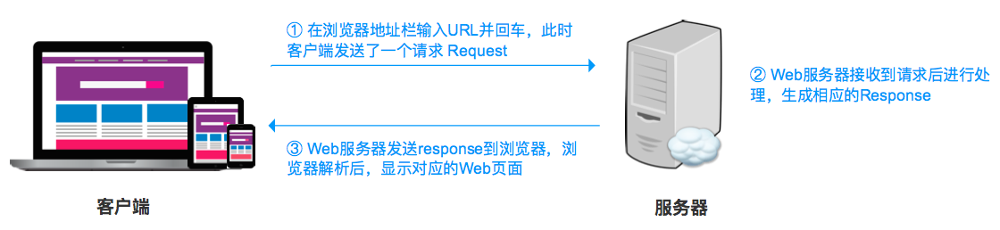
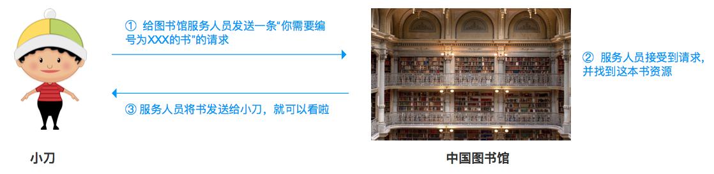
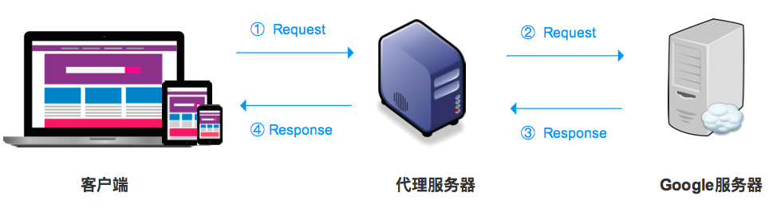
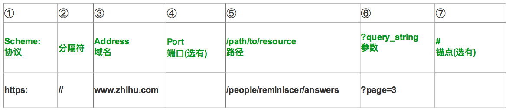
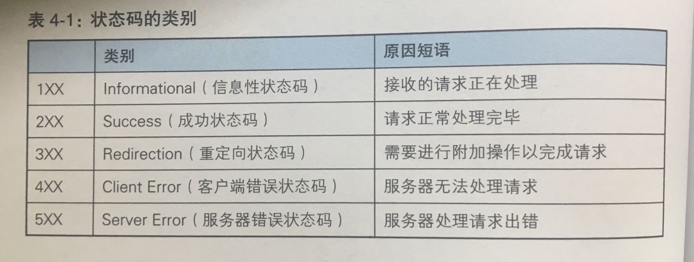
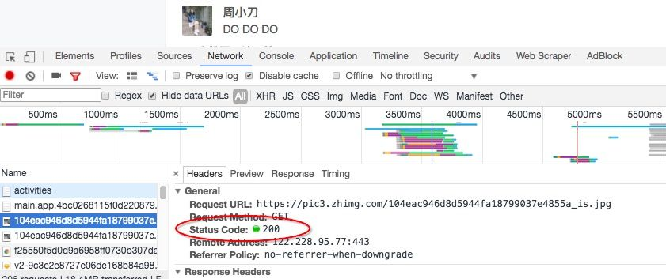

# 天天见的URL，我想了解你多一点

## 一、为什么输入URL就能看到网页呢？

终于盼来了周六，小刀打开电脑，nice，正在追的美剧也更新了，看得津津有味的小刀突然想：为什么在浏览器我输入链接后，就出现了网页？网页里面内容是从哪儿来的？

Web页面当然不会凭空而来，实际上是根据浏览器地址栏中的URL，Web浏览器将从Web服务端获取的资源信息，显示在网页中。具体过程参照下图（手机屏幕小，记得放大看）。

举个通俗易懂的例子，小刀（客户端）需要借一本编号为XXX的书，于是发请求给中国图书馆（服务器，资源所在地），中国图书馆一听，爱学习的好青年啊，于是找到这本书并将书发给小刀。当然这个过程远不止这么简单，对于非技术人员来说，理解到这就差不多啦。

## 二、为什么连接代理可以访问谷歌等国外网站？

小刀听说谷歌日历很好用，想体验一下，但是国内根本打不开呀。于是求助大鱼，大鱼说easy啊，安装了个软件并连了日本的代理。小刀一试，果然可以正常访问了。这个案例中，谷歌的服务器在中国无法访问，但是在日本可以访问，而在中国可以访问这个日本的代理服务器。所以，从中国发出的请求经过了日本代理服务器的周转，将谷歌的资源返回到中国，这也解释了为什么“连代理后可以访问谷歌”。简要的过程如下。

这就好比，小刀希望借一家美国图书馆的书，但是自己没有办法直接联系，只能联系到中国图书馆。于是借助能联系到美国图书馆的中国的图书馆，告诉它“我想借美国图书馆里名为XXX的书”，中国图书馆借到之后再将书送给小刀。

## 三、URL含有哪些元素？

URL，即Uniform Resource Locator（统一资源定位符），可以理解为我们通常说的网址，代表着网络上资源的地址。一个合规的URL对应的是服务器上一个特定的资源。

浏览器发出Request到Web服务器时，相当于告诉Web服务器需要哪个位置的资源。依然拿图书馆的栗子，套用URL的格式，小刀发送给中国图书馆的请求可能是“ **http://中国图书馆/三楼/文史馆/B区/书架F?排数=3&编号=3.23.1** ”，小刀需要的是位于中国图书馆三楼文史馆B区F书架上第三排编号是3.23.1的那本书，中国图书馆根据信息定位到小刀需要的资源。

那么一个网页的URL包含哪些元素呢？我们来解剖一下：

以 [周小刀 - 知乎](https://www.zhihu.com/people/reminiscer/answers?page=3) 为例来解释，包含以下元素：

① Scheme协议

协议以“: ”作为结束符，表示获取该资源需要的协议，包括数据如何封装打包等规则。常见的协议有http和https（加密），也有以ftp、thunder（迅雷）开头的协议。

② 分隔符

基本上每个 URL 都会包含这个符号，可以理解为将协议与后方信息隔开的符号。

③ Address服务器地址/域名

决定了去哪个服务器上去获取资源，如如果我们例子中URL，意味着我们是从 [http://zhihu.com](http://zhihu.com) 获取资源。同样，“http://中国图书馆/三楼/文史馆/B区/书架F?排数=3&编号=3.23.1”意味着去中国图书馆获取资源。

④ Port端口

如果URL中没有端口，则访问时使用默认端口。端口可以理解为访问服务器有多个服务的点，URL中不同端口代表可以通过不同的点提供服务。http的端口默认是80，https的端口默认是443，知乎的链接写成 [https://www.zhihu.com/people/reminiscer/answers?page=3](https://link.zhihu.com/?target=https%3A//www.zhihu.com%3A443/people/reminiscer/answers%3Fpage%3D3) 也可以正常访问。继续拿图书馆的做例子，图书馆有东南西北四个门都可以访问，如果路径中写上南门，那么就从南门进出，如果没有写就默认走东门。

⑤ 路径

路径，从第一个/到?之间的部分，代表所访问的资源所在的路径和名称，很好理解，与电脑本地的文件夹的路径十分类似，例如 D:/Desktop/File1/a.png代表着a图片在电脑上的路径。/people/reminiscer/answers，一层层细分到answers文件。

⑥ 参数

参数用于本地的信息传给服务器，例如?page=3代表第三页，如果有多个参数用&链接，例如?id=123&name=456、?排数=3&编号=3.23.1（from万能的图书馆案例）。

⑦锚点

锚点用于页面定位，比如十分常见的网页右下角的“回到顶部”就是利用锚点实现的。URL中锚点的形式为#+元素，锚点信息不是必备的， 并且锚点信息不会随客户端的请求发送到服务器。

一般的URL会包含以上几个元素，大家使用浏览器的过程中，不妨下意识多观察和“解剖”，揭开URL神秘面纱。

## 四、啊，网页显示404？！

页面显示404，相信很多人都见过，这到底代表什么意思呢？

其实，这是状态码的一种，状态码的职责是当客户端向服务器发送请求时，描述返回的请求结果。借助于状态码，可以指定请求成功还是异常。状态码由三位数和原因短语组成，如果200 OK，404 NOT FOUND。具体有以下五大类：

图片来自《图解HTTP》

使用谷歌浏览器的开发者工具可以查看网站请求的资源的状态，如下图，这个图片请求状态码是200，表示请求成功。

